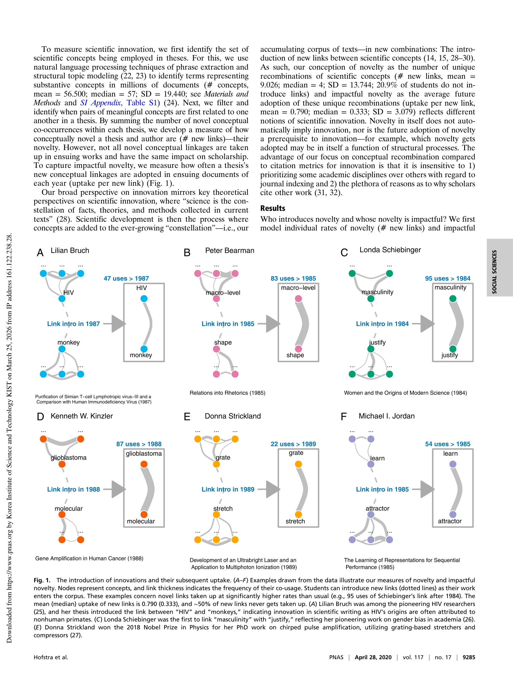

# The Diversity-Innovation Paradox in Science

> **저자**: Bas Hofstra, Vivek V. Kulkarni, Sebastian Munoz-Najar Galvez, Bryan He, Dan Jurafsky, Daniel A. McFarland | **날짜**: 2020 | **Journal**: Proceedings of the National Academy of Sciences | **DOI**: [10.1073/pnas.1915378117](https://doi.org/10.1073/pnas.1915378117) | **arXiv**: N/A
> **리뷰 모드**: PDF

---

## Essence

다양성-혁신의 역설: 소수자 연구자들은 더 참신한 개념을 제안하지만, 그들의 개념이 채택되고 인정받을 확률은 낮다. Hofstra et al.(2020)은 Stanford 박사 논문 약 1,200만 단어와 저자의 인구통계 데이터를 결합 분석하여, 여성·소수 인종 연구자가 논문에서 더 참신한(novel) 개념을 제안하지만 그 개념들이 후속 연구에서 인용·채택되는 비율은 낮음을 발견했다. 이는 과학적 지식 생산의 인구통계적 편향을 실증한다.

*Figure 1: 논문 핵심 결과 또는 방법론 개요*

## Originality (Abstract 기반)

- [authorship, finding] "We find that PhD students from underrepresented groups innovate more in their dissertations, but these innovations are less likely to be adopted."
- [novelty] "We reveal a diversity-innovation paradox—diversity increases novelty but decreases adoption of innovations."

## How (방법론)

- **데이터**: ProQuest 박사 논문 데이터베이스(1977–2015) + 저자 성별·인종 데이터 약 120만 명
- **참신성 측정**: Stanford NLP 도구로 논문 내 새로운 개념(신조어, 개념 조합) 탐지 후 후속 인용에서의 채택 추적
- **인구통계**: 이름 기반 성별·인종 분류(African American, Asian, White, Hispanic)
- **분석**: 회귀 분석으로 인구통계 → 참신성 → 채택률 경로 추정

## Why (중요성)

- 다양성이 혁신을 촉진한다는 가설을 실증하면서도, 동시에 구조적 불평등이 혁신의 확산을 억제함을 보임
- 단순한 '다양성 = 좋은 것' 담론을 넘어 다양성의 혜택이 누구에게 귀속되는지 질문
- 과학 지식 생산의 인구통계적 편향 시정을 위한 정책 근거 제공

## Limitation

- 박사 논문에 국한—출판 논문, 특허 등 다른 형태의 혁신 산출물 미포함
- 이름 기반 인종 분류의 부정확성
- '참신성' 측정이 언어적 신규성에 의존하여 실질 혁신과 괴리 가능

## Further Study

- 출판 심사 과정에서 소수자 혁신이 걸러지는 메커니즘 분석
- 멘토·지도교수 구성이 소수자 혁신 채택률에 미치는 영향
- 글로벌 확장: 개도국 연구자의 혁신 vs 채택 패턴

## 평가

| 항목 | 점수 |
|------|------|
| Novelty | 5/5 |
| Technical Soundness | 4/5 |
| Significance | 5/5 |
| Clarity | 4/5 |
| Overall | 5/5 |

**총평**: 소수자 연구자들의 더 높은 혁신성과 낮은 채택률이라는 역설적 패턴을 실증하여, 과학 지식 생산의 구조적 불평등을 드러낸 사회과학과 계산 방법의 융합 연구다.
