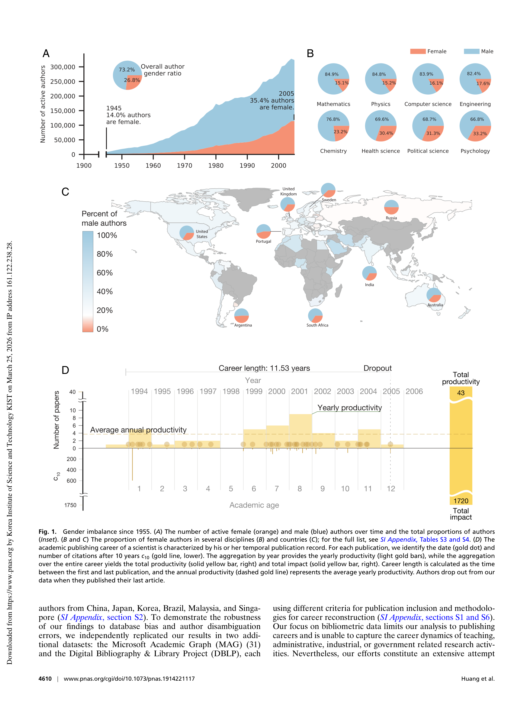

# Historical Comparison of Gender Inequality in Scientific Careers Across Countries and Disciplines

> **저자**: Junming Huang, Alexander J. Gates, Roberta Sinatra, Albert-László Barabási | **날짜**: 2020 | **Journal**: Proceedings of the National Academy of Sciences | **DOI**: [10.1073/pnas.1914221117](https://doi.org/10.1073/pnas.1914221117) | **arXiv**: N/A
> **리뷰 모드**: PDF

---

## Essence

과학 커리어에서 성별 불평등은 국가와 분야에 따라 크게 다르지만, 보편적으로 남성보다 여성의 조기 이탈(attrition)이 더 많다. Huang et al.(2020)은 1955–2010년 Scopus 논문 약 300만 편의 저자 경력 데이터를 분석해, 여성은 평균적으로 더 짧은 커리어를 보이고 조기에 과학을 떠나는 경향이 있으며, 이 gap은 분야별(물리학 최대, 간호학 최소)·국가별로 상이함을 정량화했다.

*Figure 1: 논문 핵심 결과 또는 방법론 개요*

## Originality (Abstract 기반)

- [authorship, action] "We perform a large-scale historical comparison of gender inequality in scientific careers across 83 countries and 13 fields."
- [finding] "Women have shorter careers and higher attrition rates than men in nearly all countries and disciplines."

## How (방법론)

- **데이터**: Scopus 1955–2010 논문 약 300만 편, 저자 경력 추적(첫 논문~마지막 논문)
- **성별 추정**: 이름 기반 분류(World Gender-Name Dictionary)
- **측정**: 커리어 길이(첫~마지막 논문 연도), 커리어 지속률, 논문 생산성, 협업 네트워크
- **비교**: 83개국, 13개 분야별 성별 gap 지표 비교
- **통계**: 생존 분석(Kaplan-Meier), 음이항 회귀

## Why (중요성)

- 성별 과학 불평등의 국가·분야별 패턴 파악으로 정책 개입의 타겟 설정 가능
- 조기 이탈 패턴이 생애 단계(출산 등)와 연결되는 메커니즘 이해
- 장기 추세(1955–2010) 분석으로 진전 여부와 지속되는 격차의 성격 파악

## Limitation

- Scopus 색인 편향(선진국·영어권 과잉 대표)
- 이름 기반 성별 분류의 오류, 특히 아시아·아프리카 이름
- '과학 이탈'을 마지막 출판으로 측정—실제 이탈과 단순 휴지기 구분 어려움

## Further Study

- 성별 커리어 gap의 인과 요인(육아 정책, 멘토링, 기관 문화) 준실험 분석
- 2010년 이후 데이터로 최근 추세 변화 분석
- 트랜스젠더·논바이너리 과학자의 커리어 패턴

## 평가

| 항목 | 점수 |
|------|------|
| Novelty | 4/5 |
| Technical Soundness | 4/5 |
| Significance | 5/5 |
| Clarity | 4/5 |
| Overall | 4/5 |

**총평**: 55년간 83개국 300만 논문 데이터로 과학 커리어의 성별 불평등을 역사적·비교적으로 정량화하여, 국가별·분야별 정책 개입의 표적을 제시한 대규모 계량과학 연구다.
