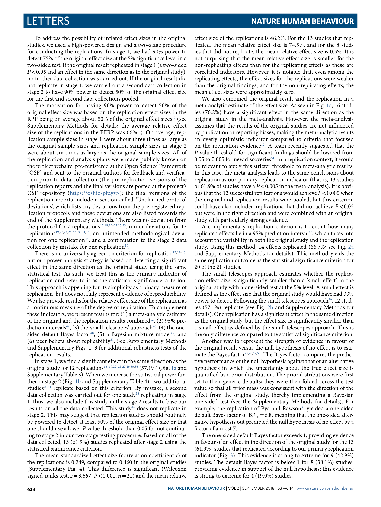

# Evaluating the Replicability of Social Science Experiments in Nature and Science

> **저자**: Colin F. Camerer, Anna Dreber, Felix Holzmeister, et al. | **날짜**: 2018 | **Journal**: Nature Human Behaviour | **DOI**: 10.1038/s41562-018-0399-z | **arXiv**: -
> **리뷰 모드**: PDF

---

## Essence

Nature와 Science에 실린 사회과학 실험 연구들은 재현 가능한가? 이 논문은 2010~2015년 두 저널에 발표된 21편의 사회과학 실험을 체계적으로 재현한 결과, **13편(62%)에서 같은 방향의 유의미한 효과가 확인**되었으며, 재현된 효과 크기는 원래의 평균 약 50% 수준이었다. 심리학 RPP(36%)보다 높지만 여전히 불완전한 재현성이 확인되었다.

*Figure 1: 21편의 재현 연구 결과 요약 - 원래 효과 크기 대비 재현 효과 크기 비교*

## Originality (Abstract 기반)

- **rule_base_novelty**: Nature/Science라는 최상위 저널에 한정한 최초의 체계적 사회과학 재현 프로젝트
- **rule_base_action**: 원저자 검토 및 사전 등록된 분석 계획(pre-registration)을 포함한 엄밀한 프로토콜
- **rule_base_finding**: 재현율 62%, 효과 크기 50%, Bayesian 분석 기반 진정 양성 비율 67%

## How (방법론)

- **데이터**: Nature/Science 2010~2015년 사회과학 실험 논문 21편 체계적 선정
- **설계**: 원저자 검토 + 사전 등록된 분석 계획 → 원래보다 평균 5배 큰 표본으로 재현
- **평가 지표**: 통계적 유의성, 효과 크기 비율, 예측 시장(prediction market), Bayesian 추정
- **참여 규모**: 24명의 공동저자, 다국가 연구팀

## Why (중요성)

재현성은 과학적 진보의 토대이다. 최상위 저널의 사회과학 연구 38%가 재현되지 않는다는 사실은, 높은 임팩트 팩터가 신뢰성을 보장하지 않음을 의미한다. 또한 연구 공동체가 재현 가능성을 사전에 예측할 수 있다는 발견은 사전 심사 개선 가능성을 시사한다.

## Limitation

### 저자들이 언급한 한계
- 21편은 사회과학 전체를 대표하기 어려운 소규모 표본
- 재현 실패가 원래 연구의 오류인지, 맥락 차이인지 구분 불가

### 자체판단 아쉬운 점
- 실험실 실험에 국한되어 현장 실험(field experiment) 재현성은 별도 고려 필요
- 효과 크기 감소가 출판 편향 때문인지 진짜 효과 크기의 추정 오류인지 불분명

## Further Study

- 경제학, 정치학 등 분야별 특화 재현 프로젝트
- 재현 실패 논문의 후속 인용 및 영향 추적

## 평가

| 항목 | 점수 |
|------|------|
| Novelty | 4/5 |
| Technical Soundness | 5/5 |
| Significance | 5/5 |
| Clarity | 5/5 |
| Overall | 5/5 |

**총평**: 최상위 저널 사회과학 연구의 재현성을 엄밀한 방법론으로 검증한 대표적 연구로, 과학 재현성 위기 논의에 중요한 실증적 기여를 했다.
