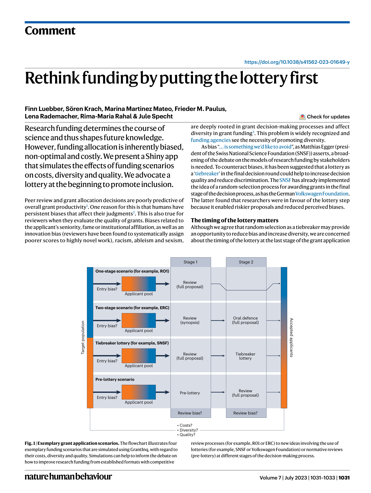

# Rethink Funding by Putting the Lottery First

> **저자**: Finn Luebber, Sören Krach, Marina Martinez Mateo, Frieder M. Paulus, Lena Rademacher, Rima-Maria Rahal, Jule Specht | **날짜**: 2023 | **Journal**: Nature Human Behaviour | **DOI**: 10.1038/s41562-023-01649-y | **arXiv**: -
> **리뷰 모드**: PDF

---

## Essence

연구비 배분의 편향을 줄이려면 어떻게 해야 하는가? 이 논문은 기존의 "마지막 단계 복권(tiebreaker lottery)" 대신 **지원 과정의 첫 단계에 복권을 배치하는 "Pre-lottery" 방식**을 제안한다. 이를 시뮬레이션하는 Shiny 앱 'GrantInq'를 개발하여, 복권 위치에 따른 비용·다양성·질적 효과를 비교한다. 복권을 먼저 배치하면 진입 장벽(entry bias)을 제거하고 역사적으로 소외된 연구자의 참여를 높일 수 있다.

*Figure 1: 네 가지 연구비 지원 시나리오(One-stage, Two-stage, Tiebreaker, Pre-lottery)의 흐름도 비교*

## Originality (Abstract 기반)

- **rule_base_novelty**: 복권의 위치(마지막 vs. 첫 단계)가 다양성과 형평성에 미치는 차별적 효과를 처음으로 체계화
- **rule_base_action**: 시뮬레이션 Shiny 앱(GrantInq)을 개발하여 공개
- **rule_base_result**: 조기 복권이 진입 편향을 제거하고 소외 집단 포함성을 높임

## How (방법론)

- **방법**: 연구비 시나리오 시뮬레이션 — 기존 R01(1단계), ERC(2단계), SNSF(복권 tiebreaker), Pre-lottery 방식 비교
- **평가 지표**: 비용(cost), 다양성(diversity), 질(quality) 3차원
- **도구**: 오픈소스 R Shiny 앱 'GrantInq' (OSI Lübeck, GitHub)
- **이론적 근거**: 진입 편향, 심사 편향, 체계적 오프셋, 언어 편향, 학문 편향 문헌 검토

## Why (중요성)

연구비 심사는 인종, 성별, 경력, 소속 기관 편향에 취약하다. 기존의 복권 tiebreaker는 이미 편향이 작용한 최종 단계에서 적용되어 효과가 제한적이다. 복권을 첫 단계에 배치하면 전통적으로 소외된 집단이 제안서를 작성하기도 전에 탈락하는 구조를 깰 수 있다.

## Limitation

### 저자들이 언급한 한계
- 실제 실험이 아닌 시뮬레이션 기반 제안으로 현실 검증 필요
- 모든 자격 보유자가 복권에 참여하는 자동화 시스템 구축의 기술적·제도적 어려움

### 자체판단 아쉬운 점
- 연구의 "질"을 어떻게 정의하고 측정할지에 대한 논의가 충분하지 않음
- 분야별 특성 차이(기초 vs. 응용, 대규모 vs. 소규모 연구)를 반영한 시뮬레이션 필요

## Further Study

- Pre-lottery 방식의 파일럿 실험 설계 및 실제 도입
- 복권 방식이 연구 위험 감수(risk-taking)와 혁신성에 미치는 장기 효과 분석

## 평가

| 항목 | 점수 |
|------|------|
| Novelty | 4/5 |
| Technical Soundness | 3/5 |
| Significance | 4/5 |
| Clarity | 5/5 |
| Overall | 4/5 |

**총평**: 연구비 배분의 형평성 문제에 대한 참신한 해결책을 제시하고 시뮬레이션 도구로 구체화한 실용적 제안으로, 펀딩 개혁 논의에 유용한 기여이다.
