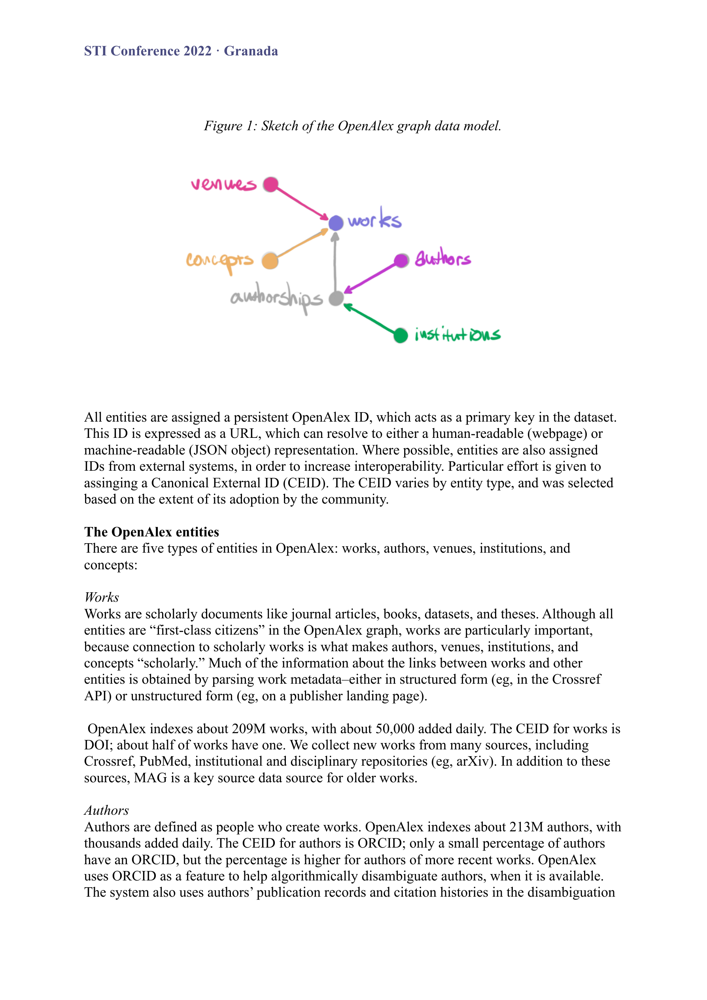

# OpenAlex: A Fully-Open Index of Scholarly Works, Authors, Venues, Institutions, and Concepts

> **저자**: Jason Priem, Heather Piwowar, Richard Orr | **날짜**: 2022 | **Journal**: arXiv | **DOI**: - | **arXiv**: 2205.01833
> **리뷰 모드**: PDF

---

## Essence

Microsoft Academic Graph(MAG) 중단 이후 완전 무료·공개 학술 데이터베이스 공백을 무엇으로 메울 수 있는가? OpenAlex는 2억 9백만 편의 논문, 2억 1,300만 명의 저자, 12만 4천 개 학술지, 10만 9천 개 기관, 6만 5천 개 개념을 포함하는 **100% 오픈 학술 지식 그래프**로서 MAG의 직접 대체재로 설계되었다. 완전한 데이터 공개, 오픈 API, 오픈소스 코드를 통해 학술 메타데이터의 민주화를 추구한다.

*Figure 1: OpenAlex 그래프 데이터 모델 — Works, Authors, Venues, Institutions, Concepts 5종 엔티티와 연결 구조*

## Originality (Abstract 기반)

- **rule_base_novelty**: MAG 종료 이후 완전 오픈(데이터·API·코드) 학술 지식 그래프를 최초로 구축
- **rule_base_action**: 5가지 엔티티 유형(Works, Authors, Venues, Institutions, Concepts)에 persistent ID 부여
- **rule_base_result**: 2억 9백만 편 논문 인덱싱, 매일 5만 편 추가

## How (방법론)

- **데이터 수집**: Crossref, PubMed, arXiv, 기관 저장소 등 수백 개 소스 통합
- **저자 모호성 해소**: ORCID + 출판 이력 + 인용 패턴 기반 알고리즘
- **기관 연결**: NLP 기반 affiliation 파싱 + ROR ID 연결 (94% 커버리지)
- **개념 분류**: MAG 기반 개념 트리 + CNN 기반 딥러닝 분류기 (위키피디아 학습)
- **오픈 인프라**: REST API, 전체 데이터 스냅샷 다운로드, PostgreSQL/Elasticsearch 지원

## Why (중요성)

Scopus, Web of Science 같은 상용 데이터베이스는 접근 비용이 높아 저소득 국가와 소규모 기관의 연구 평가·분석을 제한한다. 완전 무료·오픈 학술 그래프는 과학 측정학(scientometrics), 연구 평가, 지식 발견의 민주화를 가능하게 한다.

## Limitation

### 저자들이 언급한 한계
- 초기 런칭 단계라 데이터 품질이 Scopus/WoS보다 낮은 부분 존재
- 저자 모호성 해소 알고리즘이 흔한 이름에서 오류율 높음
- 인문학 및 일부 SSH 분야 커버리지 불균등

### 자체판단 아쉬운 점
- 개념 분류 정확도에 대한 체계적 검증 데이터가 부족
- 2022년 논문 기준으로 이후 확장/개선 현황이 반영되지 않음

## Further Study

- 저자 모호성 해소 정확도 향상을 위한 ML 모델 고도화
- OpenAlex 기반 연구 평가 표준 지표 개발

## 평가

| 항목 | 점수 |
|------|------|
| Novelty | 4/5 |
| Technical Soundness | 4/5 |
| Significance | 5/5 |
| Clarity | 5/5 |
| Overall | 5/5 |

**총평**: 학술 메타데이터의 완전 개방화를 실현한 중요한 인프라 논문으로, 과학 측정학 연구의 접근성을 근본적으로 개선하는 기여를 했다.
