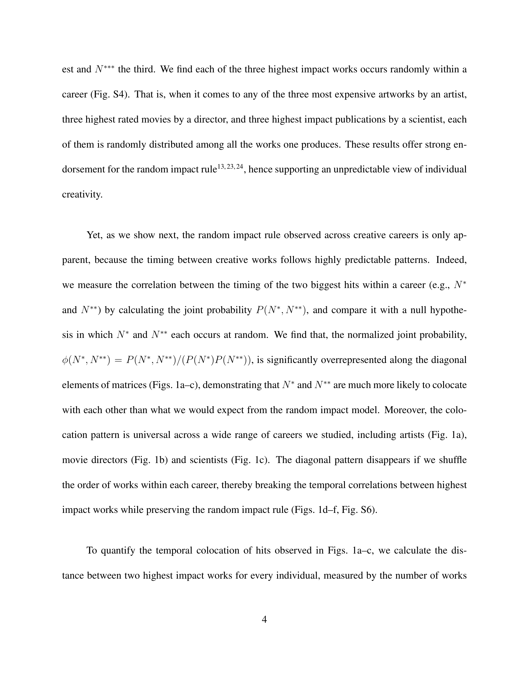

# Hot Streaks in Artistic, Cultural, and Scientific Careers

> **저자**: Lu Liu, Yang Wang, Roberta Sinatra, C. Lee Giles, Chaoming Song, Dashun Wang | **날짜**: 2018 | **Journal**: Nature | **DOI**: 10.1038/s41586-018-0315-8 | **arXiv**: -
> **리뷰 모드**: PDF

---

## Essence

창의적 경력에서 "hot streak"(연속 히트 구간)는 실제로 존재하는가, 아니면 무작위적 성공의 환상인가? 이 논문은 예술가(3,480명), 영화감독(6,233명), 과학자(20,040명)의 대규모 경력 데이터를 분석하여 **hot streak가 실재하며, 대다수 개인이 적어도 한 번의 hot streak를 경험한다**는 것을 밝혔다. Hot streak는 생산성 증가 없이 발생하고, 경력 내 무작위 시점에 출현하며, 그 기간 동안 생산된 작품이 경력 전체 성과를 좌우한다.

*Figure 1: 과학자·예술가·영화감독의 경력에서 hot streak 탐지를 위한 HMM 기반 분석 프레임워크*

## Originality (Abstract 기반)

- **rule_base_novelty**: 세 가지 창의적 도메인(미술, 영화, 과학)에서 hot streak의 보편성을 처음으로 정량적으로 입증
- **rule_base_action**: Hidden Markov Model(HMM)로 연속적 임팩트 변화에서 hot streak 구간을 자동 탐지
- **rule_base_finding**: Hot streak는 경력 내 무작위로 출현하고, 생산성 증가 없이 발생하며, 대부분 1회에 그침

## How (방법론)

- **데이터**: D1(경매 기록 3,480명 화가), D2(IMDB 6,233명 감독), D3(WoS+Google Scholar 20,040명 과학자)
- **임팩트 지표**: 예술품 경매 hammer price, 영화 IMDB 평점, 논문 C10(10년 피인용 수)
- **모델**: Hidden Markov Model(HMM) — 2-state (normal vs. hot) 상태 자동 분류
- **검증**: 합성 데이터로 HMM 탐지 정확도 검증, 분야별 강건성 확인

## Why (중요성)

Hot streak가 무작위가 아니라 실재한다면, 이 시기를 사전에 식별하고 지원하는 것이 개인의 잠재력 극대화에 중요하다. 또한 hot streak가 생산성 증가 없이 발생한다는 발견은 단순히 많이 쓰는 것이 아니라 "집중과 탐구" 간 균형에서 성과가 발생함을 시사한다.

## Limitation

### 저자들이 언급한 한계
- 임팩트 지표(피인용 수, 경매가)가 창의적 가치를 완전히 반영하지 못할 수 있음
- HMM이 탐지하는 hot streak의 정의가 모델에 의존적

### 자체판단 아쉬운 점
- Hot streak가 왜 시작되고 끝나는지 원인 메커니즘 규명이 부족
- 개인의 심리적 상태, 협력 패턴, 환경 변화와 hot streak의 관계 분석 없음

## Further Study

- Hot streak 시작 전 선행 지표(탐색 vs. 활용 패턴) 분석
- Hot streak 예측 모델 개발로 펀딩·멘토링 정책에 활용

## 평가

| 항목 | 점수 |
|------|------|
| Novelty | 5/5 |
| Technical Soundness | 4/5 |
| Significance | 5/5 |
| Clarity | 5/5 |
| Overall | 5/5 |

**총평**: 창의적 경력의 hot streak 현상을 세 도메인에서 대규모로 실증하고, 이것이 생산성이 아닌 집중도의 변화에서 비롯됨을 밝힌 중요한 연구이다.
