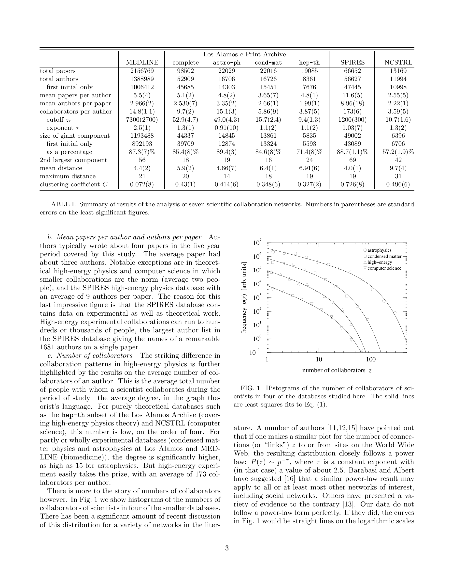

# The Structure of Scientific Collaboration Networks

> **저자**: M. E. J. Newman | **날짜**: 2001 | **Journal**: Proceedings of the National Academy of Sciences | **DOI**: 10.1073/pnas.98.2.404 | **arXiv**: -
> **리뷰 모드**: PDF

---

## Essence

과학자들의 공동 저작 네트워크는 어떤 구조를 가지고 있는가? 이 논문은 MEDLINE(생의학), Los Alamos e-Print Archive(물리학), NCSTRL(컴퓨터 과학) 등 세 개 대형 데이터베이스를 분석하여 **과학 협력 네트워크가 "작은 세계(small-world)" 구조를 형성하며, 임의로 선택된 두 과학자 사이의 평균 경로가 매우 짧다**는 것을 실증했다. 동시에 분야별 협력 패턴의 차이(물리학의 대규모 그룹 vs. 생의학·컴퓨터과학의 소규모 팀)도 정량화했다.

*Figure 1: 과학 협력 네트워크의 구조 분석 — 협력자 수 분포와 네트워크 특성*

## Originality (Abstract 기반)

- **rule_base_novelty**: 과학 공동 저작 네트워크에 대한 최초의 대규모 정량적 구조 분석
- **rule_base_finding**: 세 분야 모두 소세계(small-world) 특성 확인 — 짧은 경로 길이, 높은 클러스터링 계수
- **rule_base_result**: 물리학 네트워크가 생의학·CS보다 훨씬 높은 연결성과 대형 협력 그룹 보유

## How (방법론)

- **데이터**: MEDLINE(1995~1999, 2백만 저자), e-Print Archive(1995~1999, 5만 저자), NCSTRL(1995~1999, 1.1만 저자)
- **네트워크 구성**: 논문을 공동 저작한 두 과학자를 연결 (가중 엣지 포함)
- **측정 지표**: 평균 연결 수(degree), 클러스터링 계수, 평균 최단 경로 길이, 거대 연결 성분 크기
- **비교**: 랜덤 그래프 모델과의 비교로 실제 네트워크의 특이성 규명

## Why (중요성)

과학 협력 네트워크의 구조를 이해하는 것은 지식 확산, 연구비 배분, 연구 그룹 형성 정책의 근거가 된다. 소세계 구조는 아이디어와 정보가 과학 공동체 전반에 빠르게 전파될 수 있음을 의미한다.

## Limitation

### 저자들이 언급한 한계
- 1990년대 후반 데이터만 사용, 시간적 변화 미반영
- 저자 동명이인(name disambiguation) 문제로 일부 오류 포함 가능

### 자체판단 아쉬운 점
- 협력의 질(공동 아이디어 vs. 단순 기술 기여)을 네트워크 엣지로 구분하지 않음
- 지리적 요인이 협력 네트워크 형성에 미치는 영향 분석 부재

## Further Study

- 시간적 진화 — 인터넷 확산 이후 협력 네트워크 변화
- 협력 네트워크 구조와 연구 성과(임팩트, 혁신성) 간 상관관계 분석

## 평가

| 항목 | 점수 |
|------|------|
| Novelty | 5/5 |
| Technical Soundness | 5/5 |
| Significance | 5/5 |
| Clarity | 5/5 |
| Overall | 5/5 |

**총평**: 과학 협력 네트워크 연구의 출발점이 된 고전적 논문으로, 소세계 구조와 분야별 차이를 최초로 엄밀하게 정량화한 기념비적 기여이다.
