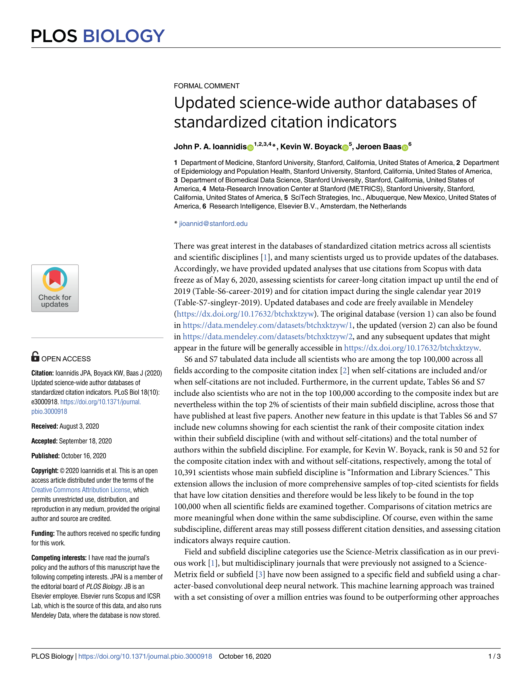

# Updated Science-Wide Author Databases of Standardized Citation Indicators

> **저자**: John P. A. Ioannidis, Kevin W. Boyack, Jeroen Baas | **날짜**: 2020 | **Journal**: PLOS Biology | **DOI**: 10.1371/journal.pbio.3000918 | **arXiv**: -
> **리뷰 모드**: PDF

---

## Essence

분야별 편향 없이 전 과학자를 비교할 수 있는 표준화된 인용 지표 데이터베이스가 가능한가? 이 논문은 Scopus 데이터를 기반으로 **22개 분야, 174개 하위 분야의 전 과학자를 아우르는 복합 인용 지표 데이터베이스**를 구축하고 업데이트했다. 상위 10만 명(또는 각 하위 분야 상위 2%) 과학자의 경력 전체 및 단일 연도 인용 순위를 공개하여, 분야 간 비교 가능한 인용 평가를 가능하게 한다.

*Figure 1: 복합 인용 지표 산출 방법론 및 분야별 과학자 데이터베이스 구조*

## Originality (Abstract 기반)

- **rule_base_novelty**: 22개 분야 전 과학자를 표준화된 복합 지표로 순위화한 최초의 전 분야 데이터베이스 업데이트
- **rule_base_action**: Science-Metrix 분류 + CNN 기반 다학제 저널 분류로 커버리지 확장
- **rule_base_result**: 경력 전체 및 단일 연도(2019) 인용 순위 공개 — 자기인용 포함/제외 버전 제공

## How (방법론)

- **데이터**: Scopus(2020년 5월 기준 freeze), 경력 전체(2019년까지) + 단일 연도(2019)
- **지표**: 논문 수, 피인용 수, h-index, hm-index, 공저자 수 조정 인용 등 6개 지표의 복합 점수
- **분류**: Science-Metrix 22개 분야/174개 하위 분야 + CNN으로 다학제 저널 추가 분류
- **공개**: Mendeley Data에 전체 데이터셋 공개

## Why (중요성)

인용 지표는 분야별로 인용 관행이 달라 직접 비교가 불가능하다. 표준화된 복합 지표는 연구자 평가, 연구비 심사, 기관 순위 산정에서 분야 편향을 줄이는 도구를 제공한다.

## Limitation

### 저자들이 언급한 한계
- Scopus 커버리지가 분야별로 불균등 (인문학, 사회과학 약함)
- 자기인용 조작 가능성 완전 제거 불가
- 논문 품질보다 논문 수가 많은 분야가 유리할 수 있음

### 자체판단 아쉬운 점
- 복합 지표 가중치 설정의 자의성
- 신진 연구자(적은 논문 수)에 불리한 구조

## Further Study

- OpenAlex 등 오픈 소스 데이터로 재현 및 확장
- 인용 지표 외 연구 영향력 측정 지표(altmetrics 등) 통합

## 평가

| 항목 | 점수 |
|------|------|
| Novelty | 3/5 |
| Technical Soundness | 4/5 |
| Significance | 4/5 |
| Clarity | 4/5 |
| Overall | 4/5 |

**총평**: 분야 표준화된 인용 지표 데이터베이스를 전 과학자 대상으로 공개한 실용적 기여로, 연구자 평가 시스템 개선에 널리 활용되는 참조 데이터셋이다.
