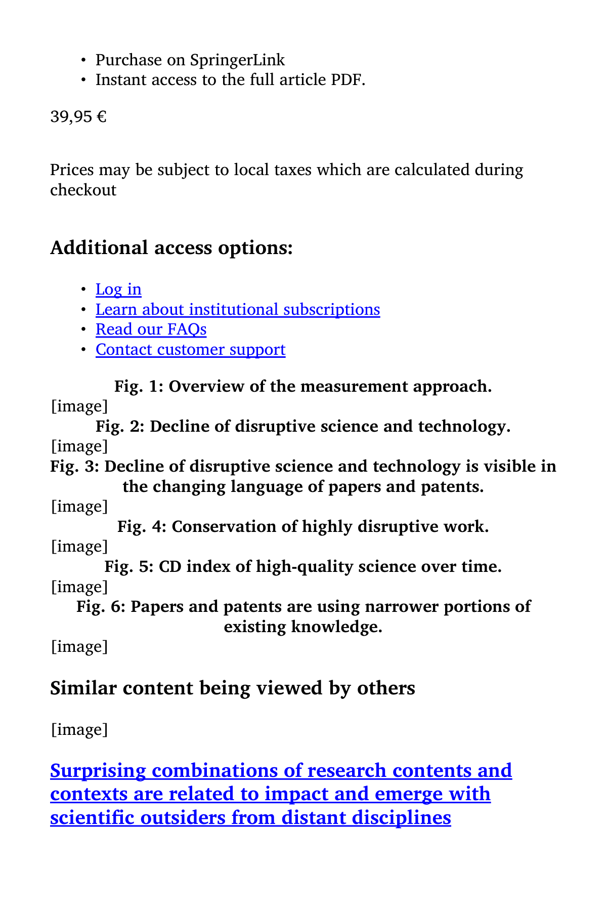

# Papers and Patents Are Becoming Less Disruptive Over Time

> **저자**: Michael Park, Erin Leahey, Russell J. Funk | **날짜**: 2023 | **Journal**: Nature | **DOI**: 10.1038/s41586-022-05543-x | **arXiv**: -
> **리뷰 모드**: PDF

---

## Essence

지식이 폭발적으로 증가하고 있는데, 왜 과학과 기술은 오히려 덜 혁신적이 되고 있는가? 이 논문은 6개 대형 데이터셋의 4,500만 편의 논문과 390만 건의 특허를 분석하여 **CD 지수(Consolidation-Disruption index)로 측정한 논문·특허의 혁신성이 지난 60년간 지속적으로 하락**했음을 실증했다. 이 하락은 모든 분야에서 보편적이며, 점점 좁아지는 지식 활용 범위(narrower knowledge use)가 핵심 원인으로 지목된다.

*Figure 1: CD 지수 측정 방법론 개요 — 논문이 기존 인용 네트워크를 파괴(disrupt)하는지 통합(consolidate)하는지 측정*

## Originality (Abstract 기반)

- **rule_base_novelty**: CD 지수를 이용해 과학·기술 혁신성의 60년 추세를 처음으로 전 분야 규모로 정량화
- **rule_base_finding**: 혁신성(disruption) 하락이 모든 분야에서 보편적이고 강건함
- **rule_base_result**: 하락 원인은 출판 품질 변화나 인용 관행이 아닌, 점점 좁아지는 지식 활용 범위

## How (방법론)

- **데이터**: APS, JSTOR, MAG, PatentsView, PubMed, WoS — 4,500만 논문 + 390만 특허 (6개 소스)
- **지표**: CD 지수 $CD_5 = \frac{n_f - n_b}{n_f + n_b + n_0}$ — 이후 논문이 초점 논문을 인용할 때 이전 피인용 논문도 함께 인용하는지 여부 측정
- **보조 지표**: 텍스트 기반 신규성 지표, 어휘 다양성 지표
- **통제 분석**: 인용 관행 변화, 출판 품질, 분야별 요인 등 대안 설명 검토

## Why (중요성)

지식 성장이 과학 진보를 자동으로 보장하지 않는다는 것을 실증적으로 보여준다. 연구 평가 시스템, 연구비 배분, 출판 관행이 혁신보다 점진적 발전을 장려하는 방향으로 작동하고 있음을 시사하며, 과학 정책의 근본적 재고를 촉구한다.

## Limitation

### 저자들이 언급한 한계
- CD 지수가 혁신성의 한 측면만 포착하며, 패러다임 전환의 중요성을 과소평가할 수 있음
- 일부 데이터셋(APS, JSTOR, WoS)은 접근 제한으로 제한적 공개

### 자체판단 아쉬운 점
- "지식 활용 범위 축소"의 원인(연구자 인센티브 vs. 인식론적 변화)을 구분하지 않음
- 비서구권 과학의 혁신성 추세가 포함되지 않을 수 있음

## Further Study

- 혁신성 하락의 제도적 원인(인센티브, 평가 시스템) 규명
- 학제간 연구가 혁신성 회복에 기여하는지 분석

## 평가

| 항목 | 점수 |
|------|------|
| Novelty | 5/5 |
| Technical Soundness | 5/5 |
| Significance | 5/5 |
| Clarity | 5/5 |
| Overall | 5/5 |

**총평**: 과학·기술의 혁신성 감소를 전례 없는 규모로 실증하고 그 원인을 지식 활용 범위 축소로 귀착시킨 이정표 논문으로, 과학 정책 전반에 깊은 함의를 갖는다.
