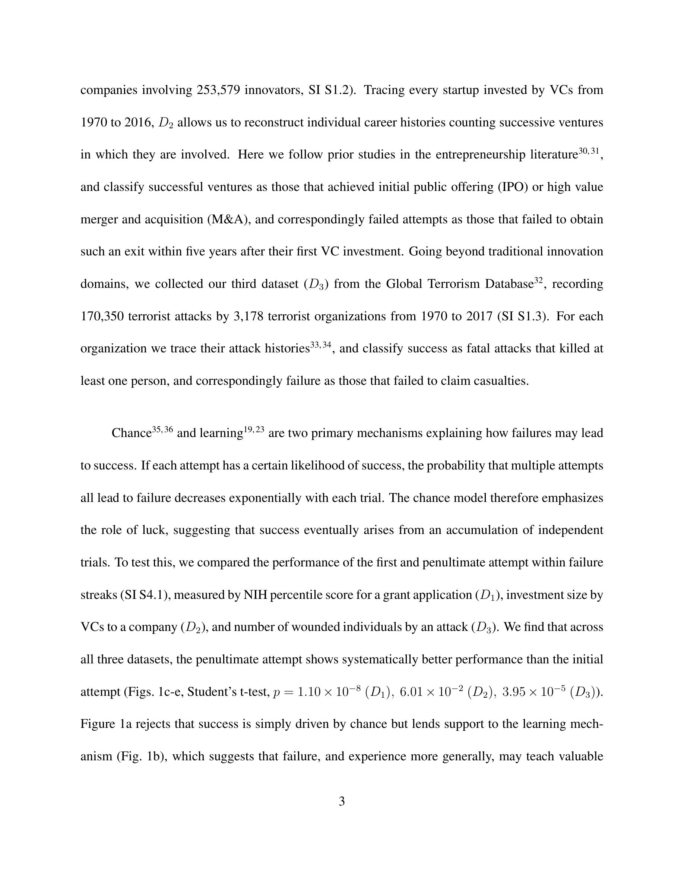

# Quantifying the Dynamics of Failure Across Science, Startups and Security

> **저자**: Yian Yin, Yang Wang, James A. Evans, Dashun Wang | **날짜**: 2019 | **Journal**: Nature | **DOI**: 10.1038/s41586-019-1725-y | **arXiv**: -
> **리뷰 모드**: PDF

---

## Essence

실패를 반복하는 사람들 중 결국 성공하는 사람과 그렇지 않은 사람을 어떻게 구별할 수 있는가? 이 논문은 NIH 연구비(139,091명), 스타트업(58,111개사), 테러 조직(3,178개)의 반복 시도 데이터를 분석하여 **성공한 집단은 실패할 때마다 시도의 효율성이 개선되지만, 실패한 집단은 개선이 없다**는 것을 밝혔다. 단순한 시도 횟수나 초기 역량이 아닌, **실패 사이에 무엇을 학습하는가**가 결정적 차이다.

*Figure 1: 실패 역학 모델 — 성공 집단과 실패 집단의 시도 간 효율성 궤적 비교*

## Originality (Abstract 기반)

- **rule_base_novelty**: 세 가지 전혀 다른 도메인(과학·창업·보안)에서 실패 역학의 보편적 패턴을 처음으로 정량화
- **rule_base_action**: 단일 매개변수 학습 모델 개발로 성공/실패 집단의 분기 임계점(critical threshold) 도출
- **rule_base_finding**: 성공 집단은 시도 간 효율성이 단조 증가, 실패 집단은 정체 또는 감소

## How (방법론)

- **데이터**: D1(NIH R01 77만 6천 건, 1985~2015), D2(VentureXpert 스타트업 5.8만 개, 1970~2016), D3(Global Terrorism Database 17만 건, 1970~2017)
- **모델**: 1-parameter 학습 모델 — 각 시도 간 효율성 개선율(improvement rate)을 추정
- **분기점 분석**: 임계값 이상(성공 궤도) vs. 이하(실패 궤도) 집단 비교
- **검증**: 초기 시도 데이터만으로 최종 결과 예측 가능성 검증

## Why (중요성)

실패는 성공의 어머니라는 통념이 옳은지, 그리고 어떤 실패가 성공으로 이어지는지를 이해하는 것은 인재 발굴, 연구비 지원, 창업 생태계 설계에 직결된다. 조기에 학습 패턴을 진단하여 타깃형 지원을 제공할 수 있다.

## Limitation

### 저자들이 언급한 한계
- 세 도메인 모두 관측 가능한(기록된) 실패만 포함 — 중도 포기는 분석 불가
- 학습 효율성 개선의 원인(내적 학습 vs. 외부 피드백)을 구분하지 않음

### 자체판단 아쉬운 점
- 테러 조직을 과학·창업과 같은 프레임으로 분석하는 것의 윤리적·방법론적 논쟁
- 개인 수준의 변화를 집단(조직) 수준에 적용하는 단위 분석 문제

## Further Study

- 실패 간 효율성 개선을 유도하는 구체적 개입(멘토링, 피드백 구조) 효과 실험
- 개인 특성(grit, resilience)과 학습 효율성 개선 간 관계 분석

## 평가

| 항목 | 점수 |
|------|------|
| Novelty | 5/5 |
| Technical Soundness | 5/5 |
| Significance | 5/5 |
| Clarity | 5/5 |
| Overall | 5/5 |

**총평**: 실패 역학을 세 도메인에서 보편적으로 정량화하고 성공/실패 집단의 조기 구별 가능성을 보인 탁월한 연구로, 과학 정책과 인재 육성 전략에 중요한 함의를 갖는다.
