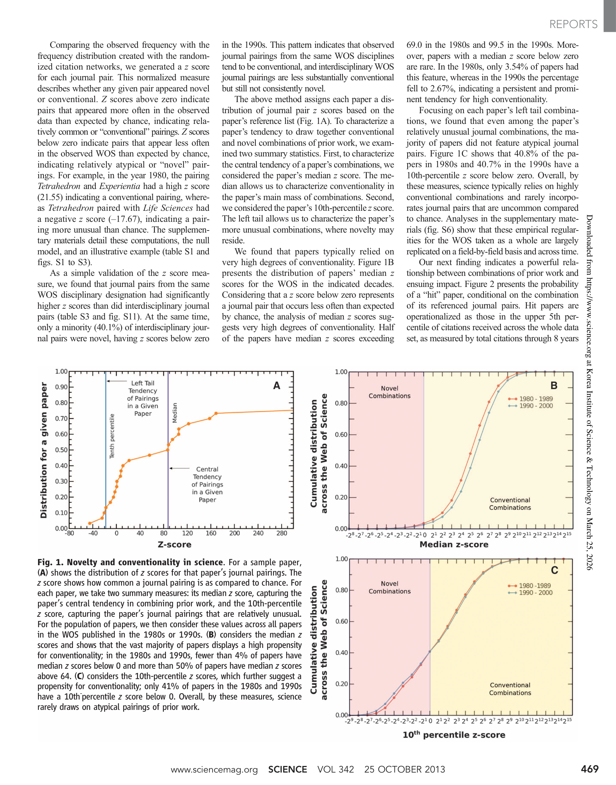

# Atypical Combinations and Scientific Impact

> **저자**: Brian Uzzi, Satyam Mukherjee, Michael Stringer, Ben Jones | **날짜**: 2013 | **Journal**: Science | **DOI**: 10.1126/science.1240474 | **arXiv**: -
> **리뷰 모드**: PDF

---

## Essence

높은 과학적 임팩트를 내는 연구는 관습적인가, 아니면 비관습적인가? 이 논문은 1,790만 편의 논문을 분석하여 **가장 높은 임팩트를 내는 과학은 압도적으로 관습적인 지식 조합에 기반하면서도, 동시에 비정상적(atypical)인 지식 조합을 소량 포함하는 '혼합 전략'을 구사한다**는 것을 밝혔다. 순수하게 비관습적이거나 순수하게 관습적인 논문 모두 임팩트가 낮으며, 이 혼합 패턴은 거의 모든 분야에서 보편적이다.

*Figure 1: 저널 쌍의 조합 참신성(novelty) 분포와 임팩트의 관계 — 높은 임팩트는 관습적+비관습적 혼합 구조*

## Originality (Abstract 기반)

- **rule_base_novelty**: 인용 조합의 참신성을 z-score로 정량화하여 임팩트와의 비선형 관계를 처음으로 전 분야에서 실증
- **rule_base_finding**: 최고 임팩트 논문은 상위 10% 관습성 + 하위 10% 비관습성의 혼합 — 피인용 확률 2배
- **rule_base_result**: 팀이 단독 저자보다 비관습적 조합 삽입 가능성 37.7% 높음

## How (방법론)

- **데이터**: WoS 1,790만 편 논문 (1954~2008) — 저널 쌍(journal pair) 공동 인용 분포 구성
- **참신성 측정**: 저널 쌍의 공동 인용 빈도를 기준으로 z-score 산출 — 낮은 z-score = 비관습적 조합
- **임팩트 측정**: 상위 5% 피인용 논문 포함 여부
- **회귀 분석**: 관습성·비관습성 수준, 팀 크기, 분야, 연도 통제

## Why (중요성)

혁신은 완전히 새로운 것의 발명이 아니라 기존 지식의 창의적 재조합에서 온다는 이론을 대규모로 검증했다. 또한 팀이 이러한 비관습적 조합을 더 잘 수행한다는 발견은 팀 과학의 가치를 재확인한다.

## Limitation

### 저자들이 언급한 한계
- 저널 쌍 기반 참신성이 진정한 지식 조합의 혁신성을 완전히 포착하지 못할 수 있음
- 1954~2008년 데이터로 최근 디지털 시대 변화 반영 미흡

### 자체판단 아쉬운 점
- 왜 특정 연구자가 비관습적 조합을 시도하는지 동기·경력 요인 분석 부재
- 비관습적 조합의 실패 사례(낮은 임팩트) 분석이 충분하지 않음

## Further Study

- AI 보조 연구가 비관습적 조합 생성을 늘리는지 분석
- 지식 지도(knowledge map) 기반 혁신 예측 시스템 개발

## 평가

| 항목 | 점수 |
|------|------|
| Novelty | 5/5 |
| Technical Soundness | 4/5 |
| Significance | 5/5 |
| Clarity | 5/5 |
| Overall | 5/5 |

**총평**: 과학적 혁신이 관습과 비관습의 창의적 혼합에서 발생한다는 것을 1,790만 편 논문으로 실증한 기념비적 연구이다.
