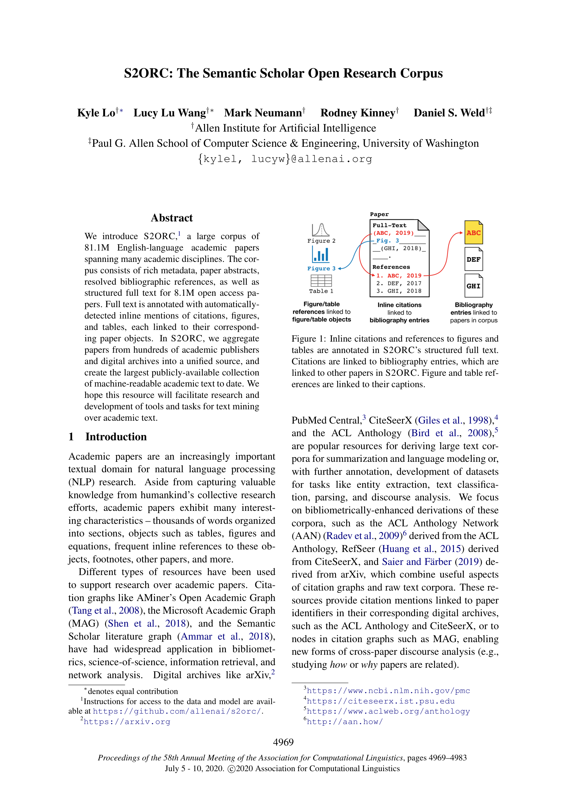

# S2ORC: The Semantic Scholar Open Research Corpus

> **저자**: Kyle Lo, Lucy Lu Wang, Mark Neumann, Rodney Kinney, Daniel Weld | **날짜**: 2020 | **Journal**: ACL 2020 | **DOI**: 10.18653/v1/2020.acl-main.447 | **arXiv**: -
> **리뷰 모드**: PDF

---

## Essence

학술 논문 전문 텍스트와 인용 그래프를 동시에 포함하는 대규모 공개 코퍼스가 존재하는가? S2ORC는 8,100만 편의 영어 학술 논문 메타데이터와 810만 편의 구조화된 전문 텍스트(인라인 인용, 그림·표 참조 포함)를 담은 **최대 규모의 공개 머신-리더블 학술 코퍼스**이다. 기존 최대 코퍼스(PubMed Central, 260만 편)의 3배 규모이며, 다학제적 커버리지를 제공한다.

*Figure 1: S2ORC 구조화 전문 텍스트 — 인라인 인용과 그림/표 참조가 논문 객체로 연결된 주석 구조*

## Originality (Abstract 기반)

- **rule_base_novelty**: 인라인 인용·그림·표 참조가 논문 객체로 연결된 구조화 전문 텍스트를 최초로 대규모 공개
- **rule_base_action**: PDF 파싱(8.1M) + LaTeX 파싱(1.5M) 이중 파이프라인으로 고품질 추출
- **rule_base_result**: 810만 편 전문 텍스트 + 8,100만 편 메타데이터, 다학제 커버리지

## How (방법론)

- **수집 소스**: 수백 개 출판사·디지털 아카이브 (arXiv, PubMed Central, ACL Anthology 등)
- **파싱 파이프라인**: PDF → Science Parse v2 (전문 구조 추출), LaTeX → LaTeXML (정확한 수식·구조 추출)
- **연결**: 인라인 인용 → 참고문헌 → 논문 객체, 그림/표 레퍼런스 → 캡션
- **배포**: 전체 데이터셋 공개 (GitHub: allenai/s2orc)

## Why (중요성)

학술 텍스트 마이닝, 인용 맥락 분석, 논문 요약, 지식 추출 등 NLP 연구에 핵심 자원을 제공한다. 특히 인용 맥락(citation context)과 논문 그래프의 통합은 과학의 지식 흐름을 언어 수준에서 분석하는 새로운 가능성을 열었다.

## Limitation

### 저자들이 언급한 한계
- PDF 파싱 오류율이 LaTeX 파싱보다 높음 (레이아웃 복잡성)
- 영어 논문만 포함 — 다국어 학술 문헌 제외
- 오픈 액세스 논문 위주라 전체 학술 문헌의 편향된 샘플

### 자체판단 아쉬운 점
- 수식 파싱 정확도에 대한 체계적 평가 부재
- 시간에 따른 데이터 업데이트 지속성 불명확

## Further Study

- 다국어 버전 확장
- 수식·알고리즘 인식 개선으로 STEM 논문 파싱 품질 향상

## 평가

| 항목 | 점수 |
|------|------|
| Novelty | 4/5 |
| Technical Soundness | 4/5 |
| Significance | 5/5 |
| Clarity | 5/5 |
| Overall | 4/5 |

**총평**: 학술 NLP 연구의 핵심 인프라를 제공하는 중요한 데이터셋 논문으로, 구조화된 전문 텍스트와 인용 그래프의 통합이 과학 텍스트 마이닝 연구를 크게 촉진했다.
