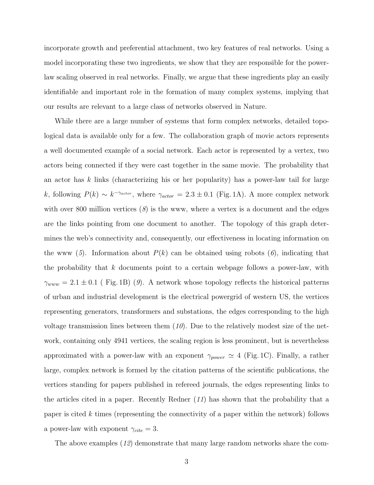

# Emergence of Scaling in Random Networks

> **저자**: Albert-László Barabási, Réka Albert | **날짜**: 1999 | **Journal**: Science | **DOI**: 10.1126/science.286.5439.509 | **arXiv**: -
> **리뷰 모드**: PDF

---

## Essence

왜 인터넷, 영화 배우 협력 네트워크, 과학 인용 네트워크 등 다양한 실제 네트워크는 멱함수(power-law) 연결도 분포를 보이는가? 이 논문은 **성장(growth)과 선호적 연결(preferential attachment)이라는 두 가지 단순 메커니즘만으로 scale-free 네트워크가 자연적으로 출현**함을 보였다. 이전의 Erdos-Renyi 랜덤 그래프 모델이 설명하지 못했던 실제 네트워크의 허브(hub) 구조가 이 두 메커니즘에서 기인한다.

*Figure 1: 영화배우 협력 네트워크, WWW, 전력망의 연결도 분포 — 멱함수 $P(k) \sim k^{-\gamma}$ 확인*

## Originality (Abstract 기반)

- **rule_base_novelty**: Scale-free 네트워크의 출현을 성장 + 선호적 연결의 두 메커니즘으로 설명하는 Barabási-Albert(BA) 모델 최초 제안
- **rule_base_finding**: $P(k) \sim k^{-\gamma}$의 멱함수 분포가 성장하는 모든 네트워크에서 보편적으로 나타남
- **rule_base_result**: BA 모델이 정적 고정점(stationary scale-free state)으로 수렴함을 분석적으로 증명

## How (방법론)

- **실증 데이터**: 영화 배우 협력 네트워크(γ=2.3), WWW(γ=2.1), 전력망(지수형)
- **모델**: 매 시간 단계에 새 노드 추가 + 기존 노드의 연결도에 비례한 확률로 연결(preferential attachment)
- **분석적 해**: Mean-field 방정식으로 $P(k) \sim k^{-3}$ 유도
- **비교**: Erdos-Renyi 모델, Watts-Strogatz 모델과의 차이 분석

## Why (중요성)

이 논문은 복잡 네트워크 과학(complex network science)의 탄생을 알린 이정표 논문이다. Scale-free 구조는 인터넷의 취약점(허브 공격에 취약), 전염병 확산, 과학 지식 전파 등 수많은 현상을 설명하는 보편적 프레임워크를 제공했다.

## Limitation

### 저자들이 언급한 한계
- 실제 네트워크에서 $\gamma$ 값이 3에서 벗어나는 경우가 많아 추가 메커니즘 필요
- 선호적 연결의 측정 방법론 불명확

### 자체판단 아쉬운 점
- 네트워크 제거(node removal) 문제는 다루지 않음
- 유향 그래프(directed network)로의 일반화 별도 논의 필요

## Further Study

- Scale-free 구조의 견고성(robustness) 및 공격 취약성 분석
- 가중 네트워크, 다층 네트워크로 BA 모델 확장

## 평가

| 항목 | 점수 |
|------|------|
| Novelty | 5/5 |
| Technical Soundness | 5/5 |
| Significance | 5/5 |
| Clarity | 5/5 |
| Overall | 5/5 |

**총평**: 복잡 네트워크 과학의 기초를 세운 역사적 논문으로, 성장과 선호적 연결이라는 단순 메커니즘으로 scale-free 네트워크의 보편성을 설명한 획기적인 기여이다.
