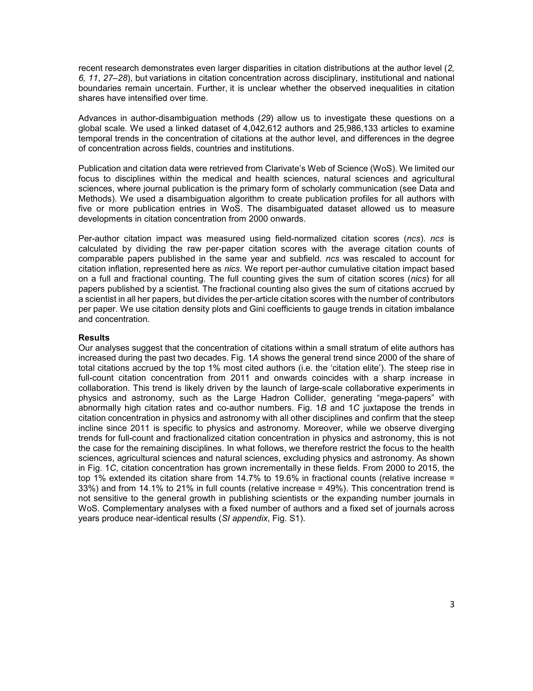

# Global Citation Inequality Is on the Rise

> **저자**: Mathias Wullum Nielsen, Jens Peter Andersen | **날짜**: 2021 | **Journal**: Proceedings of the National Academy of Sciences | **DOI**: 10.1073/pnas.2012208118 | **arXiv**: -
> **리뷰 모드**: PDF

---

## Essence

과학에서 피인용 불평등은 증가하고 있는가, 감소하고 있는가? 이 논문은 400만 명의 저자와 2,600만 편의 논문 데이터를 분석하여 **상위 1%의 최다 인용 과학자들이 전체 인용의 점유율을 2000~2015년 동안 14%에서 21%로 확대**했음을 밝혔다. Gini 계수도 0.65에서 0.70으로 상승했다. 불평등은 자연과학, 의학, 농업과학 전반에서 증가하고 있으며, 엘리트 과학자들이 더 많은 협력과 출판을 통해 격차를 벌이고 있다.

*Figure 1: 2000~2015년 과학자 인용 점유율 분포 변화 — 상위 1%의 점유율 증가와 Gini 계수 상승*

## Originality (Abstract 기반)

- **rule_base_novelty**: 15년 × 118개 학문 분야에 걸친 저자 수준 인용 불평등의 최초 종단 분석
- **rule_base_finding**: 상위 1% 인용 점유율 14% → 21% (2000→2015), Gini 계수 0.65 → 0.70
- **rule_base_result**: 상위 1% 엘리트는 협력 증가로 전체 논문 수·인용 수를 동시 확대, 일반 과학자는 협력은 늘었지만 개인 기여(fractional output)는 감소

## How (방법론)

- **데이터**: Web of Science 기반 400만 저자, 2,600만 논문 (2000~2015)
- **불평등 지표**: Gini 계수, 상위 1%·10% 인용 점유율
- **구분 분석**: 전체 인용(full-count) vs. 분수 인용(fractional-count, 공저자 수 보정)
- **지리 분석**: 상위 인용 과학자의 기관·국가별 분포 변화

## Why (중요성)

인용 불평등 증가는 Matthew 효과의 심화를 나타내며, 과학 생태계에서 소수 엘리트 집중과 다양성 감소를 의미한다. 이는 연구비 배분, 대학 순위, 학문 공동체의 형평성 논의에 직접적 함의를 갖는다.

## Limitation

### 저자들이 언급한 한계
- WoS 커버리지 편향 — 비영어권 및 사회과학·인문학 과소 대표
- 저자 동명이인 문제로 일부 개인 수준 분석에 오류 가능

### 자체판단 아쉬운 점
- 인용 불평등 증가가 능력 차이 증가인지 시스템 편향인지 구분 불가
- 성별·인종과 인용 불평등 교차 분석 부재

## Further Study

- OpenAlex 등 오픈 데이터로 인문학·비영어권 포함 확장
- 인용 불평등과 연구 영향력(사회적 임팩트) 간 관계 분석

## 평가

| 항목 | 점수 |
|------|------|
| Novelty | 4/5 |
| Technical Soundness | 4/5 |
| Significance | 4/5 |
| Clarity | 4/5 |
| Overall | 4/5 |

**총평**: 과학계 인용 불평등의 장기적 심화를 처음으로 대규모 종단 분석으로 실증한 연구로, 과학 생태계의 구조적 불평등 논의에 중요한 실증적 기반을 제공한다.
