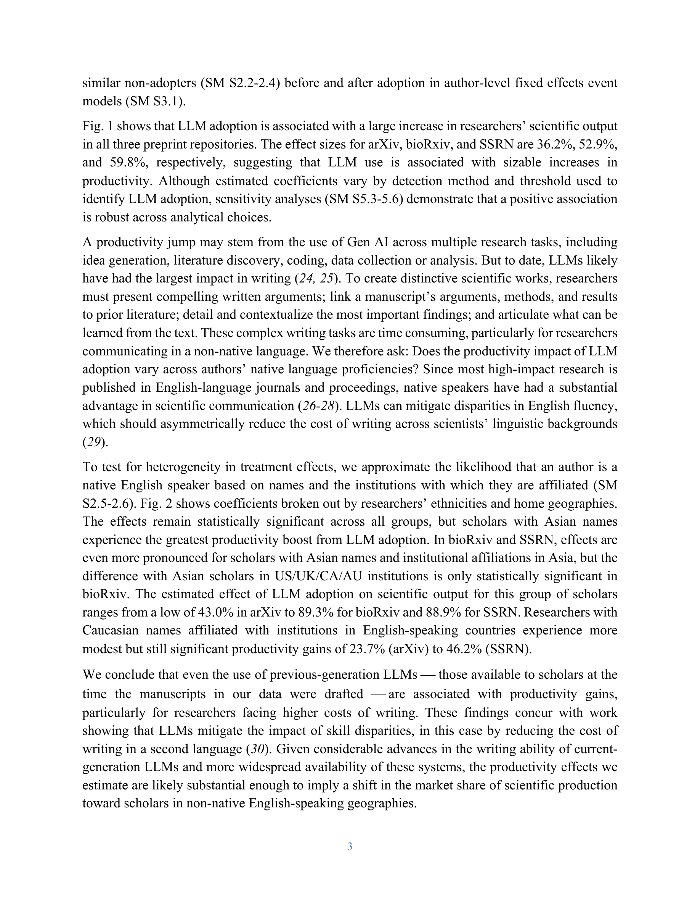

# Scientific Production in the Era of Large Language Models

> **저자**: Keigo Kusumegi, Xinyu Yang, Paul Ginsparg, Mathijs de Vaan, Toby Stuart, Yian Yin | **날짜**: 2025 | **Journal**: Science | **DOI**: 10.1126/science.adw3000 | **arXiv**: -
> **리뷰 모드**: PDF

---

## Essence

LLM은 과학 생산성을 높이는가, 아니면 과학의 질을 떨어뜨리는가? 이 논문은 210만 건의 프리프린트, 2만 8천 건의 동료 심사 보고서, 2억 4,600만 건의 온라인 접근 기록을 분석하여 **LLM 채택 저자는 논문 생산량이 23.7~89.3% 증가하지만, 글쓰기 복잡성은 높아지고 실질적 내용은 오히려 빈약해지는 역설**이 나타남을 밝혔다. 또한 LLM 채택자들은 더 다양한 선행 연구(책, 최신·비인용 문헌)를 참고하는 것으로 나타났다.

*Figure 1: LLM 채택 여부 탐지 방법론과 주요 분석 프레임워크 — arXiv, bioRxiv, SSRN 세 데이터셋 기반*

## Originality (Abstract 기반)

- **rule_base_novelty**: LLM 사용이 과학 생산성·품질·다양성에 미치는 영향을 다중 대규모 데이터셋으로 동시 분석한 최초 연구
- **rule_base_finding**: LLM 채택 후 생산성 23.7~89.3% 증가, 그러나 내용 수준은 하락 ("linguistically complex but substantively underwhelming")
- **rule_base_result**: LLM 채택자의 인용 출처가 더 다양해짐 — 책, 젊고 덜 인용된 논문 포함

## How (방법론)

- **데이터**: arXiv(120만), bioRxiv(22.1만), SSRN(67.6만) 프리프린트 (2018년 1월~2024년 6월)
- **LLM 탐지**: ChatGPT 이전 인간 작성 텍스트 vs. GPT-3.5 재작성 텍스트의 토큰 분포 비교 → 채택 임계값 설정
- **생산성 분석**: 첫 LLM 채택 전후 월별 논문 제출 수 변화 (diff-in-differences 방식)
- **품질 평가**: 동료 심사 점수, 온라인 접근 패턴, 언어적 복잡성 지표

## Why (중요성)

LLM이 과학 글쓰기를 지원하면서 표면적 복잡성은 높이지만 실질적 기여는 줄이는 패턴은 저널, 연구비 기관, 테뉴어 위원회가 논문 평가 기준을 재설계해야 함을 시사한다. AI 시대 과학 생산 시스템 전반의 재고를 촉구하는 경고이다.

## Limitation

### 저자들이 언급한 한계
- LLM 탐지 알고리즘이 완벽하지 않으며 오분류 가능성 존재
- 핵심 AI 하위 분야 논문은 분석에서 제외 (AI 연구 폭발 효과 통제 목적)

### 자체판단 아쉬운 점
- 논문의 "실질적 내용 수준"을 어떻게 측정하는지 방법론적 불명확성
- LLM 사용이 연구자의 독창적 사고를 대체하는지, 보조하는지 인과 구분 어려움

## Further Study

- LLM 사용 공시 의무화 및 탐지 도구의 정확도 향상
- LLM 채택 효과의 분야별·경력 단계별 이질성 분석

## 평가

| 항목 | 점수 |
|------|------|
| Novelty | 5/5 |
| Technical Soundness | 4/5 |
| Significance | 5/5 |
| Clarity | 5/5 |
| Overall | 5/5 |

**총평**: LLM 시대 과학 생산의 구조적 변화를 처음으로 대규모 실증한 시의적절한 연구로, AI 도구가 과학의 질과 다양성에 미치는 영향을 다층적으로 분석했다.
