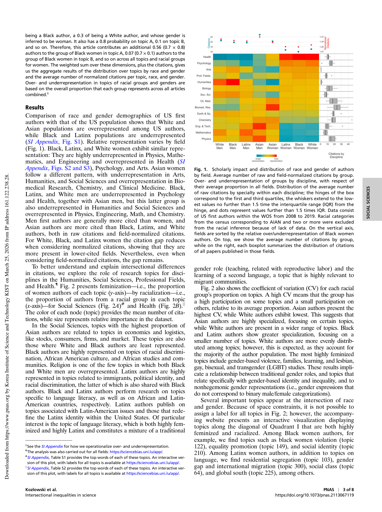

# Intersectional Inequalities in Science

> **저자**: Diego Kozlowski, Vincent Larivière, Cassidy R. Sugimoto, Thema Monroe-White | **날짜**: 2022 | **Journal**: Proceedings of the National Academy of Sciences | **DOI**: 10.1073/pnas.2113067119 | **arXiv**: -
> **리뷰 모드**: PDF

---

## Essence

과학에서의 불평등은 성별 또는 인종만으로 설명되는가, 아니면 이 두 정체성의 교차에서 추가적인 불이익이 발생하는가? 이 논문은 대규모 서지계량 분석을 통해 **교차적 정체성(인종 × 성별)이 연구 주제 선택과 인용 영향력에 독립적이고 추가적인 불이익을 야기**함을 밝혔다. 소수 집단 연구자는 자신의 정체성과 관련된 주제를 선택하는 경향이 있고, 이러한 주제는 체계적으로 낮은 인용을 받는다.

*Figure 1: 인종·성별 교차 정체성별 연구 주제 분포와 인용 영향력 격차*

## Originality (Abstract 기반)

- **rule_base_novelty**: 교차성(intersectionality) 이론을 과학계 불평등 분석에 최초로 대규모 계량서지학적으로 적용
- **rule_base_finding**: 인종·성별 교차 집단(예: 흑인 여성 연구자)이 각 범주 개별 효과의 합보다 큰 불이익을 경험
- **rule_base_result**: 소수 집단 연구자의 주제 선택이 인용 불이익을 심화시키는 이중 패널티(double penalty) 확인

## How (방법론)

- **데이터**: 미국 과학 인력 데이터 + 대규모 학술 논문 데이터베이스 (분야·기간 명시)
- **정체성 추정**: 이름 기반 인종·성별 추정 알고리즘 (Bayesian 방법)
- **주제 분류**: 논문 제목·초록 기반 연구 주제 클러스터링
- **인용 분석**: 동일 주제 내 교차 정체성별 인용 격차 측정 (within-topic citation disadvantage)

## Why (중요성)

소수 집단 연구자가 특정 주제(자신의 공동체와 관련된 문제)에 집중함으로써 과학 지식 기반을 다양화하지만, 동시에 인용 불이익으로 경력 손해를 입는 구조적 모순을 드러낸다. 이는 연구 자원 배분과 주제 다양성 정책의 근거를 제공한다.

## Limitation

### 저자들이 언급한 한계
- 이름 기반 인종·성별 추정의 오분류 가능성
- 미국 중심 분석으로 글로벌 일반화 제한

### 자체판단 아쉬운 점
- 교차 정체성의 더 세밀한 범주(예: 라틴계 여성 vs. 흑인 여성) 비교가 부족
- 인용 불이익이 주제 편향인지 네트워크 편향(동료 심사 위원 구성)인지 구분 어려움

## Further Study

- 소수 집단 연구자 주제의 장기적 인용 성장 추적
- 심사 익명화, 주제 다양성 장려 정책의 효과 검증

## 평가

| 항목 | 점수 |
|------|------|
| Novelty | 5/5 |
| Technical Soundness | 4/5 |
| Significance | 5/5 |
| Clarity | 4/5 |
| Overall | 5/5 |

**총평**: 교차성 이론을 계량서지학에 최초로 적용하여 과학계 불평등의 다층적 구조를 실증한 중요한 연구로, 다양성 정책 논의에 새로운 실증적 기반을 제공했다.
