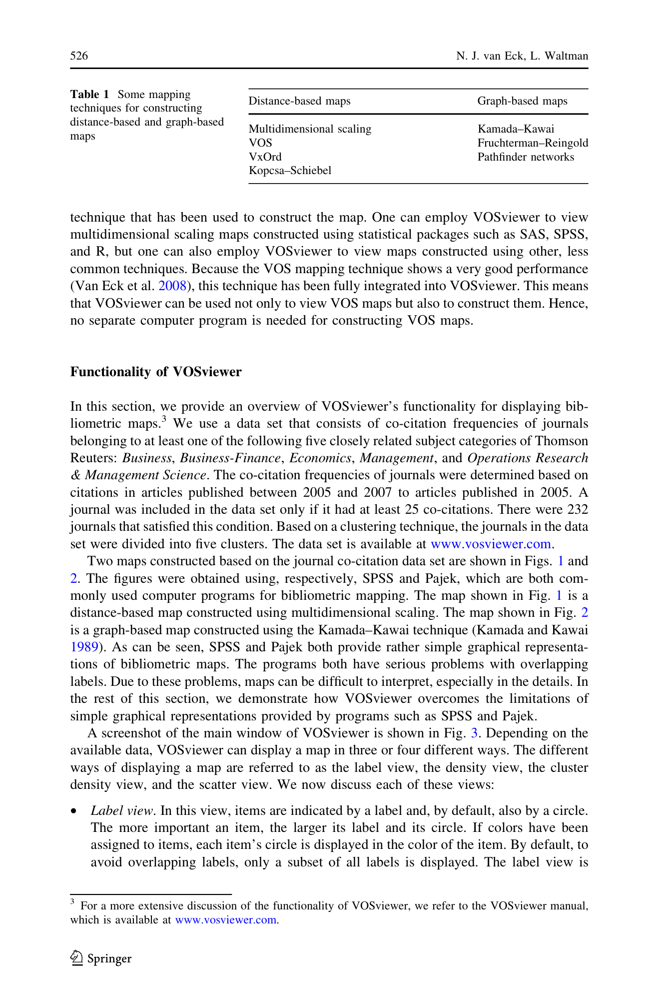

# Software Survey: VOSviewer, a Computer Program for Bibliometric Mapping

> **저자**: Nees Jan van Eck, Ludo Waltman | **날짜**: 2009 | **Journal**: Scientometrics | **DOI**: 10.1007/s11192-009-0146-3 | **arXiv**: -
> **리뷰 모드**: PDF

---

## Essence

대형 서지계량 지도(bibliometric map)를 직관적으로 시각화하는 도구가 필요한가? VOSviewer는 VOS(Visualization of Similarities) 기법을 기반으로 **최대 5,000개 이상의 항목을 포함하는 대형 서지계량 지도를 고품질로 구성하고 표시하는 무료 소프트웨어**이다. 줌, 스크롤, 검색, 밀도 시각화 등 기존 도구(SPSS, Pajek)가 제공하지 못한 대형 지도 특화 기능을 제공한다.

*Figure 1: VOSviewer로 구성한 5,000개 주요 학술지의 공동 인용 지도 — 군집 구조와 밀도 시각화*

## Originality (Abstract 기반)

- **rule_base_novelty**: VOS 매핑 기법 기반 대형 서지계량 지도 전용 시각화 소프트웨어 최초 개발
- **rule_base_action**: 공동 인용, 서지 결합, 키워드 공동 발생 등 다양한 입력 데이터 지원
- **rule_base_result**: 5,000개 주요 학술지 공동 인용 지도 구축 및 분야별 군집 시각화 성공

## How (방법론)

- **VOS 알고리즘**: 유사성 행렬에서 2D 좌표 최적화 — 유사한 항목을 가깝게 배치
- **시각화 기능**: 네트워크 뷰, 오버레이 뷰(시간/인용 정보), 밀도 뷰 (3가지 뷰 모드)
- **입력 형식**: 상관 행렬, 인접 행렬, 저자/저널 데이터 직접 파싱
- **성능**: 5,000개 항목 지도를 수 초 내 렌더링

## Why (중요성)

서지계량 지도는 과학 분야의 구조, 연구 프론트, 학문 간 연결을 시각화하는 핵심 도구이다. 기존 소프트웨어가 대형 지도에서 가독성을 잃는 문제를 해결함으로써, 연구 정책 결정자와 학자들이 방대한 학술 문헌의 지형도를 쉽게 파악할 수 있게 되었다.

## Limitation

### 저자들이 언급한 한계
- 지도 구성 알고리즘(VOS)이 모든 서지계량 분석에 최적이 아닐 수 있음
- 당시 입력 형식이 제한적 (이후 버전에서 크게 확장됨)

### 자체판단 아쉬운 점
- 초기 버전 논문으로 현재 VOSviewer의 기능(RIS, BibTeX 직접 파싱 등)을 반영하지 못함
- 지도 레이아웃의 재현성(reproducibility) 문제 미언급

## Further Study

- 동적(temporal) 서지계량 지도로 연구 트렌드 진화 시각화
- OpenAlex, Semantic Scholar 등 오픈 데이터와의 통합

## 평가

| 항목 | 점수 |
|------|------|
| Novelty | 4/5 |
| Technical Soundness | 4/5 |
| Significance | 5/5 |
| Clarity | 5/5 |
| Overall | 4/5 |

**총평**: 서지계량 지도 시각화의 실용적 한계를 돌파한 VOSviewer를 소개한 논문으로, 과학 지도화 연구의 표준 도구로 자리잡은 소프트웨어의 이론적·기술적 기반을 제시한다.
