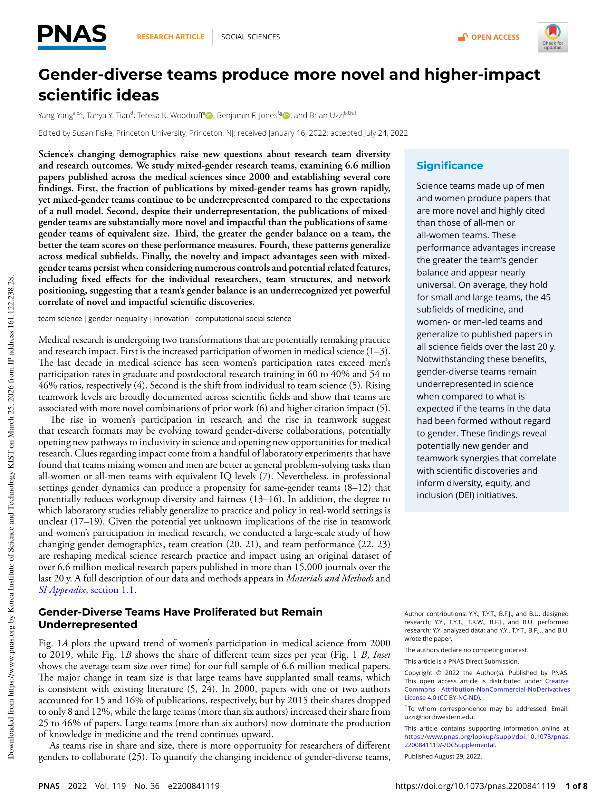

# Gender-Diverse Teams Produce More Novel and Higher-Impact Scientific Ideas

> **저자**: Yang Yang, Tanya Y. Tian, Teresa K. Woodruff, Benjamin F. Jones, Brian Uzzi | **날짜**: 2022 | **Journal**: Proceedings of the National Academy of Sciences | **DOI**: 10.1073/pnas.2200841119 | **arXiv**: -
> **리뷰 모드**: PDF

---

## Essence

성별 다양성이 높은 연구팀이 정말로 더 혁신적이고 임팩트 높은 논문을 발표하는가? 이 논문은 2000년 이후 의학 분야 660만 편의 논문을 분석하여 **성별 혼합 팀이 동성 팀보다 더 참신하고 높은 피인용을 기록**하며, 이 이점이 팀의 성별 균형이 높을수록 강해진다는 것을 밝혔다. 이 패턴은 의학 45개 하위 분야 전반에 걸쳐 보편적이며, 개인 고정효과 및 팀 구조 통제 후에도 유지된다.

*Figure 1: 2000~2019년 의학 연구에서 여성 참여 비율 증가 추세와 팀 규모 분포 변화*

## Originality (Abstract 기반)

- **rule_base_novelty**: 성별 다양성과 연구 참신성·임팩트의 관계를 660만 편 규모로 실증하고, 성별 균형 정도와 성과의 단조 관계를 최초로 확인
- **rule_base_finding**: 혼합 성별 팀이 동성 팀보다 더 참신한 논문, 높은 피인용 달성
- **rule_base_result**: 성별 균형이 클수록 이점 증가 — 팀 규모, 네트워크 위치, 개인 능력 통제 후에도 유지

## How (방법론)

- **데이터**: PubMed 기반 660만 편 의학 논문 (2000~2019), 15,000개 이상의 저널
- **성별 추정**: 이름 기반 성별 추정 알고리즘
- **참신성 측정**: 저널 조합 z-score (Uzzi et al. 2013 방법론 적용)
- **임팩트**: 5년 피인용 수
- **통제 변수**: 개인 저자 고정효과, 팀 크기, 네트워크 위치, 연구 분야

## Why (중요성)

성별 다양성이 단순 공정성의 문제가 아니라 연구 성과의 실질적 향상으로 이어진다는 것을 대규모로 실증했다. 이는 성별 다양성 촉진 정책이 윤리적 가치뿐 아니라 과학적 이익을 위해서도 필요함을 보여준다.

## Limitation

### 저자들이 언급한 한계
- 이름 기반 성별 추정의 한계 (비이진 성별, 동명이인 등)
- 의학 분야에 한정되어 다른 분야 일반화 제한

### 자체판단 아쉬운 점
- 성별 다양성이 왜 더 좋은 성과를 내는지 메커니즘(인지 다양성, 네트워크 차이) 분석 부족
- 팀 내 성별 권력 역학(예: 남성 PI + 여성 연구원)을 구분하지 않음

## Further Study

- 다른 과학 분야에서 성별 다양성 효과 검증
- 성별 다양성 효과의 지속성(팀 형성 이후 시간 경과에 따른 변화) 분석

## 평가

| 항목 | 점수 |
|------|------|
| Novelty | 4/5 |
| Technical Soundness | 4/5 |
| Significance | 5/5 |
| Clarity | 5/5 |
| Overall | 4/5 |

**총평**: 성별 다양성이 연구 혁신성과 임팩트를 실질적으로 향상시킴을 대규모 데이터로 실증한 중요한 연구로, 과학 인력 다양성 정책의 강력한 실증적 근거를 제공한다.
