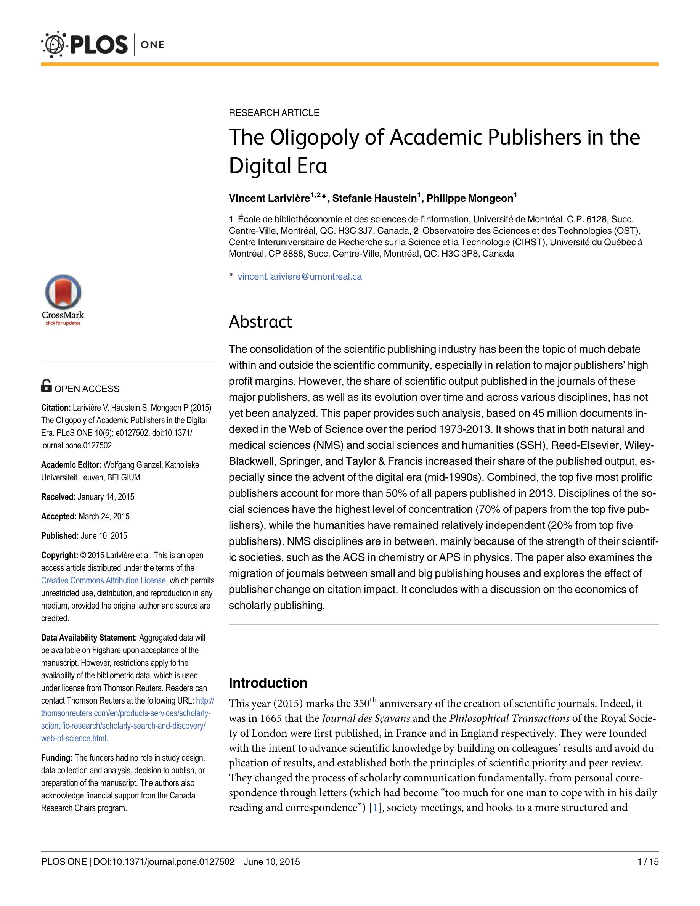

# The Oligopoly of Academic Publishers in the Digital Era

> **저자**: Vincent Larivière, Stefanie Haustein, Philippe Mongeon | **날짜**: 2015 | **Journal**: PLOS ONE | **DOI**: 10.1371/journal.pone.0127502 | **arXiv**: -
> **리뷰 모드**: PDF

---

## Essence

디지털 시대에 학술 출판은 더 분산되었는가, 아니면 오히려 소수 대형 출판사에 집중되었는가? 이 논문은 1973~2013년 WoS의 4,500만 편 논문을 분석하여 **Reed-Elsevier, Wiley-Blackwell, Springer, Taylor & Francis 등 상위 5개 출판사가 2013년 전체 논문의 50% 이상을 차지**하며, 인터넷 등장 이후인 1990년대 중반부터 집중이 더욱 심화되었음을 밝혔다. 디지털 기술이 출판 다양화 대신 과점을 강화했다는 역설적 결과이다.

*Figure 1: 1973~2013년 주요 출판사별 논문 점유율 추이 — 디지털 전환 이후 상위 5개사 점유율 급증*

## Originality (Abstract 기반)

- **rule_base_novelty**: 40년 기간 4,500만 편의 전 분야 논문으로 학술 출판 과점화를 처음으로 체계적으로 실증
- **rule_base_finding**: 상위 5개 출판사 점유율 2013년 50% 초과, 사회과학 70%
- **rule_base_result**: 디지털 전환 이후 과점 심화, 저널이 대형 출판사로 이동 시 인용 임팩트 증가

## How (방법론)

- **데이터**: WoS 1973~2013년 4,500만 편, Thomson Reuters 저널 출판사 정보
- **분석**: 연도별 출판사별 논문 점유율 추이 (자연과학·의학, 사회과학·인문학 별도)
- **분야 분류**: WoS 주제 분야별 출판사 집중도 비교
- **저널 이동 분석**: 소형 출판사 → 대형 출판사 이동 저널의 인용 임팩트 변화

## Why (중요성)

학술 출판의 과점화는 구독 비용 상승, 오픈 액세스 지연, 소규모 학회지 폐쇄 등 학문 생태계 전반에 부정적 영향을 미친다. 과점 구조가 디지털 전환으로 강화되었다는 발견은 오픈 액세스 정책, 공적 펀딩 출판 모델 논의의 실증적 근거이다.

## Limitation

### 저자들이 언급한 한계
- WoS 커버리지 편향 — 인문학, 비영어권 출판사 과소 대표
- 분석 기간이 2013년까지로 최근 오픈 액세스 출판사(MDPI, Frontiers 등)의 성장 미반영

### 자체판단 아쉬운 점
- 과점화의 원인(디지털 배포 비용 절감 이점 독점, 인수합병 전략)에 대한 분석 부족
- 대형 출판사 과점이 연구 품질에 미치는 실질적 영향 미분석

## Further Study

- 2013년 이후 Diamond OA, 크리에이티브 커먼즈 출판의 시장 점유율 변화 분석
- 출판사 집중도와 논문 철회율, 재현성 간 관계 탐색

## 평가

| 항목 | 점수 |
|------|------|
| Novelty | 4/5 |
| Technical Soundness | 4/5 |
| Significance | 5/5 |
| Clarity | 5/5 |
| Overall | 4/5 |

**총평**: 학술 출판 과점화를 4,500만 편의 40년 데이터로 처음 실증한 영향력 있는 연구로, 오픈 액세스 운동과 출판 개혁 논의의 핵심 참조 자료가 되었다.
