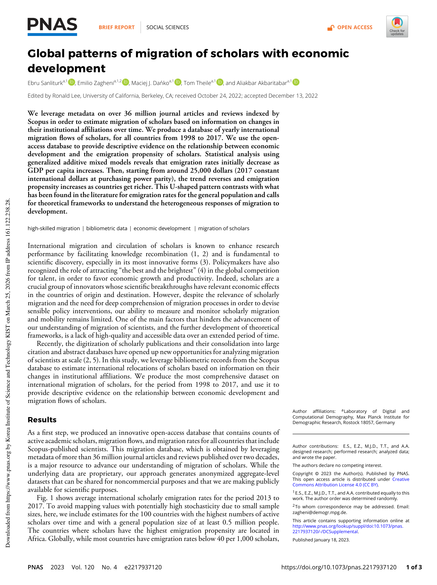

# Global patterns of migration of scholars with economic development

> **저자**: Ebru Sanliturk, Emilio Zagheni, Maciej J. Dańko, Tom Theile, Aliakbar Akbaritabar | **날짜**: 2023 | **Journal**: PNAS | **DOI**: 10.1073/pnas.2217937120
> **리뷰 모드**: PDF

---

## Essence

학자 이주율과 경제 발전(1인당 GDP) 사이에는 **U자형 관계**가 존재한다. Scopus에 색인된 3,600만 건 이상의 논문 메타데이터를 활용해 1998–2017년 전 세계 학자 국제 이주 데이터베이스를 구축한 결과, 1인당 GDP가 증가할수록 이주율은 처음에 감소하다가 약 25,000달러(2017년 기준 구매력평가 국제달러) 부근에서 반전되어 다시 증가한다. 이 패턴은 일반 인구의 이주율이 경제 발전에 따라 단조 감소한다는 기존 문헌과 대조적이며, 학자 이주의 특수한 동학을 이해하기 위한 새로운 이론적 틀의 필요성을 제기한다.

*Figure 1: 학자 이주 데이터베이스 개요. Scopus 기반 국가별 연간 이주 흐름(1998–2017) 및 U자형 패턴 분석 결과.*

## Originality (Abstract 기반)

- [authorship, action, finding] "We leverage metadata on over 36 million journal articles and reviews indexed by Scopus in order to estimate migration of scholars based on information on changes in their institutional affiliations over time."
- [authorship, finding] "Statistical analysis using generalized additive mixed models reveals that emigration rates initially decrease as GDP per capita increases. Then, starting from around 25,000 dollars (2017 constant international dollars at purchasing power parity), the trend reverses and emigration propensity increases as countries get richer."
- [finding, conclusion] "This U-shaped pattern contrasts with what has been found in the literature for emigration rates for the general population and calls for theoretical frameworks to understand the heterogeneous responses of migration to development."

## How (방법론)

- **데이터**: Scopus 색인 3,600만+ 논문/리뷰의 기관 소속 메타데이터(1998–2017)
- **이주 추정**: 연속 논문 간 기관 소속 변화를 추적해 국제 이주로 정의; 연간 국가별 이주 흐름 및 이주율 데이터베이스 구축
- **분석 모델**: Generalized Additive Mixed Models (GAMM)을 사용해 1인당 GDP와 이주율 간의 비선형 관계 추정
- **경제 지표**: 1인당 GDP(2017년 기준 구매력평가 달러, World Bank)와 학자 이주율 연계
- **오픈 데이터**: 결과 데이터베이스 공개 배포

## Why (중요성)

- 지식 재결합(knowledge recombination)과 혁신을 촉진하는 학자 이주는 국가 경쟁력 정책에서 핵심 변수이나, 대규모 체계적 측정이 부재했음
- 일반 인구 이주와 학자 이주의 동학이 다름을 실증함으로써, 두 그룹을 통합하는 기존 이론 프레임워크의 부적절성을 드러냄
- U자형 패턴은 중간 소득 국가에서 두뇌 유출(brain drain)이 일시적으로 완화되지만, 고소득 진입 시 다시 가속될 수 있음을 시사 — 과학 정책 입안에 직접적 함의

## Limitation

### 저자들이 언급한 한계
- Scopus 미수록 저널의 학자는 포착 불가 — 특히 개발도상국의 학자 과소 대표 가능성
- 기관 소속 변화를 이주로 정의하므로, 단기 방문·협력에 의한 소속 변화와 실제 이주 구분이 어려움
- 개인 수준 데이터가 아닌 집계 수준 분석으로 인과 추론 제한

### 자체판단 아쉬운 점
- 학문 분야별 이주 패턴의 이질성이 충분히 분석되지 않음 (STEM vs. 인문사회)
- 이주 방향성(선진국→개도국 reverse brain drain)에 대한 분석 부족
- 코로나19 이후 학자 이주 패턴의 급변 가능성이 데이터 기간(1998–2017)에 반영되지 않음

### 후속 연구
- 학자 이주와 혁신 성과(특허, 피인용 등) 간의 인과 관계 분석
- U자형 패턴을 설명하는 이론적 모델 개발
- 2018년 이후 데이터로 최근 이주 트렌드 업데이트

## 평가

| 항목 | 점수 |
|------|------|
| Novelty | 4/5 |
| Technical Soundness | 4/5 |
| Significance | 4/5 |
| Clarity | 4/5 |
| Overall | 4/5 |

**총평**: 학자 이주와 경제 발전 간 U자형 관계를 대규모 bibliometric 데이터로 처음 실증한 연구로, 일반 이주 이론과의 괴리를 명확히 드러내는 정책적 함의가 크다. 다만 인과 추론의 한계와 데이터 편향 문제가 남는다.
