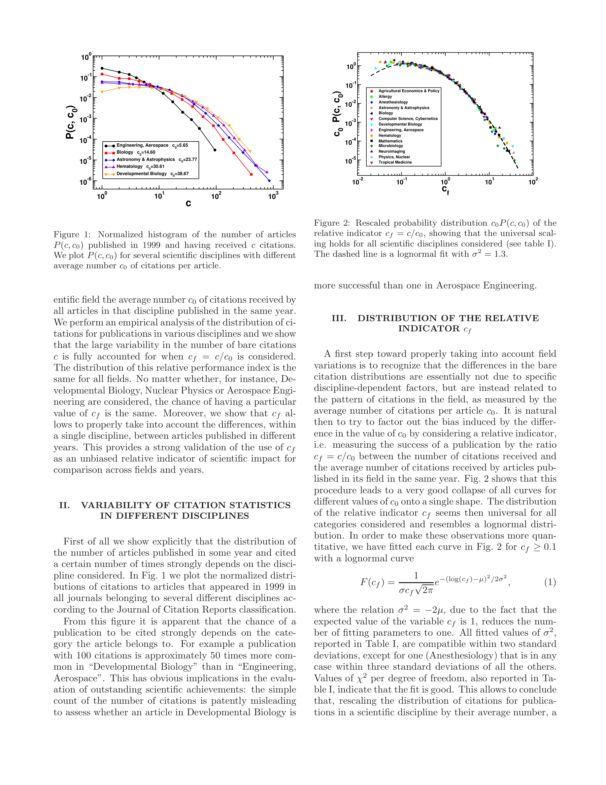

# Universality of citation distributions: Toward an objective measure of scientific impact

> **저자**: Filippo Radicchi, Santo Fortunato, Claudio Castellano | **날짜**: 2008 | **Journal**: PNAS | **DOI**: 10.1073/pnas.0806977105
> **리뷰 모드**: PDF

---

## Essence

분야별 인용 분포는 절대 수치로는 큰 차이를 보이지만, 상대 지표 $c_f = c/c_0$(여기서 $c_0$는 해당 분야의 논문당 평균 인용 수)로 정규화하면 **모든 분야와 연도에 걸쳐 단일 보편 곡선(universal curve)으로 수렴**한다. 이는 $c_f$가 분야 간 비교에 편향 없는 citation 성과 지표임을 강력히 지지하며, 이를 기반으로 서로 다른 분야의 연구자를 비교 가능한 h-index 일반화를 제안한다.

*Figure 1: 다수 학문 분야에 걸친 상대 인용 지표 $c_f$의 분포. 절대 인용 수는 분야별로 크게 다르지만, $c_f$로 정규화하면 보편 곡선으로 수렴함을 보여줌.*

## Originality (Abstract 기반)

- [authorship, finding] "We show that the probability that an article is cited c times has large variations between different disciplines, but all distributions are rescaled on a universal curve when the relative indicator $c_f = c/c_0$ is considered, where $c_0$ is the average number of citations per article for the discipline."
- [authorship, finding] "These findings provide a strong validation of $c_f$ as an unbiased indicator for citation performance across disciplines and years."
- [authorship, action] "Based on this indicator, we introduce a generalization of the h-index suitable for comparing scientists working in different fields."

## How (방법론)

- **데이터**: 다수 학문 분야(물리학, 수학, 의학, 경제학 등)의 ISI Web of Science 인용 데이터
- **핵심 지표**: $c_f = c/c_0$: 개별 논문의 인용 수 $c$를 해당 분야 동일 연도 논문의 평균 인용 수 $c_0$로 나눈 상대 지표
- **검증**: 분야별·연도별 인용 분포를 $c_f$ 스케일로 변환 후 보편 곡선 수렴 여부 통계적 검증
- **응용**: $c_f$ 기반으로 분야를 초월한 h-index 일반화 제안 — 개인의 모든 논문의 $c_f^j \geq h_f$인 논문 수로 정의

## Why (중요성)

- 절대 인용 수 비교는 분야 간 인용 관행 차이로 심각한 편향 유발 — 수학자 vs. 의사 직접 비교 불가능
- 기존 정규화 방법들(IF, percentile 등)은 임의적 기준선에 의존하거나 연도 효과를 제거하지 못함
- $c_f$의 보편성 발견은 인용 기반 평가의 이론적 기반을 제공하며, 특히 분야 간 연구자/기관 평가에 직접 적용 가능

## Limitation

### 저자들이 언급한 한계
- $c_0$ 계산에 사용되는 동일 분야·연도 정의 방식에 따라 결과가 달라질 수 있음
- 자기인용(self-citation) 효과가 보정되지 않음

### 자체판단 아쉬운 점
- 보편 곡선의 정확한 함수형(log-normal, power-law 등)이 명시적으로 규정되지 않아 이론적 토대가 약함
- 연구자가 여러 분야에 걸쳐 활동하는 경우 $c_f$ 적용 방법이 불명확
- 최근 오픈 액세스·소셜 미디어 확산으로 인용 패턴이 변화했을 가능성

### 후속 연구
- $c_f$ 기반 일반화 h-index의 대규모 적용 및 실용화
- 분야 경계 정의의 영향 체계적 분석
- 국가·기관 수준 평가에서의 $c_f$ 활용

## 평가

| 항목 | 점수 |
|------|------|
| Novelty | 5/5 |
| Technical Soundness | 4/5 |
| Significance | 5/5 |
| Clarity | 5/5 |
| Overall | 5/5 |

**총평**: 인용 분포의 분야 간 보편성을 처음 실증하고 편향 없는 상대 지표 $c_f$를 제안한 계량정보학의 이정표 논문으로, 단순하고 강력한 아이디어가 과학 평가 실무에 즉각 적용 가능한 솔루션을 제공한다.
