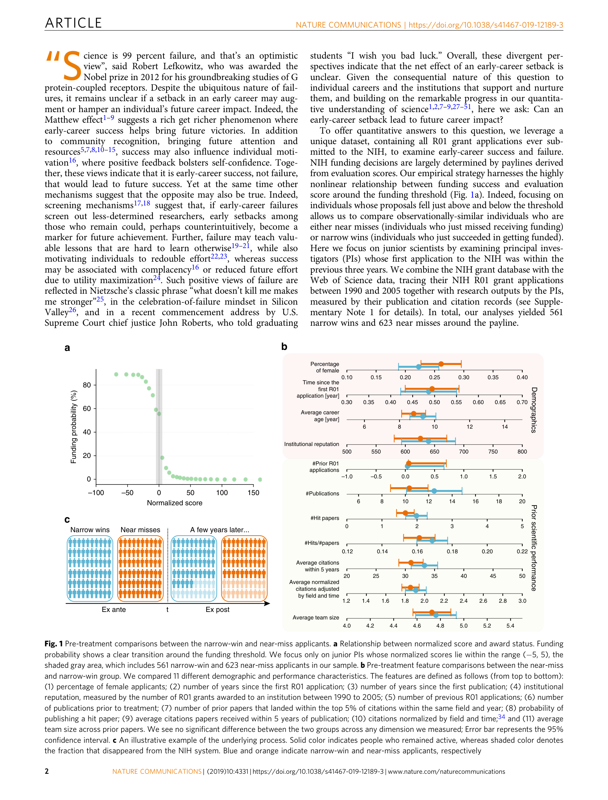

# Early-career setback and future career impact

> **저자**: Yang Wang, Benjamin F. Jones, Dashun Wang | **날짜**: 2019 | **Journal**: Nature Communications | **DOI**: 10.1038/s41467-019-12189-3
> **리뷰 모드**: PDF

---

## Essence

초기 경력 실패(NIH R01 그랜트 탈락)는 **단기적으로 탈락률을 10% 이상 높이지만, 살아남은 연구자들은 장기적으로 성공(narrow win) 집단을 능가한다**. 펀딩 문턱 바로 아래와 위의 지원자를 준실험적으로 비교한 결과(regression discontinuity), near-miss 집단은 5년 후 논문 인용 영향력에서 narrow-win 집단보다 유의하게 높은 성과를 보였으며, 이는 선별 효과(screening)를 넘어 실패 자체가 성과를 인과적으로 향상시키는 증거와 일치한다. "나를 죽이지 않는 것이 나를 더 강하게 만든다"는 가설이 과학 경력에서 실증적으로 지지된다.

*Figure 1: NIH R01 그랜트 펀딩 문턱 주변의 near-miss vs. narrow-win 비교. 좌측(탈락) 집단이 장기 인용 성과에서 우측(성공) 집단을 앞섬.*

## Originality (Abstract 기반)

- [authorship, finding] "we find that an early-career setback has powerful, opposing effects."
- [finding] "it significantly increases attrition, predicting more than a 10% chance of disappearing permanently from the NIH system."
- [finding, conclusion] "despite an early setback, individuals with near misses systematically outperform those with narrow wins in the longer run."
- [finding] "this performance advantage seems to go beyond a screening mechanism, suggesting early-career setback appears to cause a performance improvement among those who persevere."

## How (방법론)

- **데이터**: NIH R01 그랜트 신청 데이터(1990–2005) — 펀딩 문턱 인근의 junior scientist 수천 명
- **설계**: Regression Discontinuity Design(RDD) — 펀딩 문턱 바로 아래(near-miss)와 위(narrow-win) 비교로 무작위 배정에 근사
- **결과 지표**: 5년·10년 후 논문 수, 피인용 수, 최고 피인용 논문의 영향력
- **선별 효과 검증**: 탈락 후 생존한 near-miss 집단과 narrow-win 집단 비교 + 개인 특성 통제
- **데이터 규모**: 수만 건의 그랜트 신청 및 후속 출판 이력 추적

## Why (중요성)

- Matthew effect(초기 성공이 미래 성공을 낳는다)가 과학 경력의 지배적 프레임이었으나, 실패가 오히려 성과를 높일 수 있음을 준실험적으로 실증
- NIH 등 대형 펀딩 기관의 심사 기준과 junior scientist 지원 정책에 직접적 함의
- 실패의 선별 vs. 인과 효과를 분리하는 방법론적 기여

## Limitation

### 저자들이 언급한 한계
- NIH R01 그랜트에 국한된 분석으로 다른 펀딩 환경·국가 일반화 제한
- 탈락 후 비학술 분야로 이동한 연구자의 성과 추적 불가

### 자체판단 아쉬운 점
- 실패가 성과를 높이는 메커니즘(학습? 동기 강화? 연구 주제 변경?)이 직접 검증되지 않음
- 멘토·소속 기관의 조절 효과가 분석되지 않아 환경적 맥락이 불명확
- 문턱 근방 데이터에 한정되므로 대규모 실패(여러 번 탈락)에 대한 함의는 불분명

### 후속 연구
- 실패 효과의 메커니즘 규명(연구 주제 변경, 협력 네트워크 재편 등)
- 타국·타 펀딩 시스템에서의 재현 연구
- 실패 효과의 젠더·분야별 이질성 분석

## 평가

| 항목 | 점수 |
|------|------|
| Novelty | 5/5 |
| Technical Soundness | 5/5 |
| Significance | 5/5 |
| Clarity | 5/5 |
| Overall | 5/5 |

**총평**: 준실험 설계로 "실패가 강화한다"는 가설을 과학 경력에서 처음 인과적으로 검증한 탁월한 연구로, Matthew effect 패러다임에 강력한 반증을 제시하며 과학 정책과 연구자 지원 방식에 실질적 함의를 남긴다.
