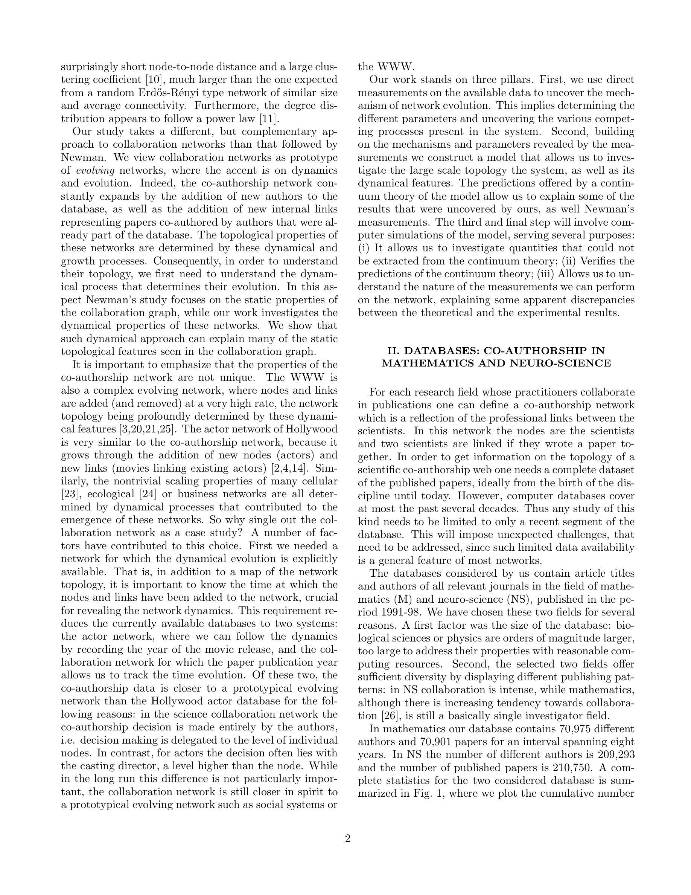

# Evolution of the social network of scientific collaborations

> **저자**: A.L. Barabási, H. Jeong, Z. Néda, E. Ravasz, A. Schubert, T. Vicsek | **날짜**: 2002 | **Journal**: Physica A | **DOI**: 10.1016/s0378-4371(02)00736-7
> **리뷰 모드**: PDF

---

## Essence

수학과 신경과학 분야 8년치(1991–1998) 공저 네트워크를 분석한 결과, 과학자 협력 네트워크는 **scale-free 구조**를 가지며 **선호적 연결(preferential attachment)**에 의해 진화한다. 기존 scale-free 네트워크 모델과 달리, 평균 연결도(degree)가 시간에 따라 증가하고 노드 간 평균 거리는 감소하는 두 가지 이례적 현상이 관찰되었으며, 이를 내부 링크(기존 협력자 간 새로운 협력)의 중요성으로 설명하는 새로운 모델을 제시한다.

*Figure 1: 수학·신경과학 공저 네트워크의 연결도 분포. Power-law 분포를 따르는 scale-free 특성 확인.*

## Originality (Abstract 기반)

- [authorship, finding] "The results indicate that the network is scale-free, and that the network evolution is governed by preferential attachment, affecting both internal and external links."
- [finding] "in contrast with most model predictions the average degree increases in time, and the node separation decreases."
- [authorship, action] "we propose a simple model that captures the network's time evolution."

## How (방법론)

- **데이터**: 수학(Mathematics Reviews)·신경과학(SPIRES, MEDLINE) 저널 8년치 전체 논문 공저 데이터(1991–1998)
- **네트워크 구성**: 공저자 간 링크로 협력 네트워크 구성 — 수학 약 70,975명, 신경과학 약 209,293명
- **분석 3종**: (1) 실증 측정(연결도 분포, 클러스터링 계수, 평균 거리), (2) 해석 가능한 수학 모델, (3) 수치 시뮬레이션
- **수식**: 연결도 성장 모델 — $\langle k \rangle \sim t^\alpha$, 선호적 연결 확률 $\Pi(k) \propto k$
- **검증**: 모델 예측과 실증 데이터 비교

## Why (중요성)

- Barabási-Albert 모델(1999)의 과학 협력 네트워크 적용·확장으로, scale-free 네트워크 이론의 사회적 검증
- 내부 링크(internal link)의 역할을 명시적으로 모델에 포함한 최초 시도 — 기존 BA 모델의 한계 극복
- 공저 네트워크를 복잡계 진화 네트워크의 원형으로 제시하여 WWW·인터넷 등 타 복잡계 연구에 방법론 제공

## Limitation

### 저자들이 언급한 한계
- 두 분야(수학·신경과학)에 한정되어 다른 과학 분야로의 일반화 필요
- 공저 = 협력의 등치가 지나치게 단순화일 수 있음

### 자체판단 아쉬운 점
- 링크 가중치(공동 논문 수)가 이분법적 유무로만 처리됨
- 협력 네트워크의 지리적·제도적 구조가 분석에서 제외됨
- 2002년 당시 데이터로 현재의 대규모 국제 협력 확대에 적용하기에는 시대적 한계

### 후속 연구
- 가중 공저 네트워크 분석으로의 확장
- 과학 분야별 협력 네트워크 위상 비교 연구
- 온라인 연구 플랫폼 등장 이후의 협력 패턴 변화 연구

## 평가

| 항목 | 점수 |
|------|------|
| Novelty | 5/5 |
| Technical Soundness | 4/5 |
| Significance | 5/5 |
| Clarity | 4/5 |
| Overall | 5/5 |

**총평**: 과학자 공저 네트워크를 복잡계 과학의 틀로 분석하여 scale-free 구조와 선호적 연결을 실증한 기념비적 연구로, 이후 수십 년간 과학 협력 네트워크 연구의 방법론적·이론적 토대를 제공했다.
