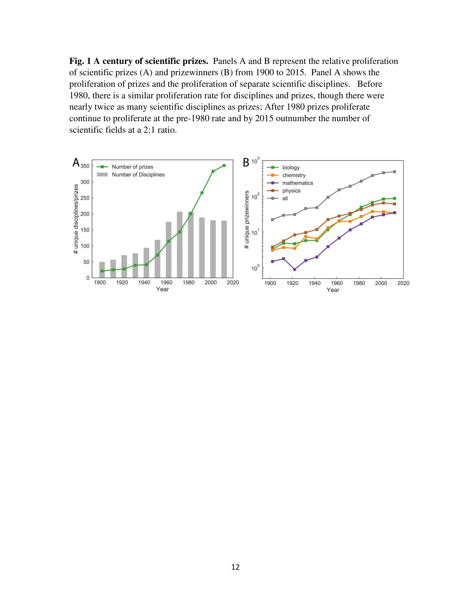

# Scientific prize network predicts who pushes the boundaries of science

> **저자**: Yifang Ma, Brian Uzzi | **날짜**: 2018 | **Journal**: PNAS | **DOI**: 10.1073/pnas.1800485115
> **리뷰 모드**: PDF

---

## Essence

전 세계 3,000개 이상의 과학 상(prize)과 10,455명의 수상자 데이터를 분석한 결과, 과학 상 네트워크는 **소수 엘리트 집단에 집중**되어 있으며(수상자의 64.1%가 2개 이상 수상, 13.7%가 5개 이상 수상), **계보(genealogy) 및 공저 네트워크가 수상 여부를 강력하게 예측**한다. 상들은 학문 간·내에서 강하게 연동(interlock)되어 있으며, 특정 지식 경로를 통해 신뢰와 인정이 체계적으로 전파됨을 보인다. 이는 상이 단순한 사후 인정을 넘어 과학의 방향과 엘리트 계층화를 적극적으로 형성함을 시사한다.

*Figure 1: 과학 상 네트워크의 구조. 상들이 복수 수상자를 통해 연동되어 있으며, 학문 분야 간 지식 경로를 형성함.*

## Originality (Abstract 기반)

- [authorship, finding] "we find several key links between prizes and scientific advances."
- [finding] "despite a proliferation of diverse prizes over time and across the globe, prizes are more concentrated within a relatively small group of scientific elites, and ties within the elites are more clustered."
- [finding] "genealogical and co-authorship networks strongly predict who wins one or more prizes and explains the high level of interconnectedness among acclaimed scientists and their path breaking ideas."

## How (방법론)

- **데이터**: 100년 이상 기간의 전 세계 3,000+ 과학 상, 10,455명 수상자 경력 이력
- **네트워크 구성**: 복수 수상자로 연결된 상-상 네트워크, 계보 네트워크(지도교수-학생), 공저 네트워크
- **분석**: 상 집중도 측정, 네트워크 중심성 분석, 수상 예측 모델(logistic regression 및 네트워크 기반)
- **예측 변수**: 계보 연결, 공저 연결, 이전 수상 경력, 학문 분야 등

## Why (중요성)

- 상의 역할이 과학적 성과 인정을 넘어 엘리트 형성과 지식 전파 경로 구조화에 기여함을 최초로 정량적으로 분석
- 계보 네트워크가 학문적 명성 전달에 중요한 역할을 함으로써, 과학에서의 기회 불평등과 Matthew effect를 상 차원에서 검증
- 상 정보를 미래 혁신 탐지 지표로 활용하는 가능성 제시

## Limitation

### 저자들이 언급한 한계
- 데이터가 존재하는 상에 한정 — 비영어권·지역 상은 과소 대표될 가능성
- 계보 정보의 완전성에 한계

### 자체판단 아쉬운 점
- 상 수여 기준의 이질성이 통제되지 않음 (명예상 vs. 연구상 vs. 경력상)
- 여성·소수자의 상 네트워크 접근성 분석 부재
- 상 수상이 실제 혁신 창출에 미치는 인과 효과보다는 상관관계 수준에 머무름

### 후속 연구
- 상 다양성(지역·성별·분야) 확대가 과학 방향에 미치는 효과
- 노벨상 vs. 지역 상의 네트워크 효과 비교
- 상 예측 모델의 실시간 적용 가능성

## 평가

| 항목 | 점수 |
|------|------|
| Novelty | 4/5 |
| Technical Soundness | 4/5 |
| Significance | 4/5 |
| Clarity | 4/5 |
| Overall | 4/5 |

**총평**: 과학 상 네트워크를 체계적으로 분석하여 과학 엘리트 형성과 지식 전파의 구조를 밝힌 흥미로운 연구로, 상이 사후 인정이 아닌 과학 방향을 능동적으로 형성하는 메커니즘임을 제시한다.
