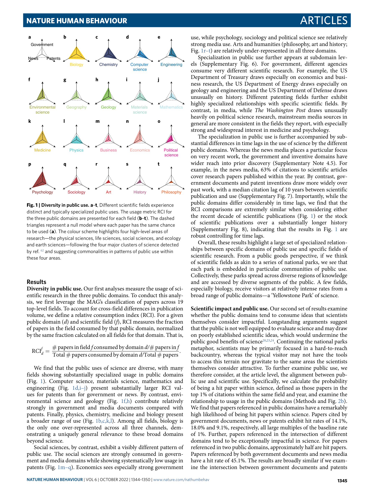

# Public use and public funding of science

> **저자**: Yian Yin, Yuxiao Dong, Kuansan Wang, Dashun Wang, Benjamin F. Jones | **날짜**: 2022 | **Journal**: Nature Human Behaviour | **DOI**: 10.1038/s41562-022-01397-5
> **리뷰 모드**: PDF

---

## Essence

공공 자금이 지원된 과학은 **정책 문서·특허·임상시험 등 세 가지 공공 영역에서 민간 자금 지원 과학보다 더 광범위하게 활용**되며, 공공 투자와 공공 활용 사이에 강한 정렬(alignment)이 존재한다. 5개 대규모 데이터셋을 연결하여 분석한 결과, 과학이 '상아탑'이라는 비판과 달리 공공 자금 과학은 실질적으로 정책·기술·의료 영역에서 광범위하게 사용된다. 다만 공공 활용이 불균등하게 분포하며 일부 분야와 기관에 집중된다는 점에서 자원 배분 정책의 개선 여지를 제시한다.

*Figure 1: 공공 자금 지원 과학의 세 가지 공공 영역(정책·특허·임상) 활용 프레임워크.*

## Originality (Abstract 기반)

- [authorship, action] "we advance a measurement framework to study public uses of science, the public funding of science and how public use and public funding relate."
- [authorship, finding] "we integrate five large-scale datasets that link scientific publications from all scientific fields to their upstream funding support and downstream public uses across three public domains."
- [finding] 공공 자금 과학이 세 공공 영역 모두에서 민간 지원 과학보다 더 높은 활용도 보임

## How (방법론)

- **데이터 5종**: Microsoft Academic Graph(MAG), Dimensions 펀딩 데이터, Overton 정책 문서, USPTO 특허, ClinicalTrials.gov 임상시험 데이터
- **연결 방식**: 논문 → 펀딩 출처(공공/민간), 논문 → 3개 공공 영역 활용 추적
- **공공 영역 3종**: 정책 문서(policy documents), 특허(patents), 임상시험(clinical trials)
- **규모**: 수백만 편 논문, 수만 건 정책 문서·특허·임상시험의 대규모 연계

## Why (중요성)

- 공공 과학 투자의 사회적 정당성에 관한 수십 년간의 논쟁("ivory tower" vs. public good)을 체계적 데이터로 처음 실증
- 과학 정책 입안자들이 공공 R&D 예산 배분 논쟁에서 활용할 수 있는 경험적 근거 제공
- 과학의 '두 문화(two cultures)' 논쟁 — 연구자-정책입안자 간의 단절 — 에 반증적 증거 제시

## Limitation

### 저자들이 언급한 한계
- 정책 문서·특허의 과학 활용이 명시적 인용에 한정 — 비인용 지식 전달 포착 불가
- 공공/민간 자금 분류의 복잡성(혼합 펀딩 처리)

### 자체판단 아쉬운 점
- 활용(use)이 반드시 영향(impact)을 의미하지 않음 — 인용이 실제 정책 결정에 영향을 미쳤는지 불명확
- 특정 국가(주로 미국·영국) 데이터 편향 가능성
- 공공 활용의 질적 측면(인용의 깊이, 정책 변화 여부) 미반영

### 후속 연구
- 활용 vs. 실제 사회적 영향력(outcomes) 연결 연구
- 과학 분야별·국가별 공공 활용 패턴 비교
- 오픈 액세스가 공공 활용에 미치는 인과적 효과 분석

## 평가

| 항목 | 점수 |
|------|------|
| Novelty | 4/5 |
| Technical Soundness | 5/5 |
| Significance | 5/5 |
| Clarity | 4/5 |
| Overall | 4/5 |

**총평**: 공공 과학 투자와 사회적 활용의 정렬을 대규모 데이터로 처음 체계적으로 실증한 중요한 연구로, '상아탑' 비판에 대한 가장 강력한 경험적 반박을 제공하며 과학 정책 논의의 새로운 지평을 열었다.
