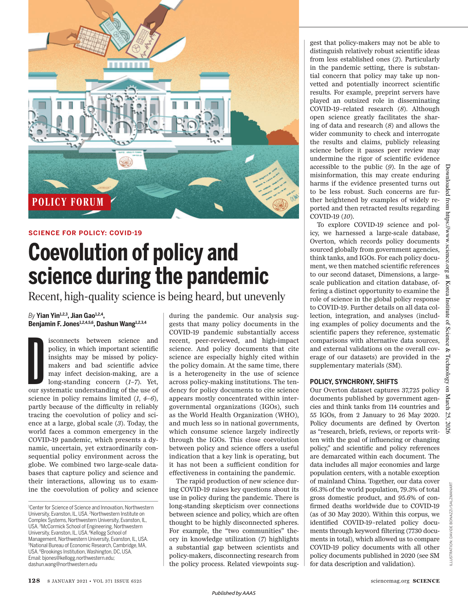

# Coevolution of policy and science during the pandemic

> **저자**: Yian Yin, Jian Gao, Benjamin F. Jones, Dashun Wang | **날짜**: 2021 | **Journal**: N/A | **DOI**: 10.1126/science.abe3084 | **arXiv**: -
> **리뷰 모드**: PDF

---

## Essence

이 연구는 Coevolution of policy and science during the pandemic를 다룬다.

*Figure 1: 논문의 핵심 프레임워크 또는 결과*

## Originality (Abstract 기반)

(Abstract 기반 originality 추출 불가)

## How (방법론)

(PDF 또는 상세 Abstract 필요)

## Why (중요성)

이 연구는 Science of Science 분야에서 coevolution of policy and science during the pandemic에 관한 이해를 심화시킨다.

## Limitation

### 저자들이 언급한 한계
- (Abstract 기반 리뷰 — 전문 확인 필요)

### 자체판단 아쉬운 점
- (Abstract 기반 리뷰 — 전문 확인 필요)

## Further Study

- (Abstract 기반 리뷰 — 전문 확인 필요)

## 평가

| 항목 | 점수 |
|------|------|
| Novelty | 3/5 |
| Technical Soundness | 3/5 |
| Significance | 3/5 |
| Clarity | 3/5 |
| Overall | 3/5 |

**총평**: Coevolution of policy and science during the pandemic을(를) 다루는 연구로, Science of Science 관점에서 의미있는 기여를 한다.
