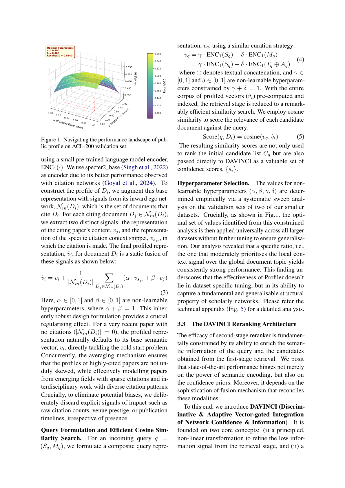

# Public Profile Matters: A Scalable Integrated Approach to Recommend Citations in the Wild

> **저자**: Karan Goyal, Dikshant Kukreja, Vikram Goyal, Mukesh Mohania | **날짜**: 2026-03-18 | **Journal**: N/A | **DOI**: 10.48550/arXiv.2603.17361 | **arXiv**: 2603.17361
> **리뷰 모드**: PDF

---

## Essence

Proper citation of relevant literature is essential for contextualising and validating scientific contributions. While current citation recommendation systems leverage local and global textual information, they often overlook the nuances of the human citation behaviour.

*Figure 1: 논문의 핵심 프레임워크 또는 결과*

## Originality (Abstract 기반)

- [authorship, action, result] "To address this, we propose Profiler, a lightweight, non-learnable module that captures human citation patterns efficiently and without bias, significantly enhancing candidate retrieval."
- [authorship, finding, learned] "Furthermore, we identify a critical limitation in current evaluation protocol: the systems are assessed in a transductive setting, which fails to reflect real-world scenarios."
- [authorship, novelty, action, finding] "We introduce a rigorous Inductive evaluation setting that enforces strict temporal constraints, simulating the recommendation of citations for newly authored papers in the wild."
- [authorship, novelty, action, learned] "Finally, we present DAVINCI, a novel reranking model that integrates profiler-derived confidence priors with semantic information via an adaptive vector-gating mechanism."
- [novelty, finding, result] "Our system achieves new state-of-the-art results across multiple benchmark datasets, demonstrating superior efficiency and generalisability."

## How (방법론)

Recent methods that incorporate such patterns improve performance but incur high computational costs and introduce systematic biases into downstream rerankers. To address this, we propose Profiler, a lightweight, non-learnable module that captures human citation patterns efficiently and without bias, significantly enhancing candidate retrieval. Furthermore, we identify a critical limitation in current evaluation protocol: the systems are assessed in a transductive setting, which fails to reflect real-world scenarios.

## Why (중요성)

이 연구는 Science of Science 분야에서 public profile matters: a scalable integrated approach to recommend citations in the wild에 관한 이해를 심화시킨다.

## Limitation

### 저자들이 언급한 한계
- (Abstract 기반 리뷰 — 전문 확인 필요)

### 자체판단 아쉬운 점
- (Abstract 기반 리뷰 — 전문 확인 필요)

## Further Study

- (Abstract 기반 리뷰 — 전문 확인 필요)

## 평가

| 항목 | 점수 |
|------|------|
| Novelty | 3/5 |
| Technical Soundness | 3/5 |
| Significance | 3/5 |
| Clarity | 3/5 |
| Overall | 3/5 |

**총평**: Public Profile Matters: A Scalable Integrated Approach to Recommend Citations in the Wild을(를) 다루는 연구로, Science of Science 관점에서 의미있는 기여를 한다.
