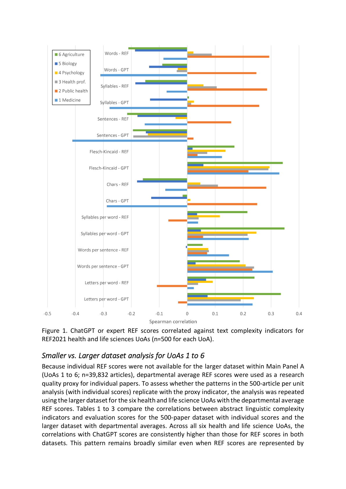

# Which stylistic features fool ChatGPT research evaluations?

> **저자**: Kayvan Kousha, Mike Thelwall | **날짜**: 2026-03-16 | **Journal**: N/A | **DOI**:  | **arXiv**: 2603.14919
> **리뷰 모드**: PDF

---

## Essence

Large Language Models (LLMs) have the potential to be used to support research evaluation and have a moderate capability to estimate the research quality of a journal article from its title and abstract. This paper assesses whether there are language-related factors unrelated to the quality of the research that influence ChatGPT's scores.

*Figure 1: 논문의 핵심 프레임워크 또는 결과*

## Originality (Abstract 기반)

- [context] "Large Language Models (LLMs) have the potential to be used to support research evaluation and have a moderate capability to estimate the research quality of a journal article from its title and abstract."
- [authorship, finding, conclusion] "This paper assesses whether there are language-related factors unrelated to the quality of the research that influence ChatGPT's scores."
- [authorship, finding, approach] "Using a dataset of 99,277 journal articles submitted to the UK-wide Research Excellence Framework (REF) 2021 assessments, we calculated several readability ind"

## How (방법론)

Large Language Models (LLMs) have the potential to be used to support research evaluation and have a moderate capability to estimate the research quality of a journal article from its title and abstract. Using a dataset of 99,277 journal articles submitted to the UK-wide Research Excellence Framework (REF) 2021 assessments, we calculated several readability ind

## Why (중요성)

이 연구는 Science of Science 분야에서 which stylistic features fool chatgpt research evaluations?에 관한 이해를 심화시킨다.

## Limitation

### 저자들이 언급한 한계
- (Abstract 기반 리뷰 — 전문 확인 필요)

### 자체판단 아쉬운 점
- (Abstract 기반 리뷰 — 전문 확인 필요)

## Further Study

- (Abstract 기반 리뷰 — 전문 확인 필요)

## 평가

| 항목 | 점수 |
|------|------|
| Novelty | 3/5 |
| Technical Soundness | 3/5 |
| Significance | 3/5 |
| Clarity | 3/5 |
| Overall | 3/5 |

**총평**: Which stylistic features fool ChatGPT research evaluations?을(를) 다루는 연구로, Science of Science 관점에서 의미있는 기여를 한다.
