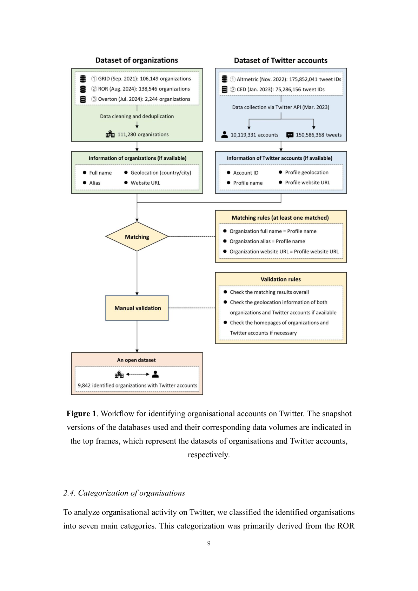

# Organisational accounts engaged in scholarly communication on Twitter: Patterns of presence, activity and engagement

> **저자**: Zohreh Zahedi, Yanqing Zhang, Zekun Han, Er-Te Zheng, Zhichao Fang | **날짜**: 2026-03-17 | **Journal**: N/A | **DOI**:  | **arXiv**: 2603.16637
> **리뷰 모드**: PDF

---

## Essence

Organisational accounts are an integral part of the Twitter (now X) ecosystem. This study identified 9,842 research- and policy-related organisational accounts that had tweeted about scholarly publications by linking three global organisational databases (GRID, ROR, and Overton) with two altmetric databases containing Twitter data (Altmetric and the former Crossref Event Data).

*Figure 1: 논문의 핵심 프레임워크 또는 결과*

## Originality (Abstract 기반)

- [context] "Organisational accounts are an integral part of the Twitter (now X) ecosystem."
- [authorship, finding] "This study identified 9,842 research- and policy-related organisational accounts that had tweeted about scholarly publications by linking three global organisational databases (GRID, ROR, and Overton) with two altmetric databases containing Twitter data (Altmetric and the former Crossref Event Data)."
- [action, approach] "The resulting openly available dataset was used to examine organisational activity in scholarly communication across th"

## How (방법론)

This study identified 9,842 research- and policy-related organisational accounts that had tweeted about scholarly publications by linking three global organisational databases (GRID, ROR, and Overton) with two altmetric databases containing Twitter data (Altmetric and the former Crossref Event Data). The resulting openly available dataset was used to examine organisational activity in scholarly communication across th

## Why (중요성)

이 연구는 Science of Science 분야에서 organisational accounts engaged in scholarly communication on twitter: patterns of presence, activity and engagement에 관한 이해를 심화시킨다.

## Limitation

### 저자들이 언급한 한계
- (Abstract 기반 리뷰 — 전문 확인 필요)

### 자체판단 아쉬운 점
- (Abstract 기반 리뷰 — 전문 확인 필요)

## Further Study

- (Abstract 기반 리뷰 — 전문 확인 필요)

## 평가

| 항목 | 점수 |
|------|------|
| Novelty | 3/5 |
| Technical Soundness | 3/5 |
| Significance | 3/5 |
| Clarity | 3/5 |
| Overall | 3/5 |

**총평**: Organisational accounts engaged in scholarly communication on Twitter: Patterns of presence, activity and engagement을(를) 다루는 연구로, Science of Science 관점에서 의미있는 기여를 한다.
