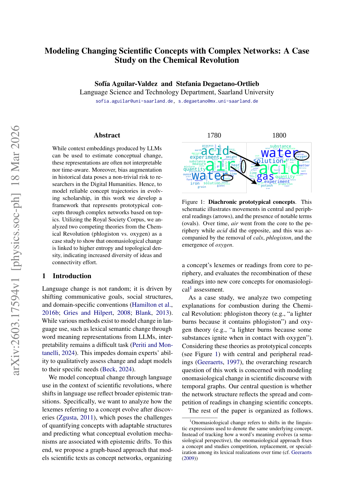

# Modeling Changing Scientific Concepts with Complex Networks: A Case Study on the Chemical Revolution

> **저자**: Sofía Aguilar-Valdez, Stefania Degaetano-Ortlieb | **날짜**: 2026 | **Journal**: N/A | **DOI**: 10.48550/ARXIV.2603.17594 | **arXiv**: 2603.17594
> **리뷰 모드**: PDF

---

## Essence

While context embeddings produced by LLMs can be used to estimate conceptual change, these representations are often not interpretable nor time-aware. Moreover, bias augmentation in historical data poses a non-trivial risk to researchers in the Digital Humanities.

*Figure 1: 논문의 핵심 프레임워크 또는 결과*

## Originality (Abstract 기반)

- [authorship, action, approach] "Hence, to model reliable concept trajectories in evolving scholarship, in this work we develop a framework that represents prototypical concepts through complex networks based on topics."
- [authorship, action] "Utilizing the Royal Society Corpus, we analyzed two competing theories from the Chemical Revolution (phlogiston vs."
- [finding] "oxygen) as a case study to show that onomasiological change is linked to higher entropy and topological density, indicating increased diversity of ideas and connectivity effort."

## How (방법론)

Moreover, bias augmentation in historical data poses a non-trivial risk to researchers in the Digital Humanities. Hence, to model reliable concept trajectories in evolving scholarship, in this work we develop a framework that represents prototypical concepts through complex networks based on topics. Utilizing the Royal Society Corpus, we analyzed two competing theories from the Chemical Revolution (phlogiston vs.

## Why (중요성)

이 연구는 Science of Science 분야에서 modeling changing scientific concepts with complex networks: a case study on the chemical revolution에 관한 이해를 심화시킨다.

## Limitation

### 저자들이 언급한 한계
- (Abstract 기반 리뷰 — 전문 확인 필요)

### 자체판단 아쉬운 점
- (Abstract 기반 리뷰 — 전문 확인 필요)

## Further Study

- (Abstract 기반 리뷰 — 전문 확인 필요)

## 평가

| 항목 | 점수 |
|------|------|
| Novelty | 3/5 |
| Technical Soundness | 3/5 |
| Significance | 3/5 |
| Clarity | 3/5 |
| Overall | 3/5 |

**총평**: Modeling Changing Scientific Concepts with Complex Networks: A Case Study on the Chemical Revolution을(를) 다루는 연구로, Science of Science 관점에서 의미있는 기여를 한다.
