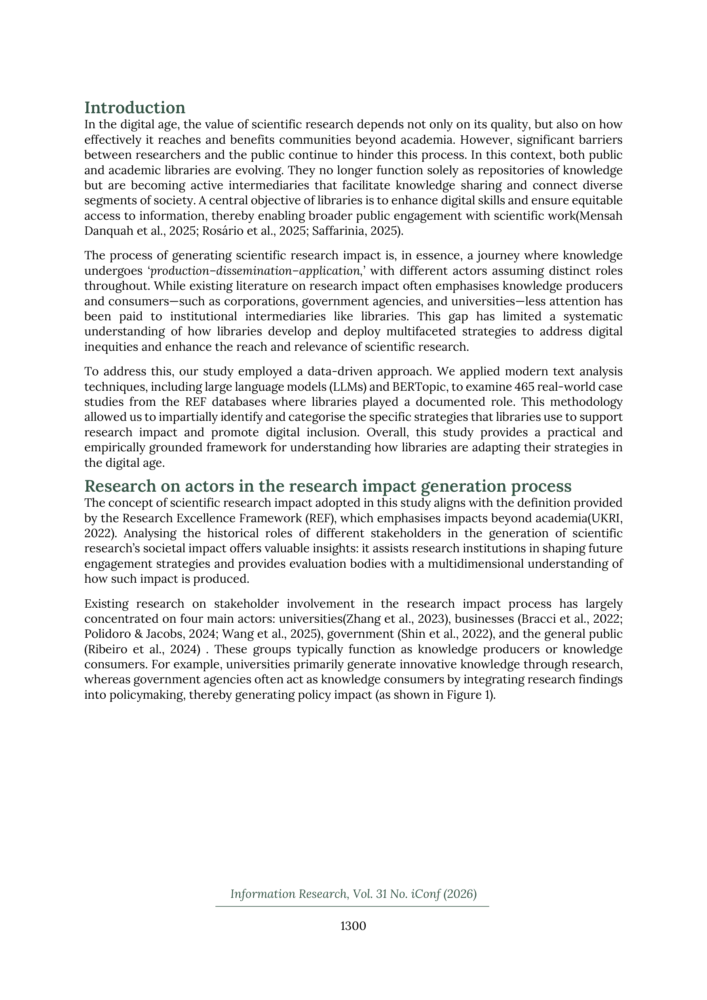

# Bridging the gap between science and society: Mapping libraries' strategies for engaging in the research impact process through semantic analysis

> **저자**: Wang Zuorong, Sun Jiaxuan, He Shan, Deng Sanhong, Wang Hao | **날짜**: 2026-03-20 | **Journal**: Information Research | **DOI**: [10.47989/ir31iconf64195](https://doi.org/10.47989/ir31iconf64195)
> **리뷰 모드**: PDF

---

## Essence

도서관이 과학-사회 간 지식 중개자로서 연구 임팩트 생성 과정에서 어떤 전략을 구사하는가? REF(Research Excellence Framework) 데이터베이스에서 도서관이 참여한 465개 사례를 LLM + BERTopic으로 분석한 결과, **5가지 핵심 전략**이 도출되었다: (1) 미디어 커뮤니케이션 및 공공 참여, (2) 공공 대화 및 문화 프리젠테이션, (3) 예술 협업 및 라이브 경험, (4) 디지털 콘텐츠 창작·배포, (5) 대규모 이벤트 조직. 도서관 기여는 Arts & Humanities(76%)에 집중되어 있으며, 주로 문화적(67%)·사회적(22%) 임팩트 영역에서 활동한다.

*Figure 1: 과학 연구 임팩트 생성 과정의 주요 행위자 구조 - 대학(지식 생산자), 기업·정부·일반 공중(지식 소비자), 도서관(중개자) 위치를 보여주는 프레임워크*

## Originality (Abstract 기반)

- [authorship, action] "We analysed 465 library participation cases from the Research Excellence Framework using a hybrid approach combining large language models (LLMs) and BERTopic semantic analysis."
- [novelty, conclusion] "This study proposes an evidence-based framework elucidating the role of libraries within the research ecosystem, offering practical insights to support the societal translation of research outcomes."

## How (방법론)

- **데이터**: REF 데이터베이스에서 도서관 참여가 기록된 465개 impact case study 수집
- **분석**: LLM을 활용한 텍스트 분류 + BERTopic 시멘틱 분석의 하이브리드 접근법
- **분류 체계**: 임팩트 유형(문화·사회·경제·환경 등), 전략 유형(5가지)을 계층적으로 구성
- **검증**: 분류 결과의 주제별 분포 및 비율 통계 분석

## Why (중요성)

- 기존 연구 임팩트 문헌은 대학, 기업, 정부, 일반 공중에만 집중하며 도서관과 같은 기관 중개자는 체계적으로 연구되지 않았음
- 도서관이 디지털 리터러시 강화와 정보 접근 형평성 보장을 통해 과학의 사회적 번역에서 수행하는 독자적 역할을 실증적으로 규명할 필요가 있었음

## Limitation

- REF는 영국 중심 데이터로, 다른 국가 도서관 시스템으로의 일반화가 제한적
- 465개 사례의 규모가 작으며, 도서관 유형별(공공·학술·전문) 분류가 충분하지 않음
- LLM 분류의 신뢰도 검증 방법이 상세히 기술되지 않아 재현성 불확실

## Further Study

- 다양한 국가·지역의 도서관 참여 전략 비교 연구
- 도서관 유형(공공·학술·국립)별 차별화된 임팩트 전략 분석
- 디지털 환경 변화에 따른 도서관 중개 역할 진화 추적

## 평가

| 항목 | 점수 |
|------|------|
| Novelty | 3/5 |
| Technical Soundness | 3/5 |
| Significance | 3/5 |
| Clarity | 4/5 |
| Overall | 3/5 |

**총평**: 연구 임팩트 생태계에서 도서관의 중개자 역할을 최초로 체계화한 탐색적 연구로, iConf 컨퍼런스 논문의 간결한 형태이지만 실증적 프레임워크를 제시하는 실용적 가치가 있다.
