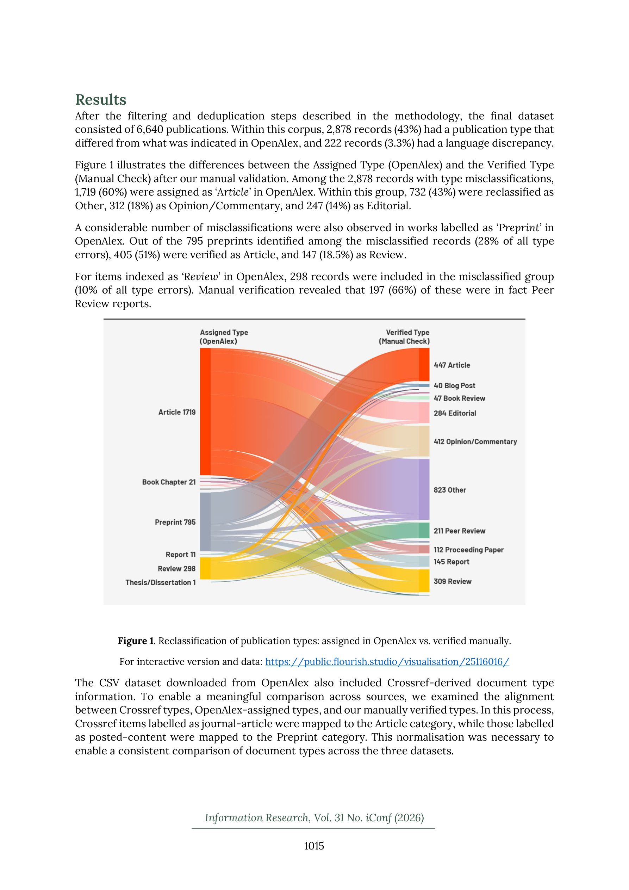

# OpenAlex in focus: Metadata quality of publication type and language fields in an open peer review corpus

> **저자**: Güleda Doğan, Ayça Nur Sezen | **날짜**: 2026-03-20 | **Journal**: Information Research | **DOI**: [10.47989/ir31iconf64207](https://doi.org/10.47989/ir31iconf64207)
> **리뷰 모드**: PDF

---

## Essence

OpenAlex는 오픈 액세스 학술 데이터베이스로서 bibliometric 연구에 널리 활용되지만, 메타데이터 품질에 심각한 문제가 있는가? 오픈 피어 리뷰를 주제로 OpenAlex에서 검색한 **6,640건**의 레코드를 수동 검증한 결과: (1) **43%**(2,878건)에서 문서 유형 불일치가 발견되었으며, 'Article'이 가장 빈번히 오분류되었다. (2) **3.3%**(222건)에서 언어 불일치가 발생했으며, 비영어 논문이 영어로 잘못 표기된 경우가 많았다. Crossref는 넓은 범주에서 OpenAlex와 유사하지만 수동 검증과는 차이를 보였다.

*Figure 1: OpenAlex 메타데이터 품질 검증 프레임워크 - 오픈 피어 리뷰 코퍼스에서 문서 유형 및 언어 필드의 일치도 분석 절차*

## Originality (Abstract 기반)

- [authorship, action] "Publications on open peer review were retrieved from OpenAlex. After filtering and deduplication, 6,640 records were manually checked."
- [finding, result] "Of 6,640 records, 2,878 (43%) showed publication type discrepancies, with 'Article' most often misused."

## How (방법론)

- **데이터**: OpenAlex에서 오픈 피어 리뷰 관련 논문 검색 후 필터링·중복 제거, 최종 6,640건 확보
- **검증 방법**: 문서 유형 및 언어 필드를 발행사 원본과 수동 교차 검증, Crossref 데이터도 비교
- **분류 조화**: 범주 간 비교 가능성 확보를 위해 수동 분류 체계 표준화
- **평가 지표**: OpenAlex–수동 분류 일치율, Crossref–OpenAlex 일치율 비교

## Why (중요성)

- 오픈 사이언스 운동의 핵심 인프라인 OpenAlex의 신뢰성은 bibliometric 연구의 유효성에 직결되며, 문서 유형과 언어는 포함/제외 기준을 결정하는 핵심 필터임
- 메타데이터 품질 문제는 systematic review, 인용 분석, 국가별 언어 다양성 분석 등에 편향을 야기할 수 있음

## Limitation

- 오픈 피어 리뷰라는 특정 주제 코퍼스에 한정되어 OpenAlex 전반으로의 일반화가 제한적
- 수동 검증은 소규모 샘플(6,640건)에 그쳐 전체 OpenAlex의 오류율 추정이 어려움
- Crossref도 표준으로 사용하기에는 불일치가 있어 검증의 기준 자체가 불완전

## Further Study

- 다양한 주제 분야와 시기에 걸친 OpenAlex 메타데이터 품질의 체계적 평가
- 자동화된 메타데이터 정제 파이프라인 개발을 통한 오류율 감소
- 언어 다양성(비영어권 연구) 표현의 정확성 개선 방안

## 평가

| 항목 | 점수 |
|------|------|
| Novelty | 3/5 |
| Technical Soundness | 4/5 |
| Significance | 4/5 |
| Clarity | 4/5 |
| Overall | 3/5 |

**총평**: OpenAlex를 사용하는 연구자에게 실질적 주의사항을 제공하는 실용적 연구로, 6,640건의 수동 검증을 통해 43% 문서 유형 오분류라는 충격적인 수치를 제시하여 오픈 데이터베이스의 신뢰성에 대한 중요한 경고를 전달한다.
