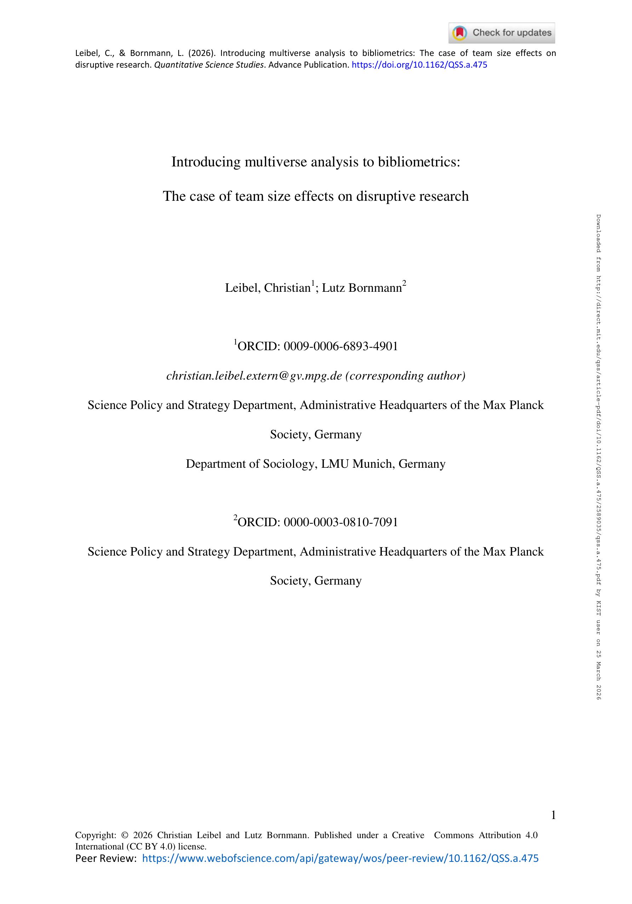

# Introducing multiverse analysis to bibliometrics: The case of team size effects on disruptive research

> **저자**: Christian Leibel, Lutz Bornmann | **날짜**: 2026-03-23 | **Journal**: Quantitative Science Studies | **DOI**: [10.1162/qss.a.475](https://doi.org/10.1162/qss.a.475)
> **리뷰 모드**: PDF

---

## Essence

팀 크기가 disruptive research에 미치는 영향에 대한 Wu et al.(2019)의 "소규모 팀이 더 파괴적인 연구를 낳는다"는 주장은 얼마나 견고한가? 이 논문은 **multiverse analysis**를 bibliometrics에 처음 도입해 그 질문에 답한다. 결론은 "효과의 방향(음의 방향)은 견고하지만, 효과 크기는 모델 설정에 따라 크게 달라진다"는 것이다. 즉, 소규모 팀이 더 disruptive하다는 결론 자체는 유지되지만, 그 효과의 실질적 크기와 정책적 함의는 분석 선택에 크게 의존하므로 단일 모델 결과에 과신하지 말아야 한다.

*Figure 1: Multiverse analysis 개념 도식 - 데이터 선택, 지표 구성, 모델링 결정의 조합으로 생성되는 모든 타당한 모델 공간(multiverse)을 시각화*

## Originality (Abstract 기반)

- [authorship, novelty, action] "This study introduces multiverse analysis to bibliometrics."
- [authorship, finding] "We found robust evidence of a negative effect of team size on disruption scores, the effect size depends substantially on the model specification."
- [conclusion] "Our findings underscore the importance of assessing the multiverse robustness of bibliometric results to clarify their practical implications."

## How (방법론)

- **기반 연구**: Wu et al.(2019)의 팀 크기-CD index 관계 분석을 대상으로 선정
- **Multiverse 구성**: 데이터 선택 기준(연도, 분야), disruption 지표(CD5, CD10, MCD 등), 통제변수 조합, 추정 방법(OLS, negative binomial 등)의 모든 타당한 조합을 체계적으로 열거
- **결과 요약**: 수백 개 모델의 추정치 분포를 specification curve로 시각화
- **비교 기준**: Petersen et al.(2025)의 반박 연구와의 결과 차이 원인 분석

## Why (중요성)

- Wu et al.(2019)와 Petersen et al.(2025)의 상반된 결과가 서로 다른 모델 가정에서 비롯되며, 단일 모델에 의존한 정책 권고는 위험할 수 있음
- Bibliometrics는 지표 선택, 데이터 필터링, 추정 방법에 따라 결과가 크게 달라지지만 이를 투명하게 보고하는 관행이 부재함

## Limitation

- Multiverse 분석은 모든 모델 선택지를 열거해야 하므로, 어떤 조합이 "타당한" 것인지 연구자가 사전에 정의해야 하는 주관적 판단이 개입됨
- 계산 비용이 높아 모든 분야와 데이터셋에 적용하기 어려울 수 있음
- 결과의 이질성이 크면 "어떤 결론도 없다"는 허무주의적 해석으로 이어질 위험

## Further Study

- 다른 핵심 bibliometric 발견들(gender gap, h-index 예측력 등)에 multiverse analysis 적용
- Multiverse analysis의 자동화 도구 개발로 bibliometrics 재현성 표준화
- Specification curve를 통한 연구자 공동체의 "대표적 모델" 합의 프로세스 설계

## 평가

| 항목 | 점수 |
|------|------|
| Novelty | 5/5 |
| Technical Soundness | 5/5 |
| Significance | 4/5 |
| Clarity | 4/5 |
| Overall | 5/5 |

**총평**: Multiverse analysis를 bibliometrics에 최초 도입한 방법론적 혁신 논문으로, 단일 모델 결과에 대한 과신 문제를 실증적으로 해결하는 강력한 도구를 제시한다. Wu et al.(2019)의 팀 크기-파괴성 관계라는 고전적 논쟁을 사례로 활용하여 설득력 있게 개념을 전달한다.
