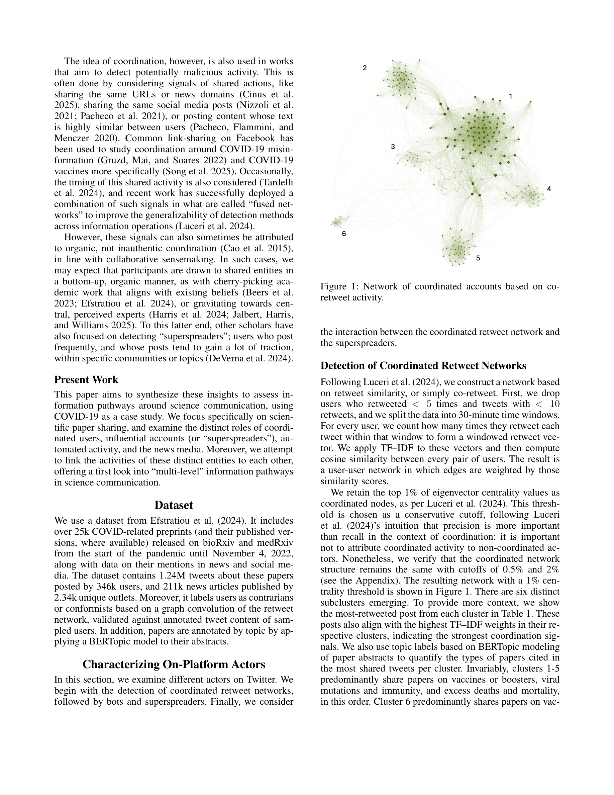

# Information Pathways in Online Science Communication: The Role of Platform Actors and News Media

> **저자**: Alexandros Efstratiou, Giuseppe Russo, Luca Luceri | **날짜**: 2026-03-18 | **Journal**: arXiv preprint | **arXiv**: [2603.17249](https://arxiv.org/abs/2603.17249)
> **리뷰 모드**: PDF

---

## Essence

온라인 과학 커뮤니케이션에서 정보는 어떤 경로로 흐르는가, 그리고 반-합의(anti-consensus) 콘텐츠는 어떻게 확산되는가? COVID-19 관련 논문을 인용한 **124만 건의 트윗과 21만 1천 건의 뉴스 기사**를 분석한 결과, 세 가지 핵심 발견이 나왔다: (1) Twitter에서 가장 영향력 있는 계정들은 주로 의학·연구 자격증을 가진 전문가들이다. (2) 그러나 이들 중 일부는 백신, 록다운 등에 대한 반-합의 입장을 가진 전문가를 **조직적으로 증폭**하는 협력 네트워크를 형성하고 있다. (3) **뉴스 매체는 소셜 미디어 superspreader들이 먼저 공유한 논문을 사후에 보도하는 경향**이 있어, Twitter가 뉴스 어젠다를 선행한다.

*Figure 1: 과학 정보 흐름의 다층 경로 분석 프레임워크 - Twitter 행위자 유형(일반 사용자, 봇, superspreader, 협력 계정)과 뉴스 미디어 간의 상호작용 구조*

## Originality (Abstract 기반)

- [authorship, action] "Using the COVID-19 pandemic as a case study, we analyze 1.24M tweets and 211k news articles that reference pandemic-related scientific papers."
- [finding, result] "News outlets tend to report on scientific studies after they have been highlighted by social media superspreaders."
- [novelty] "Together, these findings reveal multi-level pathways of information flow and coordinated amplification structures that shape science communication across social media and news."

## How (방법론)

- **데이터**: COVID-19 관련 preprint를 언급한 Twitter 게시물 124만 건 + 뉴스 기사 21.1만 건
- **행위자 분류**: Twitter 계정을 유기적 사용자, 봇, superspreader, 협력 계정으로 분류 (기계학습·봇 탐지 알고리즘 활용)
- **정보 경로 분석**: 동일 논문을 다룬 행위자 간의 시간적 선행 관계(temporal precedence)를 추적하여 정보 경로 정의
- **네트워크 분석**: 협력 계정 탐지를 위한 co-retweeting 네트워크 분석
- **미디어 분류**: 뉴스 소스를 주류/의학/저품질/음모론 미디어로 분류

## Why (중요성)

- 과학 회의주의(science skepticism) 확산에서 전문가 자격증을 가진 반-합의 전문가들의 조직적 역할이 밝혀짐으로써 단순한 "가짜 뉴스" 프레임을 넘어선 복잡한 정보 생태계 이해가 필요함
- Twitter가 뉴스 미디어의 어젠다를 선행한다는 발견은 저널리즘과 미디어 리터러시 교육에 중요한 함의를 가짐

## Limitation

- COVID-19 팬데믹이라는 특수한 위기 상황에서의 데이터로, 일반적인 과학 커뮤니케이션으로의 일반화가 제한적
- Twitter(X)가 2022년 이후 정책 변화를 겪어 현재 플랫폼 역학과의 차이 가능성
- 인과관계가 아닌 시간적 선행 관계를 "정보 경로"로 정의하여 실제 인과적 영향 해석에 주의 필요

## Further Study

- 다른 플랫폼(YouTube, Facebook, Telegram)에서의 과학 커뮤니케이션 경로 비교
- 반-합의 전문가 네트워크의 자금 구조 및 조직적 기반 분석
- 알고리즘 추천 시스템이 반-합의 콘텐츠 증폭에 미치는 영향

## 평가

| 항목 | 점수 |
|------|------|
| Novelty | 4/5 |
| Technical Soundness | 4/5 |
| Significance | 5/5 |
| Clarity | 4/5 |
| Overall | 4/5 |

**총평**: COVID-19 과학 커뮤니케이션 생태계를 대규모 데이터로 분석하여 뉴스 미디어가 소셜 미디어 superspreader를 뒤따른다는 새로운 정보 흐름 패턴을 실증한 영향력 있는 연구다. 반-합의 전문가들의 조직적 증폭 구조를 발견한 것은 미디어 리터러시와 플랫폼 거버넌스에 직접적 함의를 지닌다.
