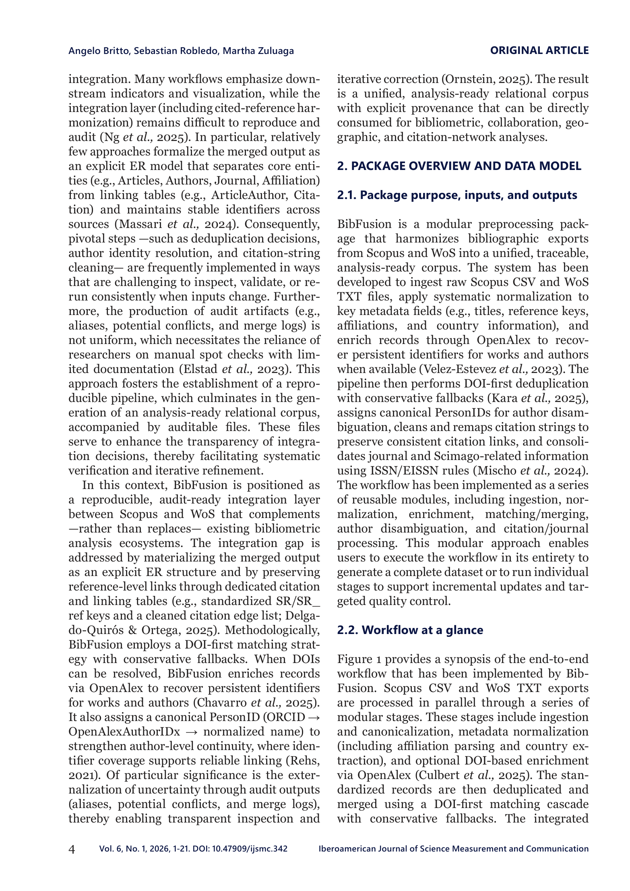

# BibFusion: A Python package to integrate, deduplicate, and harmonize exported bibliographic records from Scopus and Web of Science for bibliometric analysis

> **저자**: Angelo Britto, Sebastian Robledo, Martha Zuluaga | **날짜**: 2026-02-14 | **Journal**: Iberoamerican Journal of Science Measurement and Communication | **DOI**: [10.47909/ijsmc.342](https://doi.org/10.47909/ijsmc.342)
> **리뷰 모드**: PDF

---

## Essence

BibFusion은 무엇이고 어떤 문제를 해결하는가? Scopus CSV와 Web of Science TXT 파일을 단일의 추적 가능한 분석-준비 코퍼스로 통합하는 Python 패키지다. 핵심 기능: (1) DOI 우선 중복 제거(DOI 없으면 제목-연도-제1저자 fallback), (2) ASCII/대문자 표준화, (3) OpenAlex를 통한 식별자(ORCID, OpenAlex ID) 보강, (4) ORCID → OpenAlexAuthorID → 정규화된 이름의 계층적 저자 disambiguation. 실증 시연에서 기업가적 마케팅 쿼리 436건 → **253개 고유 논문** 통합, 8,569건 인용 코퍼스 구성에 성공했다.

*Figure 1: BibFusion 처리 파이프라인 - Scopus/WoS 입력에서 정규화, 중복 제거, OpenAlex 보강을 거쳐 통합 코퍼스 출력까지의 워크플로*

## Originality (Abstract 기반)

- [authorship, novelty, action] "The study presented BibFusion, a Python software package that harmonizes bibliographic exports from Scopus and Web of Science into a single, traceable, analysis-ready corpus for bibliometric and scientometric research."
- [result] "BibFusion consolidated 436 source records into 253 unique main works and materialized a unified corpus of 8,569 articles."
- [conclusion] "BibFusion offers a reusable, auditable integration workflow that has been demonstrated to reduce duplicate inflation and metadata fragmentation."

## How (방법론)

- **입력 처리**: Scopus CSV와 WoS TXT 파일 ingestion, 필드별 표준화(ASCII/대문자)
- **중복 제거**: DOI 우선 cascade → DOI 부재 시 제목+연도+제1저자 보수적 fallback
- **식별자 보강**: DOI 기반 OpenAlex API 쿼리로 OpenAlex Work ID, ORCID, OpenAlex Author ID 회수
- **저자 disambiguation**: ORCID → OpenAlexAuthorID → 정규화 이름의 PersonID 계층
- **인용 연결**: 인용 문자열 정제 및 재매핑으로 일관된 citation link 보존
- **저널 정보**: ISSN/EISSN 규칙으로 Scimago 저널 정보 통합

## Why (중요성)

- Scopus와 WoS는 커버리지, 내보내기 구조, 메타데이터 완결성이 달라 통합 시 중복·저자 불명확·인용 단절이 발생하며, ad hoc 전처리는 편향된 지표로 이어짐
- 재현 가능하고 감사 가능한(auditable) 통합 도구가 없어 bibliometric 연구의 신뢰성이 저해되어 왔음

## Limitation

- Scopus와 WoS 두 데이터베이스에만 한정되어 arXiv, PubMed, Dimensions 등 다른 소스는 미지원
- DOI가 없는 오래된 논문이나 비영어 논문에서 제목 기반 fallback 매칭의 정확도가 불확실
- OpenAlex API 의존성으로 인한 네트워크 의존성과 API 변경에 따른 취약성

## Further Study

- arXiv, PubMed, OpenAlex 직접 수집 소스로의 확장
- 퍼지 매칭(fuzzy matching) 기반 중복 제거 정확도 향상
- 자동화된 품질 지표(precision/recall) 평가 프레임워크 통합

## 평가

| 항목 | 점수 |
|------|------|
| Novelty | 3/5 |
| Technical Soundness | 4/5 |
| Significance | 3/5 |
| Clarity | 4/5 |
| Overall | 3/5 |

**총평**: Scopus-WoS 통합이라는 실용적이고 반복적인 문제를 체계적으로 해결하는 Python 패키지로, 감사 가능한 파이프라인과 OpenAlex 보강이 강점이다. 범용 bibliometric 도구로서의 독창성은 제한적이나 실용적 가치가 높다.
