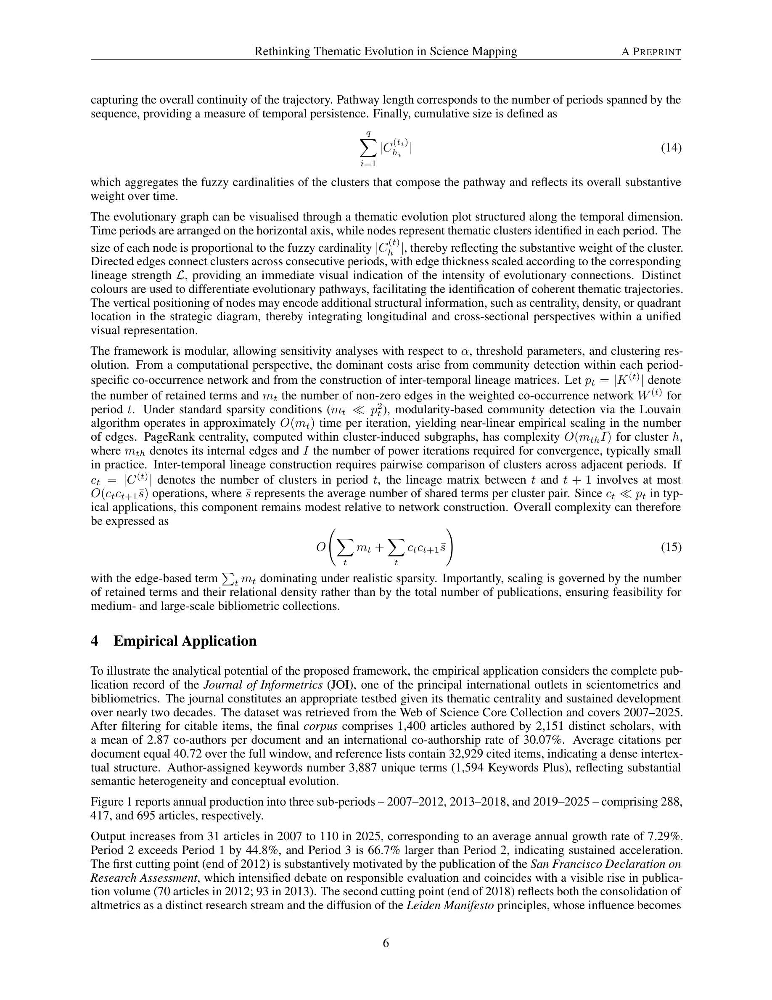

# Rethinking Thematic Evolution in Science Mapping: An Integrated Framework for Longitudinal Analysis

> **저자**: Massimo Aria, Luca D'Aniello, Michelangelo Misuraca, Maria Spano | **날짜**: 2026-03-06 | **Journal**: arXiv preprint | **arXiv**: [2603.06436](https://arxiv.org/abs/2603.06436)
> **리뷰 모드**: PDF

---

## Essence

종단적 science mapping에서 주제 탐지와 주제 연계가 서로 다른 논리(관계 클러스터링 vs. 어휘 중복)를 사용하는 구조적 불일치 문제를 어떻게 해결하는가? 이 논문은 **구조적으로 통합된 프레임워크**를 제안한다: 주제 탐지와 시계열 연계를 모두 동일한 가중치 관계 아키텍처 내에서 수행한다. 핵심 혁신은 두 가지다: (1) 그라디드 문서 소속(graded document affiliation)으로 이분법적 주제 할당을 대체하고, (2) 방향성 커버리지와 centrality 가중 구조적 관련성을 결합한 **lineage-strength measure**로 주제 연속성을 측정한다. 이를 통해 어휘적 지속성이 아닌 관계 구조의 재구성으로 주제 진화를 개념화한다.

*Figure 1: 제안된 통합 프레임워크의 구조 - 공-단어 네트워크에서의 횡단면 주제 탐지와 종단 연계가 동일한 가중치 관계 패러다임 내에서 수행되는 방식*

## Originality (Abstract 기반)

- [authorship, novelty, action] "This study introduces a structurally integrated framework in which lineage reconstruction is embedded within the same weighted relational architecture that underpins cross-sectional detection."
- [novelty] "The approach models thematic continuity through graded document affiliation and a lineage-strength measure that combines directional coverage with centrality-weighted structural relevance."
- [conclusion] "By aligning thematic detection and temporal modelling within a unified relational paradigm, the framework enhances the methodological coherence and interpretive robustness of longitudinal science mapping."

## How (방법론)

- **기반**: Callon et al.의 전략적 다이어그램(strategic diagram)과 co-word analysis 전통에서 출발
- **그라디드 소속**: 문서-주제 소속을 이분법적(crisp)이 아닌 정도(graded)로 모델링하여 혼합적 연구의 복잡성을 포착
- **Lineage-strength measure**: 연속 시기 간 주제 연계 강도를 방향성 커버리지(directional coverage) × centrality 가중 구조적 관련성으로 정의
- **구현**: R 패키지 bibliometrix의 개발 버전에 알고리즘 구현 (GitHub 공개)
- **검증**: 시뮬레이션 또는 실제 학술 데이터셋에 적용하여 기존 어휘 중복 방식과 비교

## Why (중요성)

- 기존 종단적 science mapping은 주제를 관계 클러스터링으로 탐지하면서도 시기 간 연계는 어휘 중복(keyword overlap)으로 추론하는 이중 기준을 사용해, 어휘보다 구조가 더 많이 변화하는 경우 잘못된 연계를 낳을 수 있음
- 오늘날 학제 간 연구가 증가하면서 하나의 연구가 여러 주제에 걸쳐 있는 경우가 많아, 이분법적 주제 할당은 현실을 왜곡함

## Limitation

- 저자들이 언급한 한계: 프리프린트 단계로 실증적 검증이 제한적이며, 매개변수(lineage-strength threshold 등) 설정에 대한 민감도 분석이 충분히 제시되지 않음
- lineage-strength measure의 가중치 설계에 주관적 판단이 개입할 수 있음
- 계산 비용이 대규모 co-word 네트워크에서 얼마나 증가하는지 불명확

## Further Study

- 다양한 학문 분야에 적용하여 기존 방법 대비 주제 연계 차이 실증 비교
- 동적 커뮤니티 탐지(dynamic community detection)나 임베딩 기반 방법과의 체계적 비교
- bibliometrix 패키지를 통한 사용자 친화적 도구화 및 재현 가능 워크플로 배포

## 평가

| 항목 | 점수 |
|------|------|
| Novelty | 4/5 |
| Technical Soundness | 4/5 |
| Significance | 4/5 |
| Clarity | 3/5 |
| Overall | 4/5 |

**총평**: 종단적 science mapping의 오래된 방법론적 불일치를 명확히 진단하고, 관계 구조 내에서의 통합 프레임워크를 제안한 이론적으로 탄탄한 연구다. bibliometrix 구현을 통한 실용적 보급이 예정되어 있어 과학 지식 지형 연구에 실질적 영향이 기대된다.
