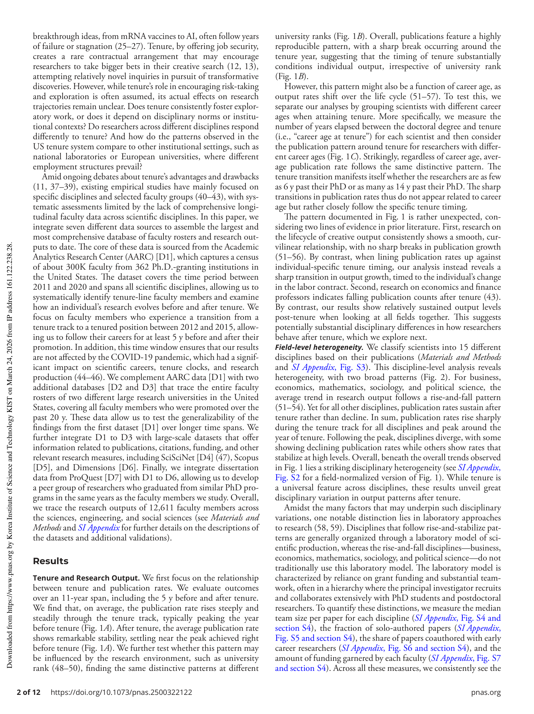

# Tenure and research trajectories

> **저자**: Giorgio Tripodi, Xiang Zheng, Yifan Qian, Dakota Murray, Benjamin F. Jones, Chaoqun Ni, Dashun Wang | **날짜**: 2025-07-29 | **Journal**: Proceedings of the National Academy of Sciences | **DOI**: [10.1073/pnas.2500322122](https://doi.org/10.1073/pnas.2500322122)
> **리뷰 모드**: PDF

---

## Essence

종신재직권(tenure)은 미국 학자들의 연구 궤적에 어떤 영향을 미치는가? 7개 데이터 소스를 통합해 **12,000명 이상의 연구자, 15개 분야**를 추적한 결과, 세 가지 메커니즘이 모두 작동함이 밝혀졌다: (1) **선발 메커니즘**: 출판율은 tenure-track 기간 동안 급격히 증가해 tenure 직전 정점에 달한다. (2) **유인 메커니즘**: post-tenure 추세는 분야에 따라 갈린다 — 실험실 기반 분야(생물학, 화학)는 높은 생산성을 유지하는 반면, 비실험실 분야(수학, 사회학)는 출판율이 크게 감소한다. (3) **창의적 탐색 메커니즘**: tenure 이후 더 새롭고 고위험 연구를 수행하지만, 인용 영향력은 오히려 감소한다.

*Figure 1: Tenure 전후 연구자 출판율 궤적 - tenure 연도를 기준으로 정렬한 평균 출판율 변화 패턴 (분야별 비교 포함)*

## Originality (Abstract 기반)

- [authorship, action, novelty] "Here, we integrate data from seven different sources to trace US tenure-line faculty and their research outputs at a remarkable scale and scope, covering over 12,000 researchers across 15 disciplines."
- [finding] "Faculty publication rates typically increase sharply during the tenure track and peak just before obtaining tenure."
- [finding] "Faculty increasingly produce novel, high-risk research after securing tenure. However, this shift toward novelty and risk-taking comes with a decline in impact."

## How (방법론)

- **데이터 통합**: 7개 출처 결합 — 대학 교원 명부, NSF/NIH 펀딩, Web of Science, 특허 데이터 등 12,000명+ 종단 추적
- **Tenure 연도 식별**: 대학 공개 자료와 CV에서 tenure 연도 수동·자동 추출
- **분야 분류**: 실험실 기반(생물학·화학·물리학 등) vs. 비실험실 기반(수학·사회학·역사학 등) 15개 분야
- **인과 추론**: 동일한 경력 나이지만 다른 tenure 연도를 가진 연구자 비교, tenure 기반 vs. 비-tenure 기반 기관 비교
- **참신성 측정**: Uzzi et al.의 novelty/conventionality 지표 활용

## Why (중요성)

- 미국 학술 시스템의 근간인 tenure가 연구 생산성과 혁신성에 어떤 영향을 주는지 대규모 실증 증거가 없어 정책 논쟁이 경험적 근거 없이 진행되어 왔음
- Tenure 시스템의 유지·개혁 논의에서 선발, 유인, 창의적 탐색이라는 세 이론적 메커니즘이 동시에 작동함을 처음으로 종합적으로 검증

## Limitation

- 저자들이 언급한 한계: 미국 tenure-track 시스템에 한정되어 다른 국가 학술 시스템으로의 일반화 불명확
- Tenure 이후 참신성 증가가 인용 감소로 이어지는 메커니즘(의도적 위험 감수 vs. 품질 저하)의 인과 구분 어려움
- 자체판단: 12,000명 샘플이 인문학·예술 등 일부 분야에서 대표성이 약할 수 있음

## Further Study

- 비미국권 학술 시스템(독일 종신교수제, 영국 강사 계약제 등)과의 비교 연구
- Tenure 이후 고위험 연구의 장기 영향(10-20년 후 인용)이 단기 인용 감소를 상쇄하는지 추적
- 성별, 인종, 기관 유형에 따른 tenure 효과의 이질성 분석

## 평가

| 항목 | 점수 |
|------|------|
| Novelty | 4/5 |
| Technical Soundness | 5/5 |
| Significance | 5/5 |
| Clarity | 5/5 |
| Overall | 5/5 |

**총평**: 12,000명 이상의 미국 교원 경력을 7개 데이터 소스로 추적하여 tenure 시스템의 세 가지 이론적 메커니즘을 동시에 검증한 PNAS급 대규모 연구다. Tenure 이후 참신성은 늘어나지만 인용은 줄어든다는 역설적 발견은 학문 자유와 생산성 유인 간의 근본적 긴장을 드러낸다.
