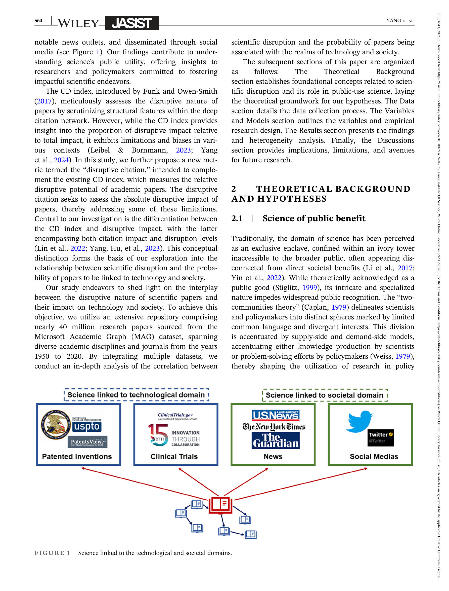

# Are disruptive papers more likely to impact technology and society?

> **저자**: Alex J. Yang, Xiaohui Yan, Haotian Hu, Hanlin Hu, Jia Kong, Sanhong Deng | **날짜**: 03/2025 | **Journal**: Journal of the Association for Information Science and Technology | **DOI**: [10.1002/asi.24947](https://doi.org/10.1002/asi.24947)
> **리뷰 모드**: PDF

---

## Essence

CD index로 측정한 disruptive 논문이 기술·사회에 더 큰 영향을 미칠 것이라는 직관적 기대는 옳은가? 답은 "아니다"이며, 동시에 "올바른 지표로 측정하면 맞다"는 이중적 결론이다. **4천만 건** 가까운 논문(MAG, 1950-2020)을 분석한 결과: (1) CD index가 높은 논문은 오히려 특허, 임상시험, 뉴스, 소셜미디어에 대한 영향 확률이 **낮다**. (2) 그러나 저자들이 새롭게 도입한 "**disruptive citation**"(절대적 파괴 영향 지표)이 높은 논문은 기술·사회 영향 확률이 유의미하게 **높다**. 이는 CD index의 bias(상대적 지표의 한계)를 드러내며, 절대적 파괴 임팩트가 더 나은 지표임을 시사한다.

*Figure 1: 연구와 기술·사회 연결 4대 경로 - 특허 인용, 임상시험 활용, 뉴스 보도, 소셜미디어 언급을 통한 과학의 기술·사회 영향 측정 프레임워크*

## Originality (Abstract 기반)

- [authorship, novelty, action] "We introduce the concept of 'disruptive citation,' a nuanced metric gauging the absolute disruptive impact of papers."
- [finding] "Papers characterized by a higher CD index paradoxically exhibit a diminished propensity to influence technological and societal domains."
- [finding] "Papers drawing higher disruptive citations exhibit a significantly higher probability to influence both technological and societal spheres."

## How (방법론)

- **데이터**: Microsoft Academic Graph(MAG) 약 4천만 건(1950-2020, 전 분야)
- **기술·사회 영향 측정**: 특허 인용, 임상시험 활용, 뉴스 보도(Altmetric), 소셜미디어 언급(Altmetric)의 4개 경로
- **Disruptive citation 정의**: 논문 i를 인용하면서 i의 참고문헌도 인용하지 않는 "순수 파괴적" 인용 수 (CD index의 비율적 측면과 달리 절대 수치)
- **통계 분석**: 로지스틱 회귀로 CD index 및 disruptive citation이 4개 영향 경로에 미치는 효과 추정, 연도·분야 고정효과 통제
- **강건성 검증**: 대안적 disruption 지표 사용, 총 인용수 통제

## Why (중요성)

- CD index는 영향력 있는 disruption 지표이나 분모(총 인용)에 의존해 절대적 파괴력이 큰 논문도 낮은 CD를 가질 수 있는 구조적 편향이 있음
- 정책 입안자들이 "파괴적 과학이 곧 실용적"이라고 가정하며 CD index 높은 연구를 우대하면 잘못된 자원 배분으로 이어질 수 있음

## Limitation

- MAG 데이터는 2021년 이후 업데이트가 중단되어 최근 논문에 대한 분석이 불가능
- "disruptive citation"의 개념이 직관적이나, CD index와의 상관관계 구조가 복잡하여 두 지표를 어떻게 함께 해석해야 할지에 대한 가이드라인이 부족
- STEM 분야 편향이 두드러져 인문·사회과학에서의 패턴은 별도 검토 필요

## Further Study

- Disruptive citation 지표의 시계열 변화와 과학 분야 특성별 비교
- CD index bias를 보정한 새로운 표준화 지표 개발
- 임상시험이나 특허와 같은 기술·사회 영향 경로별 disruption 효과의 메커니즘 분석

## 평가

| 항목 | 점수 |
|------|------|
| Novelty | 4/5 |
| Technical Soundness | 4/5 |
| Significance | 4/5 |
| Clarity | 4/5 |
| Overall | 4/5 |

**총평**: CD index의 역설적 편향을 4천만 건 데이터로 실증하고 "disruptive citation"이라는 대안 지표를 제안한 영향력 있는 연구다. CD index의 구조적 한계를 직접 겨냥하여 지표 개발 논의에 실질적 기여를 한다.
