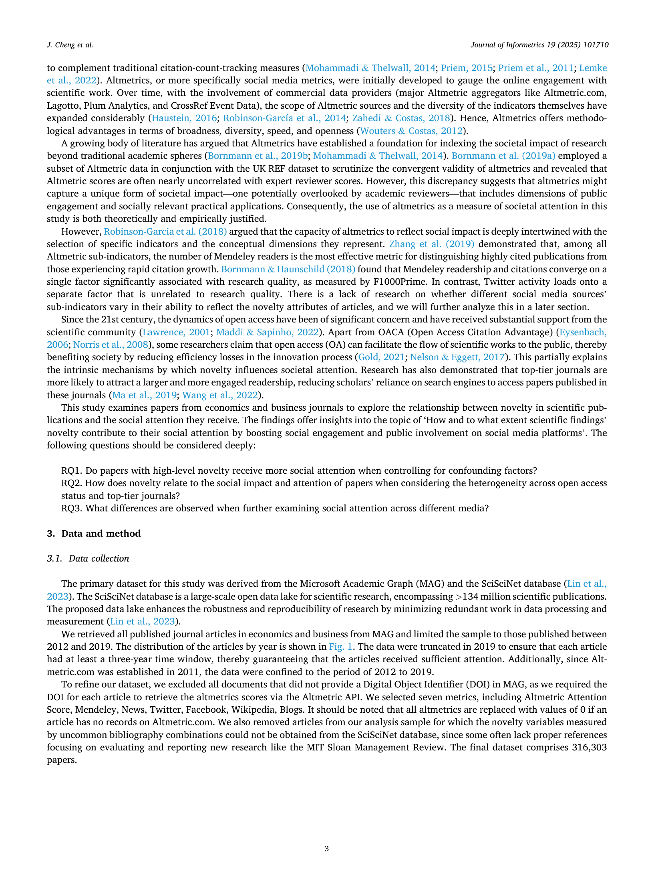

# Do novel papers attract more social attention?

> **저자**: Jiaqi Cheng, Yundong Xie, Qiang Wu | **날짜**: 08/2025 | **Journal**: Journal of Informetrics | **DOI**: [10.1016/j.joi.2025.101710](https://doi.org/10.1016/j.joi.2025.101710)
> **리뷰 모드**: PDF

---

## Essence

참신한 논문은 실제로 더 많은 사회적 주목을 받는가? 경제·경영 분야 **31만 건 이상**의 논문(2012-2019)을 대상으로 Altmetric Attention Score, Mendeley, Twitter, Blogs, News, Facebook, Wikipedia 등 7개 소셜 미디어 지표를 분석한 결과, **"그렇다"**는 답이 도출되었다. 참신한 연구는 모든 플랫폼에서 더 높은 사회적 주목을 받으며, 특히 **상위 저널 논문**과 **오픈 액세스 논문**에서 효과가 두드러진다. 이 결과는 대안적 참신성 지표와 인용수 통제 후에도 견고하다.

*Figure 1: 연구 참신성과 사회적 주목 간의 관계를 분석하는 프레임워크 - 경제·경영 분야 논문의 Altmetric 기반 사회적 영향 측정 체계*

## Originality (Abstract 기반)

- [authorship, action] "This study examines how the novelty of scientific research correlates with the social attention it garners."
- [finding, result] "The results show that novel research consistently garners greater social attention, with particularly strong effects observed in top-tier journals and open-access publications."
- [novelty] "Our findings remain robust even when employing alternative measures of novelty and controlling for the citation count."

## How (방법론)

- **데이터**: 경제·경영 분야 38만여 편 논문(2012-2019), 최종 31만 건 분석
- **참신성 측정**: 조합적 참신성 지표(Uzzi et al. 방식 — 참고문헌의 예상치 못한 조합)
- **사회적 주목 측정**: Altmetric Attention Score 종합 지수 + Twitter, Mendeley, Blogs, News, Facebook, Wikipedia 개별 지표
- **통계 분석**: 회귀 분석으로 참신성 → 소셜 주목 효과 추정, 인용수 통제, 저널 계층, OA 여부 상호작용 분석
- **강건성**: 대안적 참신성 지표(예: reference novelty) 사용 반복 검증

## Why (중요성)

- 소셜 미디어 확산이 과학 커뮤니케이션의 핵심 채널이 되면서 참신성이 사회적 주목을 이끄는지가 연구 평가와 공공 engagement 정책에 중요해짐
- 기존 연구들은 Twitter 언급과 인용의 약한 상관관계만 보고했으나, 참신성이라는 논문 내재적 속성과 소셜 주목의 관계는 미탐구 상태였음

## Limitation

- 경제·경영이라는 단일 분야에 한정되어 다른 분야로의 일반화 불확실
- 참신성 측정이 인용 네트워크 기반이어서, 참신하지만 참고문헌이 적은 논문에서 측정 오류 가능
- 인과관계가 아닌 상관관계 수준의 분석; 참신한 논문이 더 주목받는지 혹은 주목받을 만한 논문이 참신하게 쓰여지는지 구분 어려움

## Further Study

- 다양한 분야(의학, 물리학, 컴퓨터과학)에서 참신성-소셜 주목 관계의 일반성 검증
- 오픈 액세스 매개 효과의 인과 구조 분석 (OA가 확산 경로인지 vs. 참신성 선택 효과인지)
- 소셜 미디어 플랫폼별 메커니즘 차이 — 전문가 네트워크(Mendeley)와 일반 공중(Facebook) 비교

## 평가

| 항목 | 점수 |
|------|------|
| Novelty | 3/5 |
| Technical Soundness | 4/5 |
| Significance | 3/5 |
| Clarity | 4/5 |
| Overall | 3/5 |

**총평**: 참신성과 사회적 주목의 정(+)의 관계를 다중 Altmetric 플랫폼에서 일관되게 입증한 탄탄한 실증 연구다. 경제·경영 단일 분야 한정이라는 한계가 있으나, 오픈 액세스와의 상호작용 발견 등 정책적으로 유용한 함의를 제공한다.
