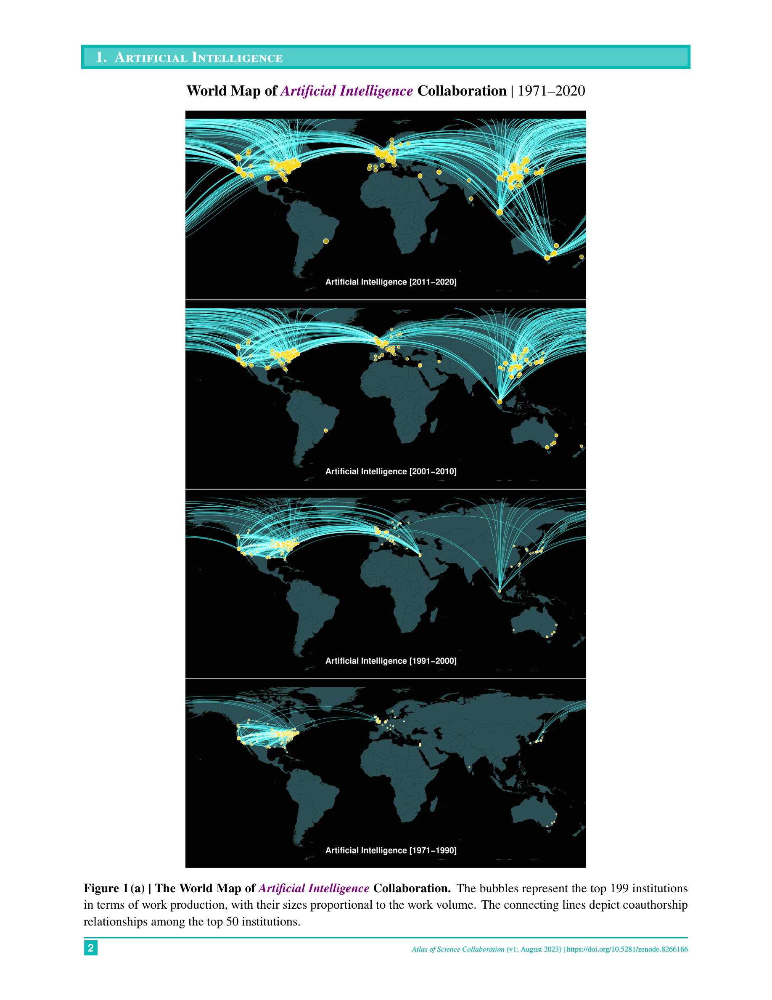

# Atlas of Science Collaboration, 1971–2020

> **저자**: Keisuke Okamura | **날짜**: 2024-06-11 | **Journal**: SN Computer Science | **DOI**: [10.1007/s42979-024-02973-4](https://doi.org/10.1007/s42979-024-02973-4)
> **리뷰 모드**: PDF

---

## Essence

1971년부터 2020년까지 50년간 자연과학 15개 분야에서 기관 간 연구 협력은 어떻게 진화했는가? OpenAlex 오픈 데이터를 기반으로 공저 관계를 분석하여 세계 지도와 다이어그램으로 시각화한 **협력 지도책(atlas)**을 제시한다. 주요 과학 생산국과 그 협력 관계의 변화, 분야별 국제·기관 간 협력의 현황을 한눈에 파악할 수 있도록 설계된 실용 참고 자료로, 과학 정책 입안자, 외교관, 기관 연구부서를 주요 독자로 한다.

*Figure 1: Atlas의 샘플 시각화 - 특정 분야(예: 인공지능)에서 상위 기관 간 공저 협력 네트워크를 세계 지도 및 표 형태로 표현*

## Originality (Abstract 기반)

- [authorship, novelty, action] "The evolving landscape of interinstitutional collaborative research across 15 natural science disciplines is explored using the open data sourced from OpenAlex."
- [novelty] "The findings are visually presented on world maps and other diagrams, offering a clear and insightful portrayal of notable variations in both national and international collaboration patterns."

## How (방법론)

- **데이터**: OpenAlex에서 2023년 8월 기준 수집한 1971-2020년 자연과학 15개 분야 논문
- **협력 측정**: 공저(coauthorship)를 기반으로 기관 간 연결 관계 매핑
- **시각화**: 세계 지도 + 상위 기관 목록 + 협력 행렬 다이어그램 (분야별 15개 챕터)
- **분야**: AI, 양자과학, 생명공학, 나노기술, 농업공학, 입자물리, 항공우주, 핵공학, 해양, 신경과학, 응집물질물리, 환경공학, 지구과학, 천문학, 순수수학

## Why (중요성)

- 50년간 기관 간 과학 협력의 진화를 한 권에 담은 포괄적 시각 참고 자료가 없었음
- 오픈 데이터(OpenAlex)만을 사용하여 무료·재현 가능한 과학 지형 지도 제작의 모범 사례 제시
- 과학 외교와 국제 협력 전략 수립에 즉시 활용 가능한 실용 자료

## Limitation

- Coauthorship이 실제 협력의 깊이와 질을 반드시 반영하지 않을 수 있음
- OpenAlex의 기관 disambiguation 오류가 협력 네트워크 정확도에 영향을 줄 수 있음
- 15개 자연과학 분야에 한정되어 사회과학, 인문학, 공학이 제외됨

## Further Study

- 시계열 애니메이션으로 협력 패턴의 동적 변화 시각화
- 사회과학·공학 분야로의 확장
- 국가 수준의 과학 외교 정책과 협력 패턴 간 상관관계 분석

## 평가

| 항목 | 점수 |
|------|------|
| Novelty | 3/5 |
| Technical Soundness | 3/5 |
| Significance | 3/5 |
| Clarity | 5/5 |
| Overall | 3/5 |

**총평**: 50년간 15개 자연과학 분야의 기관 간 협력을 오픈 데이터로 시각화한 실용적 참고 자료다. 새로운 방법론적 기여보다는 정책 입안자·외교관·기관 연구부서에 즉시 활용 가능한 시각 정보 제공이 핵심 가치다.
