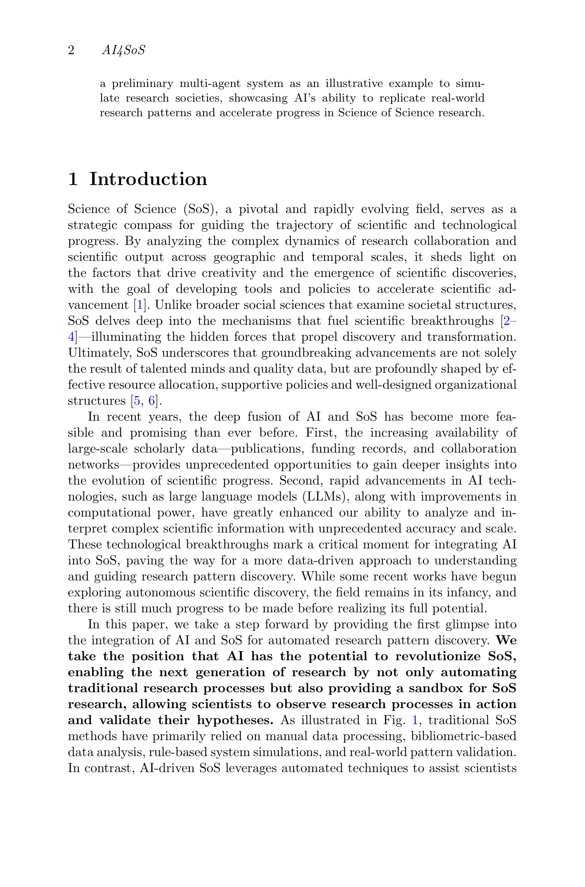
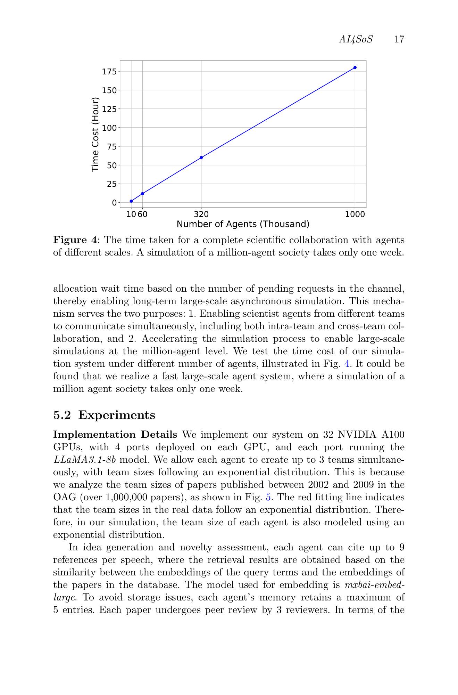

# AI-Driven Automation Can Become the Foundation of Next-Era Science of Science Research

> **저자**: Renqi Chen, Haoyang Su, Shixiang Tang, Zhenfei Yin, Qi Wu, Hui Li, Ye Sun, Nanqing Dong, Wanli Ouyang, Philip Torr | **날짜**: 2025-05-17 | **Journal**: arXiv preprint | **DOI**: [10.48550/arXiv.2505.12039](https://doi.org/10.48550/arXiv.2505.12039)
> **리뷰 모드**: PDF

---

## Essence

AI는 Science of Science(SoS) 연구의 다음 세대를 어떻게 바꿀 수 있는가? 이 논문은 AI4SoS라는 새로운 학제간 연구 방향을 정의하고, 기존 인간 주도 연구 프로세스(수동 데이터 처리 → 서지계량 분석 → 규칙 기반 시뮬레이션 → 실세계 패턴 검증)를 AI 기반 파이프라인으로 대체하는 비전을 제시한다. 핵심 실증으로, **100만 에이전트 규모의 LLM 기반 멀티에이전트 시스템**으로 가상 연구 사회를 시뮬레이션하여 실제 2010년 데이터의 인용 패턴(민족 다양성·소속 다양성·대학 랭킹과 인용 수 간 상관관계)을 성공적으로 복제했다. 100만 에이전트 시뮬레이션은 32개 NVIDIA A100 GPU로 약 1주일이면 완료된다.

*Figure 1: 인간 주도 vs. AI 주도 SoS 연구 프로세스 비교 — 데이터 처리, 데이터 분석, 시스템 시뮬레이션, 패턴 검증의 4단계에서의 차이를 보여줌.*

## Originality (Abstract 기반)

- [authorship, novelty] "This paper offers a forward-looking perspective on the integration of Science of Science with AI for automated research pattern discovery."
- [authorship, action] "we present a preliminary multi-agent system as an illustrative example to simulate research societies, showcasing AI's ability to replicate real-world research patterns and accelerate progress in Science of Science research."
- [novelty] AI4SoS를 AI for Science와 구별되는 독립적 연구 영역으로 처음 정의하고 자동화 수준 계층(hierarchy of automation levels)을 제안

## How (방법론)

- **AI4SoS 자동화 계층 정의**: 수동 보조 → 반자동 → 완전 자동화에 이르는 단계적 자동화 수준 프레임워크 제안
- **멀티에이전트 시뮬레이션 시스템**:
  - **에이전트 규모**: 최대 100만 에이전트 (LLaMA3.1-8b 기반)
  - **인프라**: 32 NVIDIA A100 GPU, GPU당 4포트, OASIS 기반 비동기 분산 시스템
  - **팀 구성**: 에이전트당 최대 3팀 동시 참여; 팀 크기는 실제 데이터(2002-2009 OAG 100만편)에서 도출된 지수 분포 $P(k) \propto e^{-0.335(k-3)}$로 모델링
  - **피어 리뷰**: 논문당 3명 리뷰어
  - **40 에포크** 시뮬레이션
- **검증 지표**: 인용 수와 민족 다양성(Shannon entropy), 소속 다양성, 대학 랭킹 간 상관관계를 실제 2010년 데이터와 비교

*Figure 4: 에이전트 규모에 따른 시뮬레이션 소요 시간 — 100만 에이전트 사회 시뮬레이션이 약 1주일 소요됨.*

## Why (중요성)

- 기존 SoS는 선형 회귀, 규칙 기반 시뮬레이션 등 단순 통계 도구에 의존하여 현대 연구 생태계의 복잡성을 포착하지 못했음
- AI가 SoS에서 단순 도구가 아닌 **연구 프로세스 자동화의 토대**가 될 수 있다는 관점 전환이 핵심 — 가설 생성부터 패턴 발견까지 AI가 주도하는 연구 패러다임
- 100만 에이전트 규모의 가상 연구 사회 시뮬레이션은 실제 실험이 불가능한 반사실적(counterfactual) 시나리오(예: 특정 정책 변화의 효과)를 탐색하는 도구로 활용 가능
- 다양성-인용 상관관계를 가상 환경에서 복제함으로써 AI 시뮬레이션이 실세계 패턴을 재현할 수 있음을 입증

## Limitation

### 저자들이 언급한 한계
- **데이터 불균형**: 학문 분야별 데이터 가용성 격차 — 일부 분야는 대규모 데이터 부족
- **파라미터 과잉**: 과학 사회 시뮬레이션 시스템의 압도적인 파라미터 수
- **검증 체계 부재**: 시뮬레이션의 신뢰성을 검증하는 합리적 평가 체계 미흡

### 자체판단 아쉬운 점
- LLaMA3.1-8b의 역할 수행 능력이 실제 과학자의 창의적·전략적 의사결정을 얼마나 반영하는지 의문
- 민족 다양성과 인용 상관관계 복제는 상관관계 패턴 매칭이지, 인과 메커니즘 검증이 아님
- "전망(perspective)" 논문으로서 실험 부분이 제한적이며, 제시된 자동화 계층이 구체적 로드맵보다는 비전에 가까움

### 후속 연구
- 완전 자동화 SoS — AI가 연구 질문 수립부터 결과 검증까지 자율적으로 수행하는 시스템 구현
- 시뮬레이션 결과의 인과 메커니즘 분석 — 관측 데이터에서 검증 불가능한 반사실적 시나리오 탐색
- 다양한 학문 분야와 국가 맥락에서의 범용 SoS 시뮬레이션 프레임워크 개발

## 평가

| 항목 | 점수 |
|------|------|
| Novelty | 5/5 |
| Technical Soundness | 3/5 |
| Significance | 5/5 |
| Clarity | 4/5 |
| Overall | 4/5 |

**총평**: AI4SoS를 독립적 연구 영역으로 처음 정의하고 100만 에이전트 규모의 연구 사회 시뮬레이션이라는 인상적인 개념 증명을 제시한 비전 논문이다. 실증 실험의 깊이보다 광범위한 프레임워크 제시에 방점이 찍혀 있어 기술적 엄밀성은 다소 제한적이나, Science of Science의 AI 기반 자동화라는 새로운 연구 의제를 설득력 있게 제안한다.
