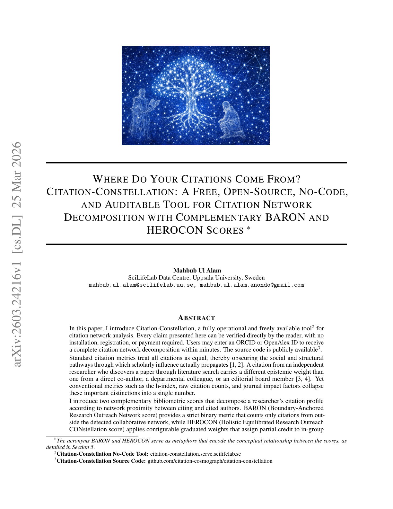

# Where Do Your Citations Come From? Citation-Constellation: A Free, Open-Source, No-Code, and Auditable Tool for Citation Network Decomposition with Complementary BARON and HEROCON Scores

> **저자**: Mahbub Ul Alam | **날짜**: 2026-03-25 | **Journal**: arXiv preprint | **DOI**: N/A | **arXiv**: [2603.24216](https://arxiv.org/abs/2603.24216)
> **리뷰 모드**: PDF

---

## Essence

인용은 어디서 오는가 — 진정한 외부 인정인가, 아니면 사회적 네트워크의 증폭 효과인가? Citation-Constellation은 이 질문에 답하는 오픈소스 도구다. BARON(Boundary-Anchored Research Outreach Network score)은 협업 네트워크 외부에서 온 인용만 엄격하게 카운트하는 이진 지표이고, HEROCON(Holistic Equilibrated Research Outreach CONstellation score)은 관계 근접도에 따라 단계적 가중치를 부여하는 지표다. 두 점수의 차이(gap)는 "내부 집단 의존도"의 진단 지표가 된다. ORCID 검증 기반 저자 식별, ROR 기반 기관 소속 매칭, 완전한 감사 추적(audit trail)을 갖춘 4단계 파이프라인으로 구현되며, 프로그래밍 없이 웹 인터페이스에서 즉시 이용 가능하다.

*Figure 1: Citation-Constellation의 인용 네트워크 분해 아키텍처 — 자기인용, 공저자 그래프, 기관 소속, 저널 거버넌스의 4단계 탐지 레이어*

## Originality (Abstract 기반)

- [action, conclusion] "BARON (Boundary-Anchored Research Outreach Network score) is a strict binary metric counting only citations from outside the detected collaborative network."
- [approach] "They should not be used for hiring, promotion, or funding decisions."
- [continuation] "HEROCON weights are experimental and require empirical calibration."

## How (방법론)

- **4단계 탐지 아키텍처**: (1) 자기인용 분석, (2) 공저자 그래프 순회, (3) ROR을 통한 시간적 기관 소속 매칭, (4) 로컬 LLM 기반 저널 거버넌스 추출 (1-3단계 운영 중, 4단계 개발 중)
- ORCID 검증을 통한 저자 동명이인 해소(disambiguation) — 기존 도구들의 핵심 취약점 해결
- 메타데이터 불충분 인용을 EXTERNAL로 암묵적 분류하지 않고 UNKNOWN으로 명시적 분류
- 모든 분류 결정을 JSON 파일로 문서화하는 완전 감사 추적(audit trail) 시스템
- SciLifeLab Serve에 배포된 no-code 웹 인터페이스: ORCID 또는 OpenAlex ID 입력만으로 수분 내 결과

## Why (중요성)

- h-index, 원시 인용수, JIF는 모두 인용의 사회적 근접도를 무시하여 네트워크 증폭 효과를 실제 임팩트로 오인
- 진정한 외부 도달 범위(genuine external reach)와 협업 네트워크 내 순환 인용을 구분함으로써 더 공정한 연구자 평가 가능
- 책임있는 연구 평가(responsible research assessment) 운동과 정렬되는 구조적 진단 도구

## Limitation

### 저자들이 언급한 한계
- HEROCON 가중치는 실험적이며 경험적 보정이 필요
- Phase 4(저널 거버넌스 추출)는 아직 개발 중
- 인용 동기 연구와의 교차 검증이 미완성

### 자체판단 아쉬운 점
- 단일 저자 연구로, 도구의 정확성에 대한 독립적 검증 부재
- BARON/HEROCON 점수와 연구 품질 간 상관관계 검증 데이터 없음
- 소규모 또는 신흥 연구자에 대한 메타데이터 불충분 문제가 UNKNOWN 비율을 높일 수 있음

### 후속 연구
- HEROCON 가중치의 경험적 보정을 위한 인용 동기 연구
- Phase 4 저널 거버넌스 데이터베이스 완성 및 배포
- 다양한 분야·경력 단계 연구자에 대한 BARON/HEROCON 점수 분포 분석

## 평가

| 항목 | 점수 |
|------|------|
| Novelty | 4/5 |
| Technical Soundness | 3/5 |
| Significance | 4/5 |
| Clarity | 4/5 |
| Overall | 4/5 |

**총평**: 인용의 사회적 근접도를 정량화하는 실용적이고 투명한 오픈소스 도구로, 책임있는 연구 평가 운동에 직접 기여한다. HEROCON 가중치 보정과 독립 검증이 향후 신뢰도의 관건이다.
