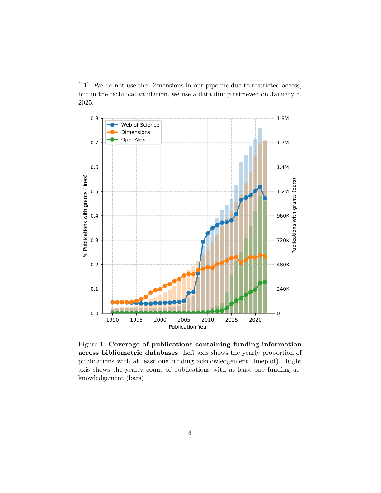

# Linking Global Science Funding to Research Publications

> **저자**: Jacob Aarup Dalsgaard, Filipi Nascimento Silva, Jin AI | **날짜**: 2026-03-25 | **Journal**: arXiv preprint (Scientific Data 제출 예정) | **DOI**: N/A | **arXiv**: [2603.24147](https://arxiv.org/abs/2603.24147)
> **리뷰 모드**: PDF

---

## Essence

전 지구적 과학 펀딩을 연구 논문과 어떻게 연결할 수 있는가? 이 논문은 Web of Science에서 추출한 **740만 개의 고유 펀딩 감사(acknowledgment) 문자열**을 OpenAlex와 ROR의 표준 기관 식별자에 매핑한 대규모 데이터셋을 제시한다. 렉시컬 정규화, MinHash 유사도 클러스터링, 규칙 기반 매칭, 개체명 인식(NER), 수동 검증을 결합한 다단계 파이프라인을 통해 **190만 개의 고유 펀더 문자열**을 표준 식별자에 연결했다. 이 데이터셋은 펀딩 흐름, 지역 대표성, 글로벌 연구 시스템의 집중 패턴 분석을 지원하며, Global South 펀더의 저조한 대표성 문제를 처음으로 체계적으로 문서화한다.

*Figure 1: 다단계 펀더 명칭 disambiguation 파이프라인 — 렉시컬 정규화부터 수동 검증까지의 처리 흐름*

## Originality (Abstract 기반)

- [authorship, novelty, action] "We present a dataset for linking global science funding organizations to research publications by systematically disambiguating unique funding acknowledgment strings extracted from publication metadata."
- [novelty, finding] "The resulting dataset links 1.9 million unique funder strings to canonical organization identifiers and records match types and unresolved cases to support transparency."
- [finding] "Technical validation includes paper-level comparisons across bibliometric sources and manual verification against full-text acknowledgment sections, with reported recall and precision metrics."
- [continuation] "This dataset supports analyses of funding flows, institutional funding portfolios, regional representation, and concentration patterns in the global research system."

## How (방법론)

- **데이터 소스**: Web of Science 출판 메타데이터에서 740만 개 펀딩 감사 문자열 추출
- **다단계 disambiguation 파이프라인**:
  1. 렉시컬 정규화 (소문자화, 특수문자 제거, 약어 확장)
  2. MinHash locality-sensitive hashing 기반 유사도 클러스터링
  3. 규칙 기반 매칭 (알려진 펀더 약어 및 변형 사전)
  4. NER(Named Entity Recognition) 보조 매칭
  5. 유사도 기반 폴백 방법
  6. 타깃 수동 검증
- **매핑 대상**: OpenAlex 및 ROR(Research Organization Registry) 표준 식별자
- **검증**: 서지 소스 간 논문 단위 비교, 전문 acknowledgment 섹션 수동 검증, recall·precision 지표 보고

## Why (중요성)

- 펀딩 감사 문자열의 비표준화로 인한 측정 오류는 과학 정책 연구의 신뢰성을 심각하게 훼손
- Dimensions은 고소득 국가 펀더에 편중; WoS는 더 광범위한 지리적 커버리지를 보임 — 데이터베이스 선택이 분석 결과에 미치는 영향을 처음으로 정량화
- 190만 개 펀더-식별자 매핑 데이터셋은 글로벌 과학 펀딩 연구의 핵심 인프라

## Limitation

### 저자들이 언급한 한계
- 포괄적 통합보다는 모호성을 보존하는 접근으로, 일부 매핑은 미해결 상태로 남음
- WoS 데이터에 기반하여 OpenAlex 등 다른 소스와의 커버리지 차이 존재
- Global South 지역의 메타데이터 불완전성으로 해당 지역 펀더 커버리지 제한

### 자체판단 아쉬운 점
- 다단계 파이프라인의 각 단계별 기여도(contribution)가 명확히 분리되지 않음
- NER 모델의 구체적 아키텍처와 훈련 데이터가 초록에서 불명확
- 시간에 따른 펀더 명칭 변화(기관 합병, 명칭 변경)에 대한 처리 방식 미명시

### 후속 연구
- 데이터셋을 활용한 글로벌 펀딩 집중도 및 지역 형평성 분석
- 펀딩-산출물 연계를 통한 특정 펀더의 연구 임팩트 추적
- 다른 bibliometric 데이터베이스로 파이프라인 확장

## 평가

| 항목 | 점수 |
|------|------|
| Novelty | 4/5 |
| Technical Soundness | 4/5 |
| Significance | 5/5 |
| Clarity | 4/5 |
| Overall | 4/5 |

**총평**: 글로벌 과학 펀딩 연구의 핵심 인프라 문제를 체계적으로 해결한 데이터 논문으로, 190만 개 펀더 매핑 데이터셋과 데이터베이스 간 편향의 정량적 비교는 과학계량학 및 과학 정책 연구의 중요한 기반이 된다.
