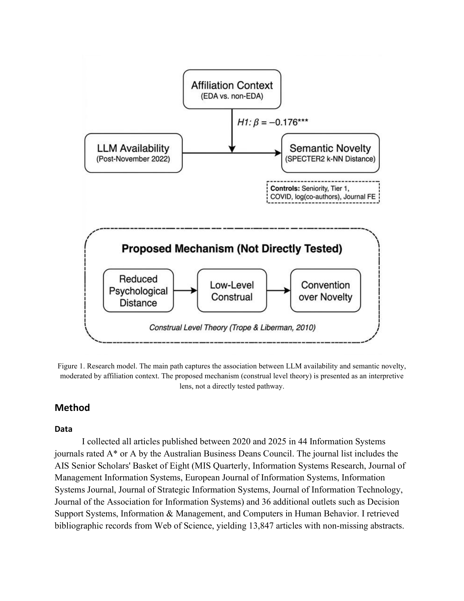

# Do Large Language Models Reduce Research Novelty? Evidence from Information Systems Journals

> **저자**: Ali Safari | **날짜**: 2026-03-23 | **Journal**: arXiv preprint | **DOI**: N/A | **arXiv**: [2603.22510](https://arxiv.org/abs/2603.22510)
> **리뷰 모드**: PDF

---

## Essence

LLM은 연구의 새로움을 실제로 줄이는가? 답은 조건부 '예'다. ChatGPT 출시(2022년 11월)를 자연 실험으로 활용한 이중차분(difference-in-differences) 분석에서, **비영어권 국가 소속 연구자들은 영어권 연구자 대비 상대적 novelty가 0.18 표준편차 감소**했다 (β = -0.176, p < 0.001, 7 백분위점 하락). 44개 정보시스템 학술지에 게재된 13,847편의 논문을 SPECTER2 임베딩으로 분석한 이 결과는 플라시보 검정, 대안적 치료 시점, 다중 robustness check를 모두 통과했다. LLM은 비영어권 연구자의 작문 장벽을 낮추되, 동시에 추상적·탐색적 사고보다 관습적·구체적 실행으로 인지 방향을 전환시키는 "근접성 도구(proximity tool)"로 기능한다고 해석된다.

*Figure 1: 연구 novelty의 시계열 변화 — ChatGPT 출시 전후 영어권/비영어권 연구자 집단의 이중차분 분석*

## Originality (Abstract 기반)

- 389번 논문은 rule-based originality 추출 결과 없음 (LLM fallback 대상). 초록에서 직접 추출:
- [action, novelty] "I address this gap by measuring the semantic novelty of 13,847 articles published between 2020 and 2025 in 44 Information Systems journals."
- [finding] "authors affiliated with institutions in non-English-dominant countries show a 0.18 standard deviation decline in relative novelty compared to authors in English-dominant countries (beta = -0.176, p < 0.001)"
- [approach] "I interpret these results through the lens of construal level theory, proposing that LLMs function as proximity tools that shift researchers from abstract, exploratory thinking toward concrete, convention-following execution."

## How (방법론)

- **데이터**: 44개 정보시스템 학술지, 2020-2025년 출판 13,847편 논문
- **Novelty 측정**: SPECTER2 임베딩으로 각 논문과 최근접 선행 논문들 간의 cosine distance를 novelty로 조작화
- **인과 식별**: 이중차분(DiD) 설계 — ChatGPT 출시(2022년 11월)를 처리 시점으로, 영어권/비영어권 국가 소속을 집단 구분 기준으로 사용
- **검증**: 대안적 novelty 명세, 대안적 처리 시점, 하위 표본 분석, 처리 전 시점 플라시보 검정
- **이론 틀**: Construal Level Theory — LLM이 시간적 거리, 가설적 거리, 노력 거리를 줄여 고수준 구성(추상·탐색)에서 저수준 구성(관습·실행)으로 이동시킴

## Why (중요성)

- LLM 생산성 연구들은 출력량·정확도만 측정했으나, 지식의 다양성과 novelty에 미치는 영향은 미탐구 상태였음
- 집합적 차원에서 LLM이 출력 동질화를 초래할 수 있다는 첫 번째 학술 대규모 증거
- 비영어권 연구자가 LLM을 가장 많이 활용하면서 역설적으로 novelty 손실도 가장 크다는 발견은 글로벌 과학 다양성 정책에 중요한 시사점

## Limitation

### 저자들이 언급한 한계
- LLM 실제 채택 여부나 construal level을 직접 관측하지 못함 — 비영어권 국가 소속을 LLM 의존도의 프록시로 사용
- 정보시스템 분야에 국한되어 다른 분야로의 일반화 불확실
- SPECTER2 임베딩 기반 novelty는 의미적 거리를 측정하지, 진정한 지적 혁신을 측정하지 않음

### 자체판단 아쉬운 점
- 비영어권 국가 = LLM 높은 의존도 가정은 단순화 — 비영어권 내에서도 국가·기관별 LLM 접근성과 사용 패턴의 이질성이 큼
- Novelty 감소가 LLM 때문인지 COVID-19 이후 연구 환경 변화 때문인지 완전한 분리가 어려움
- 44개 정보시스템 학술지가 분야 전체를 대표하는지에 대한 샘플링 편향 우려

### 후속 연구
- 실제 LLM 사용 데이터(API 로그, 설문)와 연계한 인과 관계 직접 검증
- STEM, 인문사회과학 등 다양한 분야로 분석 확장
- LLM 사용이 novelty를 높이는 특정 조건(독창적 prompting 전략 등)에 대한 탐색

## 평가

| 항목 | 점수 |
|------|------|
| Novelty | 4/5 |
| Technical Soundness | 4/5 |
| Significance | 5/5 |
| Clarity | 4/5 |
| Overall | 4/5 |

**총평**: LLM의 생산성 증가가 지식 다양성 감소라는 대가를 치를 수 있다는 중요한 증거를 제시하며, 특히 비영어권 연구자에게 집중된 novelty 손실은 글로벌 과학 정책 논의에 긴급한 화두를 던진다.
