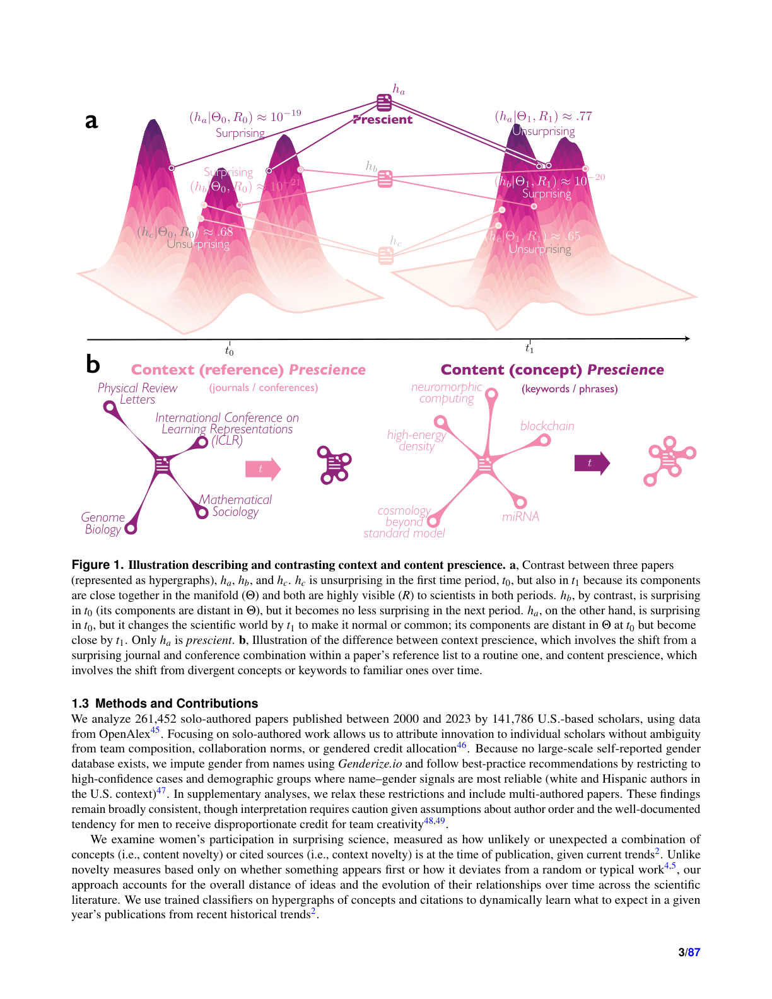

# The Innovation Recognition Paradox: How Science Undervalues the Boundary-Crossing Work Women Produce

> **저자**: C. Biliotti, M. Riccaboni, J. W. Lockhart, J. A. Evans | **날짜**: 2026-03-21 | **Journal**: arXiv preprint | **DOI**: N/A | **arXiv**: [2603.20597](https://arxiv.org/abs/2603.20597)
> **리뷰 모드**: PDF

---

## Essence

과학은 왜 여성이 생산하는 경계 초월 연구를 과소평가하는가? 261,452편의 미국 연구자 단독 저술 논문을 분석한 결과, **여성은 원거리 학문 간 연결(context novelty)을, 남성은 분야 내 개념 재조합(content novelty)을 더 자주 추구한다.** 역설적으로, 여성의 학제간 혁신은 더 파괴적이고 더 선견지명이 있지만, 과학은 이를 처벌한다. 동등한 수준의 혁신적 연구임에도 여성 논문은 더 낮은 위신의 저널에 게재되고 인용 크레딧을 덜 받는다. 이 격차는 극단적 novelty 수준에서만 좁아지는데, 이는 여성이 동등한 인정을 받으려면 예외적으로 놀라운 연구를 해야 함을 의미한다. 이는 여성의 기여 부족이 아니라, 분야를 가장 변혁시킬 경계 초월 연구를 체계적으로 평가절하하는 **보상 구조의 문제**임이 밝혀졌다.

*Figure 1: content novelty(분야 내 개념 재조합)와 context novelty(학제간 참조 조합)의 이중 프레임워크 및 성별 분포 패턴*

## Originality (Abstract 기반)

- [authorship, novelty, finding] "we show that women more often bridge distant disciplines through novel reference combinations, while men more often recombine concepts within fields."
- [finding] "Women's interdisciplinary innovations prove more disruptive and more prescient, yet science penalizes them for it."
- [novelty] "For equally innovative work, women's papers land in lower-prestige journals and tend to receive less downstream citation credit, though their disruptive impact is greater."
- [result, conclusion] "These gaps narrow only at extreme levels of novelty, suggesting women must produce exceptionally surprising work to achieve parity."
- [continuation] "Men's within-field concept innovations, by contrast, attract recognition from disciplinary gatekeepers who control careers."
- [finding] "The asymmetry reveals not a deficit in women's contributions but a reward structure that systematically undervalues the boundary-crossing work most likely to transform fields."

## How (방법론)

- **데이터**: 261,452편 미국 연구자 단독 저술 논문 (성별 분석의 교란 요인 제거 목적), 수백만 편 다저자 논문으로 패턴 확인
- **Content novelty**: 논문 내 개념(entity) 조합의 희귀성 — 기존 과학 트렌드 대비 새로운 개념 쌍 측정
- **Context novelty**: 참조 문헌들의 출처 분야 간 거리 — 원거리 학문 연결의 측정 (Uzzi et al. atypicality 방법론 확장)
- **보상 측정**: 저널 위신(prestige), 인용 크레딧, Disruption Index(CD 지수) 활용
- **선견지명(prescience)**: 논문 발표 이후 해당 개념 조합의 과학계 수용 정도로 측정
- **통제 변수**: 분야, 연도, 경력 단계, 공동 저자 수 등 포함

## Why (중요성)

- Hofstra et al.(2021)의 "다양성-혁신 역설"을 확장: 여성이 단순히 더 많이 혁신하는 것이 아니라 **다르게** 혁신하며, 보상 구조가 특정 혁신 유형을 편애한다는 핵심 발견
- Content novelty vs. context novelty의 구분은 기존 연구들이 단일 novelty 지표로 놓쳤던 성별 전문화 패턴을 가시화
- 분야 게이트키퍼(심사위원, 편집자)가 자신들에게 익숙한 분야 내 혁신을 선호하는 구조적 편향의 메커니즘을 실증

## Limitation

### 저자들이 언급한 한계
- 미국 연구자에 한정되어 있어 국제적 일반화 필요
- 단독 저술 논문 중심 분석으로 협업 역학의 영향 제한적 반영
- 성별 분류는 이름 기반 추론으로 논바이너리 정체성 포함 불가

### 자체판단 아쉬운 점
- 저널 위신과 novelty 간의 인과 관계가 아닌 상관관계 가능성 — 여성이 의도적으로 다른 저널을 선택하는지 여부 불확실
- Disruption Index 자체가 분야마다 다르게 작동하여 학제간 비교의 표준화 문제
- 경력 초기 vs. 후기 연구자 간 패턴 차이에 대한 분석 부재

### 후속 연구
- 비미국권(유럽, 아시아) 연구자로 확장하여 문화적 맥락의 영향 분석
- 심사 및 편집 과정에서의 편향 메커니즘을 직접 추적하는 연구
- 학제간 연구에 적합한 평가 시스템 설계 방안 탐색

## 평가

| 항목 | 점수 |
|------|------|
| Novelty | 5/5 |
| Technical Soundness | 4/5 |
| Significance | 5/5 |
| Clarity | 5/5 |
| Overall | 5/5 |

**총평**: content/context novelty의 구분이라는 혁신적 프레임워크로 성별 혁신 패턴의 차이와 보상 구조의 비대칭성을 261,452편의 대규모 데이터로 설득력 있게 규명했다. 과학 평가 시스템 개혁 논의에 핵심적인 실증적 기반을 제공한다.
