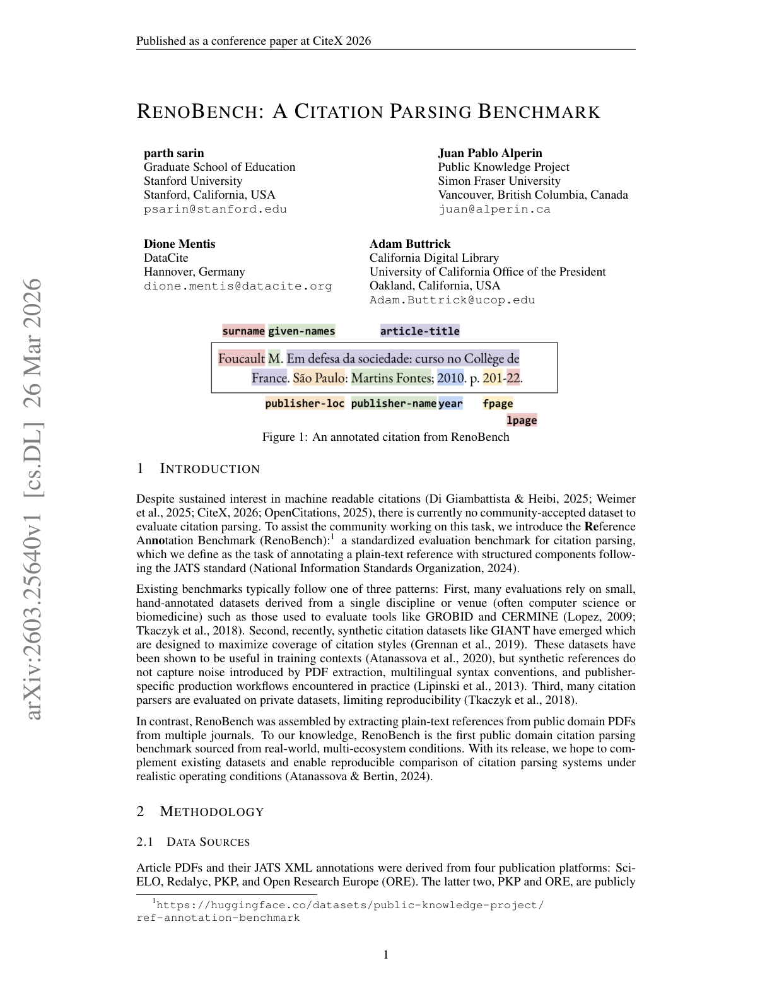

# RenoBench: A Citation Parsing Benchmark

> **저자**: Parth Sarin, Juan Pablo Alperin, Adam Buttrick, Dione Mentis | **날짜**: 2026-03-26 | **Journal**: CiteX 2026 (Conference Paper) | **DOI**: N/A | **arXiv**: [2603.25640](https://arxiv.org/abs/2603.25640)
> **리뷰 모드**: PDF

---

## Essence

인용 파싱(citation parsing) 시스템을 공정하고 재현 가능하게 평가할 표준 벤치마크가 존재하는가? 기존 평가 방법은 합성 데이터 기반이거나, 특정 시스템에 한정되거나, 공개되지 않아 일반화가 어렵다. RenoBench는 SciELO, Redalyc, Public Knowledge Project, Open Research Europe 등 **4개 오픈 액세스 출판 생태계의 PDF에서 출처한 10,000개 인용 파싱 벤치마크 데이터셋**이다. 161,000개 주석 인용으로 시작해 자동 검증과 특성 기반 샘플링을 거쳐 다국어·다출판유형·다플랫폼을 포괄한다. 파인튜닝된 언어 모델이 가장 강한 성능을 보임을 실험으로 확인했다.

*Figure 1: RenoBench 데이터셋 구축 파이프라인 — 4개 출판 생태계에서 PDF 수집, 주석, 자동 검증, 특성 기반 샘플링까지*

## Originality (Abstract 기반)

- [authorship, action] "We introduce RenoBench, a public domain benchmark for citation parsing, sourced from PDFs released on four publishing ecosystems: SciELO, Redalyc, the Public Knowledge Project, and Open Research Europe."
- [authorship, finding, approach] "Starting from 161,000 annotated citations, we apply automated validation and feature-based sampling to produce a dataset of 10,000 citations spanning multiple languages, publication types, and platforms."
- [authorship, finding] "We then evaluate a variety of citation parsing systems and report field-level precision and recall."
- [finding, conclusion] "Our results show strong performance from language models, particularly when fine-tuned."
- [finding] "RenoBench enables reproducible, standardized evaluation of citation parsing systems, and provides a foundation for advancing automated citation parsing and metascientific research."

## How (방법론)

- **데이터 수집**: SciELO, Redalyc, PKP(Public Knowledge Project), Open Research Europe 4개 플랫폼 PDF에서 참조문헌 추출
- **주석(annotation)**: 출판사 제공 구조화 메타데이터를 ground truth로 활용, 161,000개 인용 주석
- **품질 관리**: 자동 검증(형식 일관성, 필드 완전성) + 특성 기반 샘플링으로 10,000개 균형 데이터셋 구성
- **다양성 확보**: 다국어(영어, 스페인어, 포르투갈어 등), 다출판 유형(저널, 학위논문, 회의록), 다플랫폼
- **평가**: 여러 인용 파싱 시스템에 대해 필드 단위(저자, 제목, 연도, 저널 등) precision/recall 측정

## Why (중요성)

- 인용 파싱은 학술 지식 그래프, 서지 데이터베이스, 메타과학 연구의 기반 인프라이나 평가 방법 표준화가 미흡
- 기존 벤치마크의 합성 데이터 편향과 비공개 문제는 재현 가능한 비교를 불가능하게 함
- 오픈 액세스 플랫폼 중심의 데이터셋은 Global South 및 비영어권 학술 출판물의 포함으로 대표성 확보

## Limitation

### 저자들이 언급한 한계
- 4개 오픈 액세스 플랫폼에 한정되어 구독 기반 저널(Elsevier, Springer 등) 포함 불가
- 특성 기반 샘플링이 실제 인용 분포를 완전히 반영하지 못할 수 있음
- 일부 언어의 인용 수가 불균형할 수 있음

### 자체판단 아쉬운 점
- 161,000개에서 10,000개로의 샘플링 과정에서 정보 손실 가능성 — 희귀 인용 형식의 과소 대표
- 파인튜닝 LM이 최고 성능이라는 발견은 특정 시스템(AnystyleParser, GROBID 등)과의 직접 수치 비교 없이는 맥락화 어려움
- 시간에 따른 인용 형식 변화(구 논문 vs. 최신 논문)를 처리하는 방식 미명시

### 후속 연구
- 구독 기반 및 회색 문헌(gray literature) 포함으로 벤치마크 확장
- 인용 파싱 오류가 downstream 과학계량학 분석에 미치는 영향 정량화
- 다국어 파인튜닝 전략의 최적화 연구

## 평가

| 항목 | 점수 |
|------|------|
| Novelty | 3/5 |
| Technical Soundness | 4/5 |
| Significance | 4/5 |
| Clarity | 4/5 |
| Overall | 4/5 |

**총평**: 인용 파싱 연구의 오랜 재현성·일반화 문제를 해결하는 공공 도메인 벤치마크로, 특히 비영어권과 오픈 액세스 출판물의 포함은 기존 도구들의 편향을 드러내는 데 기여한다.
