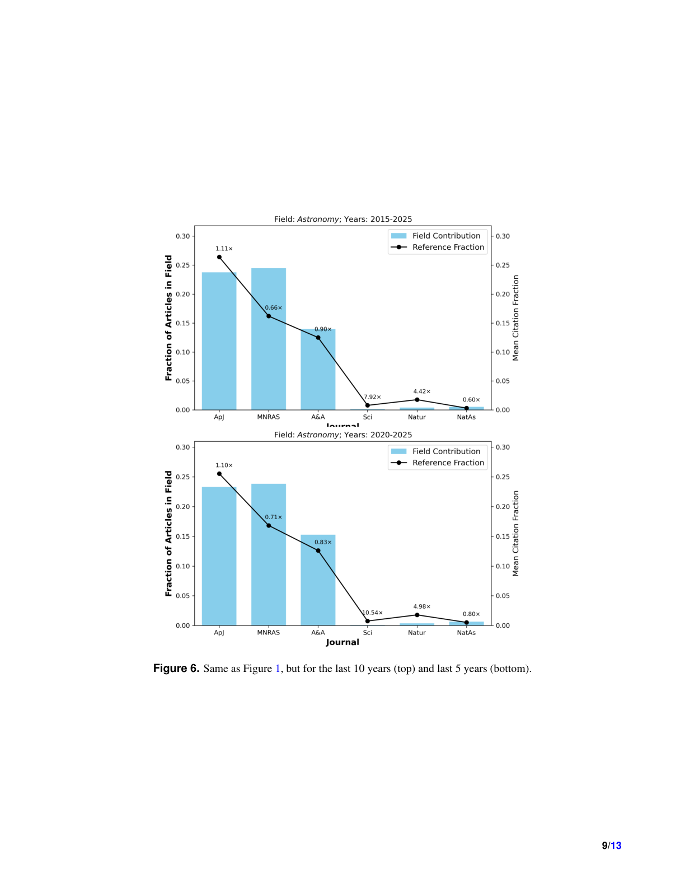

# Reinforcing Prestige: Journal Citation Biases in Astronomy

> **저자**: Vardan Adibekyan, Olivier Demangeon, Tiago Campante, Nuno Santos, Susana Barros, Artur Hakobyan | **날짜**: 2026-03-26 | **Journal**: arXiv preprint | **DOI**: N/A | **arXiv**: [2603.25349](https://arxiv.org/abs/2603.25349)
> **리뷰 모드**: PDF

---

## Essence

천문학에서 저널 인용 편향은 얼마나 심각하며, 어떤 패턴으로 나타나는가? 2000-2025년 사이 출판된 약 255,000편의 천문학 논문을 분석한 결과, **다학제 저널(Nature, Science 등)은 논문 점유율 대비 최대 9배 더 많은 인용**을 받는다. 저자가 특정 저널에 논문을 게재하면 그 저널에 대한 인용도 유의미하게 증가하는 '자기 기여 편향(self-contribution bias)'은 다학제 저널에서 특히 두드러진다. 이 효과는 지난 10년간 감소 추세이나 여전히 유의미하다. 이는 주제 클러스터링, 기관/개인 출판 습관, 편집 기대에 부응하기 위한 전략적 참조 행동의 복합적 결과로 해석된다.

*Figure 1: 천문학 저널별 논문 점유율 대비 인용 비율 분포 — 다학제 vs. 분야 특화 저널 비교*

## Originality (Abstract 기반)

- [authorship, action, finding] "We analyzed approximately 255,000 refereed astronomy articles published between 2000 and 2025 to investigate how journals are cited relative to their publication volume and authorship context."
- [authorship, finding] "We find that multidisciplinary journals receive disproportionately more citations, up to nine times higher than their share of articles, while field-specific journals are cited less frequently in proportion to their output."
- [result] "Citations to a journal also increase significantly when authors publish within it, a bias particularly pronounced in multidisciplinary journals."
- [continuation] "Although this effect has declined over the past decade, it remains notable."
- [continuation] "These patterns likely arise from a combination of topical clustering, institutional/individual publishing habits, and strategic referencing to align with editorial expectations."
- [finding, approach, conclusion, learned] "Our findings reveal persistent structural biases in scientific visibility and suggest that citation-based metrics should be used with greater awareness of the publishing context they reflect."

## How (방법론)

- **데이터**: NASA/ADS(Astrophysics Data System)에서 2000-2025년 천문학 분야 피심사 논문 약 255,000편
- **인용 편향 측정**: 저널별 (총 인용 수) / (논문 수) 비율을 계산하여 논문 점유율 대비 인용 과다/과소 저널 식별
- **자기 기여 편향**: 저자가 특정 저널에 게재한 후 해당 저널 인용 빈도 변화를 추적
- **시간적 분석**: 2000-2025년을 연도별로 분할하여 편향의 시간적 추이 파악
- **저널 분류**: 다학제(Nature, Science, PNAS 등) vs. 분야 특화(Astronomy & Astrophysics, ApJ 등)

## Why (중요성)

- 인용 기반 지표(IF, h-index)는 저널 선택 편향과 자기 기여 편향으로 연구 품질을 왜곡 측정
- 천문학은 arXiv 기반 오픈 액세스 문화가 강한 분야로, 저널 인용 편향 연구의 이상적 사례
- 다학제 저널의 구조적 과대 인용은 분야 특화 저널에서 발표하는 연구자의 경력 불이익으로 직결

## Limitation

### 저자들이 언급한 한계
- 천문학 분야에 한정되어 다른 분야로의 직접 일반화에 주의 필요
- 인용 동기(의도적 전략 vs. 무의식적 습관)를 직접 측정하지 못함
- 자기 기여 편향의 인과 관계와 상관 관계 구분의 어려움

### 자체판단 아쉬운 점
- 논문 저자들 자신이 천문학자로, 분야 내 평가자 편향 가능성
- 다학제 저널의 "9배 인용" 편향이 순전히 편향인지 실제 광범위한 독자층 반영인지 구분 어려움
- 연구팀 규모와 기관 위신이 편향에 미치는 영향을 통제하지 않음

### 후속 연구
- 물리학, 생명과학, 컴퓨터과학 등 타 분야와의 저널 인용 편향 비교 연구
- arXiv 인용 패턴과 저널 인용 패턴 간의 비교로 오픈 액세스의 편향 완화 효과 검증
- 저자들이 권장하는 공정한 참조 선택을 위한 실천 가이드라인 개발

## 평가

| 항목 | 점수 |
|------|------|
| Novelty | 3/5 |
| Technical Soundness | 4/5 |
| Significance | 4/5 |
| Clarity | 4/5 |
| Overall | 4/5 |

**총평**: 천문학 분야 25년치 255,000편 논문으로 저널 인용 편향의 규모(최대 9배)와 자기 기여 편향을 정량화했으며, citation-based 지표를 더 비판적으로 해석해야 한다는 실증적 근거를 제공한다.
