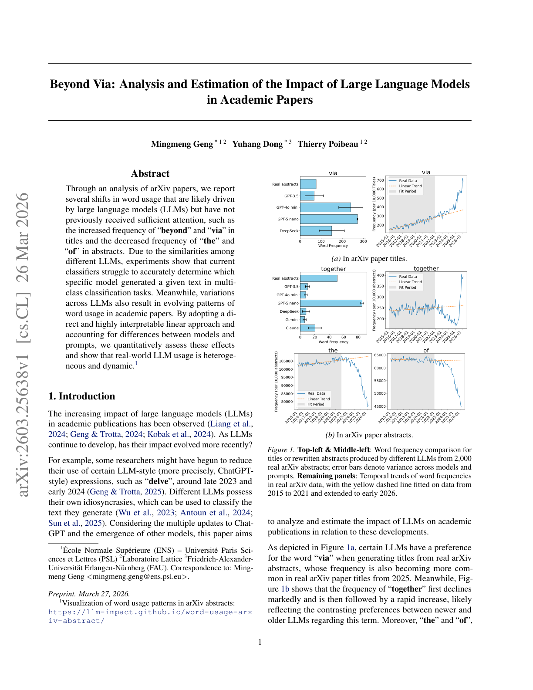

# Beyond Via: Analysis and Estimation of the Impact of Large Language Models in Academic Papers

> **저자**: Mingmeng Geng, Yuhang Dong, Thierry Poibeau | **날짜**: 2026-03-26 | **Journal**: arXiv preprint | **DOI**: N/A | **arXiv**: [2603.25638](https://arxiv.org/abs/2603.25638)
> **리뷰 모드**: PDF

---

## Essence

학술 논문에서 LLM의 영향은 어떻게 측정할 수 있으며 실제로 어느 정도인가? arXiv 논문 분석을 통해 LLM이 구동하는 단어 사용 패턴 변화를 포착했다. 제목에서는 "beyond"와 "via"의 빈도가 증가하고, 초록에서는 "the"와 "of"의 빈도가 감소한다. 현재 분류기들은 어떤 특정 모델이 텍스트를 생성했는지 멀티클래스 분류에서 정확히 판별하기 어렵다 — LLM들이 서로 비슷하기 때문이다. 해석 가능한 선형 접근법을 채택하고 모델·프롬프트 차이를 보정하여, 실세계 LLM 사용이 **이질적이고 동적**임을 정량적으로 보였다.

*Figure 1: arXiv 논문 제목/초록에서 특정 단어 빈도의 시계열 변화 — LLM 출시 전후 비교*

## Originality (Abstract 기반)

- [authorship, learned] "Through an analysis of arXiv papers, we report several shifts in word usage that are likely driven by large language models (LLMs) but have not previously received sufficient attention, such as the increased frequency of 'beyond' and 'via' in titles and the decreased frequency of 'the' and 'of' in abstracts."
- [action, finding] "Due to the similarities among different LLMs, experiments show that current classifiers struggle to accurately determine which specific model generated a given text in multi-class classification tasks."
- [continuation] "Meanwhile, variations across LLMs also result in evolving patterns of word usage in academic papers."
- [authorship, finding, approach] "By adopting a direct and highly interpretable linear approach and accounting for differences between models and prompts, we quantitatively assess these effects and show that real-world LLM usage is heterogeneous and dynamic."

## How (방법론)

- **데이터**: arXiv 논문 코퍼스 (시계열 데이터, ChatGPT 출시 전후 포함)
- **단어 빈도 분석**: 제목과 초록 내 특정 단어들의 시간적 빈도 변화 추적
- **LLM 식별 분류**: 여러 LLM(GPT-4, Claude, Gemini 등)으로 생성한 텍스트를 멀티클래스 분류 — 성능 한계 분석
- **선형 접근법**: 해석 가능성을 위한 선형 모델 사용 (비선형 블랙박스 모델 대신)
- **모델·프롬프트 보정**: 서로 다른 LLM과 프롬프트 조건의 영향을 분리하여 측정

## Why (중요성)

- LLM이 학술 논문 작성에 미치는 영향을 텍스트 통계로 포착하는 간단하면서 해석 가능한 방법 제시
- LLM 간 유사성 때문에 어떤 모델이 사용되었는지 판별이 어렵다는 발견은 AI 감지(detection) 연구에 중요한 시사점
- "beyond"와 "via" 같은 구체적 단어 신호는 LLM 사용 모니터링을 위한 실용적 지표로 활용 가능

## Limitation

### 저자들이 언급한 한계
- LLM이 구동한다고 "likely" 판단되는 패턴이나 인과 관계 확정이 어려움
- 멀티클래스 분류의 어려움 — 특정 LLM 귀속(attribution)은 현재 기술 수준에서 신뢰성 낮음
- 실세계 사용 패턴의 이질성으로 단일 모델로 설명하기 어려움

### 자체판단 아쉬운 점
- "beyond"와 "via" 증가가 LLM 때문인지, 연구 트렌드 변화(특정 연구 접근법의 증가) 때문인지 구분 어려움
- arXiv에 한정되어 구독 기반 저널이나 다른 분야의 패턴을 반영하지 못함
- 선형 모델의 해석 가능성은 높으나 예측 정확도 희생에 대한 trade-off 논의 부족

### 후속 연구
- 특정 단어 패턴 변화와 실제 LLM 사용 데이터(API 로그)의 상관 관계 직접 검증
- 분야별(CS, 물리학, 생물학) LLM 영향 패턴 비교
- LLM 사용 모니터링을 위한 실시간 단어 빈도 기반 지수 개발

## 평가

| 항목 | 점수 |
|------|------|
| Novelty | 3/5 |
| Technical Soundness | 3/5 |
| Significance | 3/5 |
| Clarity | 4/5 |
| Overall | 3/5 |

**총평**: LLM 영향의 어휘 지표를 간결하고 해석 가능하게 제시한 탐색적 연구이나, 인과 관계 확립과 특정 LLM 귀속의 어려움은 향후 해결해야 할 핵심 과제다.
