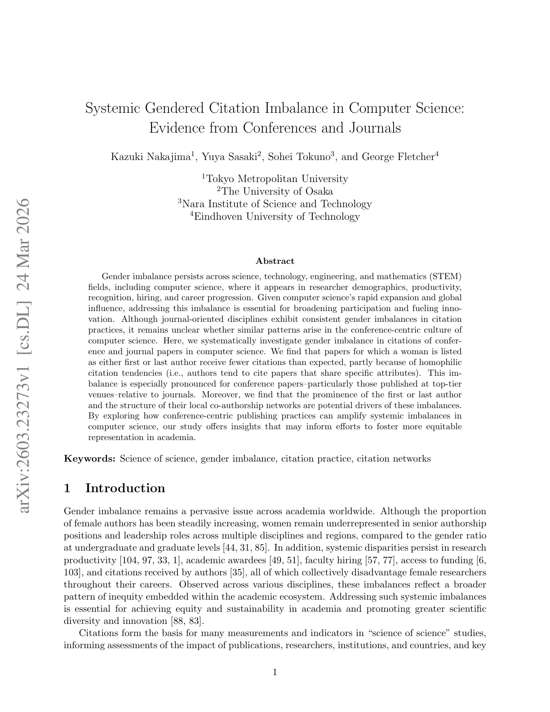

# Systemic Gendered Citation Imbalance in Computer Science: Evidence from Conferences and Journals

> **저자**: Kazuki Nakajima, Yuya Sasaki, Sohei Tokuno, George Fletcher | **날짜**: 2026-03-24 | **Journal**: arXiv preprint | **DOI**: N/A | **arXiv**: [2603.23273](https://arxiv.org/abs/2603.23273)
> **리뷰 모드**: PDF

---

## Essence

컴퓨터과학의 컨퍼런스 중심 출판 문화는 성별 인용 불균형을 어떻게 증폭시키는가? 컴퓨터과학의 여성 제1저자/마지막 저자 논문은 기대치보다 인용이 적으며, 이는 동종선호(homophilic citation tendency) — 저자들이 자신과 유사한 특성을 공유하는 논문을 인용하려는 경향 — 에 부분적으로 기인한다. 이 불균형은 **컨퍼런스 논문에서 특히 두드러지며, 특히 최상위 컨퍼런스에서 더 심하다.** 저널 논문 대비 컨퍼런스 논문의 불균형이 더 크다는 발견은, 컴퓨터과학의 독특한 컨퍼런스 중심 문화가 성별 불균형을 구조적으로 강화한다는 새로운 통찰을 제공한다. 제1저자·마지막 저자의 명성(prominence)과 로컬 공저자 네트워크 구조도 불균형의 잠재적 동인으로 확인됐다.

*Figure 1: 컴퓨터과학 컨퍼런스 vs. 저널에서 성별 인용 불균형의 측정 프레임워크*

## Originality (Abstract 기반)

- [conclusion] "Gender imbalance persists across science, technology, engineering, and mathematics (STEM) fields, including computer science, where it appears in researcher demographics, productivity, recognition, hiring, and career progression."
- [action] "Given computer science's rapid expansion and global influence, addressing this imbalance is essential for broadening participation and fueling innovation."
- [continuation] "Although journal-oriented disciplines exhibit consistent gender imbalances in citation practices, it remains unclear whether similar patterns arise in the conference-centric culture of computer science."
- [authorship, finding] "Here, we systematically investigate gender imbalance in citations of conference and journal papers in computer science."
- [authorship, novelty, finding, approach] "We find that papers for which a woman is listed as either first or last author receive fewer citations than expected, partly because of homophilic citation tendencies."
- [continuation] "This imbalance is especially pronounced for conference papers--particularly those published at top-tier venues--relative to journals."
- [authorship, novelty, finding] "Moreover, we find that the prominence of the first or last author and the structure of their local co-authorship networks are potential drivers of these imbalances."
- [authorship, action, learned] "By exploring how conference-centric publishing practices can amplify systemic imbalances in computer science, our study offers insights that may inform efforts to foster more equitable representation in academia."

## How (방법론)

- **데이터**: 컴퓨터과학 분야 컨퍼런스 및 저널 논문 대규모 데이터셋 (Semantic Scholar, DBLP 등)
- **성별 추론**: 제1저자·마지막 저자 이름 기반 성별 분류
- **인용 불균형 측정**: 기대 인용 수 대비 실제 인용 수 비교 (네트워크 특성 통제)
- **동종선호 분석**: 인용 그래프에서 성별 동질성 측정 — 남성 저자가 남성 저자 논문을 더 많이 인용하는 경향 정량화
- **컨퍼런스 vs. 저널 비교**: 동일한 분석을 두 출판 유형에 적용하여 컨퍼런스 중심 문화의 증폭 효과 분리
- **드라이버 분석**: 저자 명성(총 인용수, h-index 프록시)과 로컬 공저자 네트워크 구조의 영향 검증

## Why (중요성)

- 컴퓨터과학은 저널이 아닌 컨퍼런스가 중심인 독특한 출판 문화를 갖는데, 이 구조가 성별 불균형을 어떻게 증폭하는지 처음으로 체계적 분석
- 최상위 컨퍼런스(NeurIPS, ICML, CVPR 등)에서의 인용 편향은 AI 분야 여성 연구자의 가시성과 경력에 직접 영향
- 동종선호 메커니즘의 확인은 다양성 촉진 정책(블라인드 리뷰, 다양한 프로그램 위원회 구성)의 근거 제공

## Limitation

### 저자들이 언급한 한계
- 이름 기반 성별 추론의 불확실성 — 특히 아시아권 이름에서 정확도 저하
- 논바이너리 성별 정체성을 이진 분류에 포함 불가
- 자기 선택 편향 — 여성 연구자가 특정 분야나 저널을 선호하는 것이 결과에 영향

### 자체판단 아쉬운 점
- 컴퓨터과학 분야 내 세부 분야(ML, 시스템, 이론 등)별 패턴 차이 분석 부재
- 시간적 트렌드 분석이 제한적 — 불균형이 개선되고 있는지 악화되는지 불명확
- 저자 명성을 인용 불균형 드라이버로 지목했으나, 이것이 편향의 원인인지 결과인지 순환론적 문제

### 후속 연구
- 블라인드 리뷰 도입 컨퍼런스와 미도입 컨퍼런스 간의 인용 불균형 비교
- 프로그램 위원회(PC) 성별 구성이 선택된 논문의 인용 패턴에 미치는 영향 분석
- 컴퓨터과학 외 컨퍼런스 중심 분야(의학, 물리학 일부)와의 비교

## 평가

| 항목 | 점수 |
|------|------|
| Novelty | 4/5 |
| Technical Soundness | 4/5 |
| Significance | 4/5 |
| Clarity | 4/5 |
| Overall | 4/5 |

**총평**: 컴퓨터과학의 컨퍼런스 중심 문화가 성별 인용 불균형을 저널보다 심하게 증폭시킨다는 발견은 분야 특수성을 반영한 중요한 기여이며, 동종선호 메커니즘의 정량화는 형평성 정책 설계에 직접적 근거를 제공한다.
