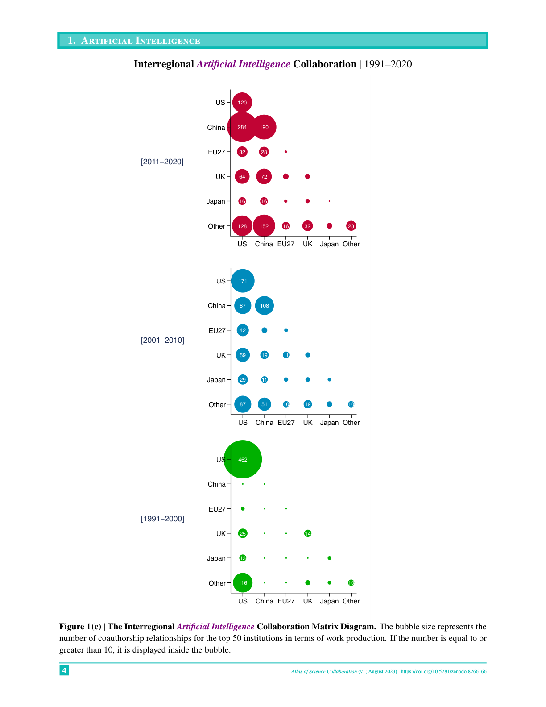
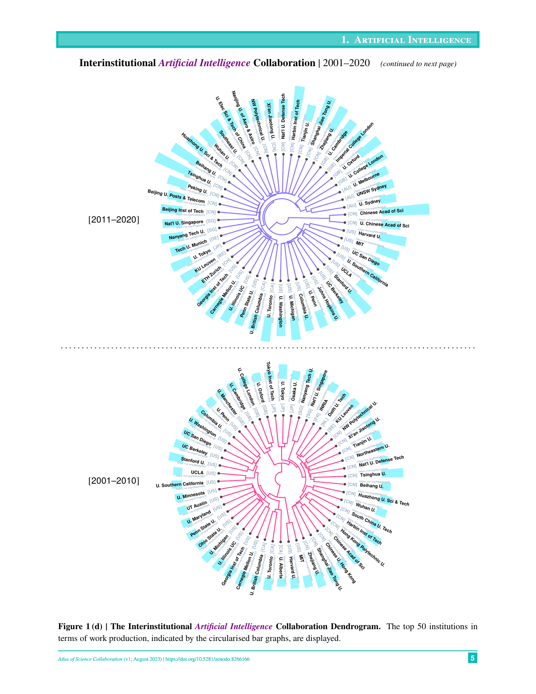

# Atlas of Science Collaboration, 1971–2020
> **저자**: Keisuke Okamura | **날짜**: 2024-06-11 | **Journal**: SN Computer Science | **DOI**: 10.1007/s42979-024-02973-4

---

## Essence

1971년부터 2020년까지 50년간 15개 자연과학 분야의 기관 간(interinstitutional) 및 국제(international) 연구 협업 패턴을 OpenAlex 데이터를 활용하여 세계 지도, 매트릭스 다이어그램, 덴드로그램 등으로 시각화한 아틀라스(atlas)이다. 전 분야에 걸쳐 **"축소하는 세계(Shrinking World)"** 현상이 확인되었으며 -- 과학 산출은 폭발적으로 증가하면서도 기관 간 협력 거리는 지속적으로 감소했다. 과학기술 정책입안자, 외교관, 기관 연구자를 위한 글로벌 협업 현황의 직관적 참조 자료를 제공한다.

## Motivation

- **Known**: 국제 연구 협업은 지난 수십 년간 급격히 증가해왔으며, 이를 정량적으로 파악하는 것은 과학기술 정책 수립에 핵심적이다.
- **Gap**: 기존 서지분석(bibliometric) 연구는 특정 분야나 시기에 국한되거나, 기관 수준의 글로벌 협업 네트워크를 분야별/시기별로 체계적으로 비교 시각화한 자료가 부족했다.
- **Why**: 과학 협업의 지리적 분포, 시간적 진화, 분야별 차이를 한눈에 파악할 수 있는 종합적 시각 자료가 필요하다.
- **Approach**: OpenAlex의 공개 데이터를 활용하여 15개 분야 x 4개 시기(1971-1990, 1991-2000, 2001-2010, 2011-2020)에 걸친 공저(coauthorship) 관계를 세계 지도, 버블 매트릭스, 계층적 클러스터링 덴드로그램으로 시각화한다.

## Achievement

1. **15개 자연과학 분야의 50년간 협업 지도 완성**: AI, 양자과학, 생명공학, 나노기술, 농업공학, 입자물리, 항공우주, 원자력, 해양공학, 신경과학, 응집물질물리, 환경공학, 지구과학, 천문학, 순수수학.
2. **4가지 시각화 유형**: 세계 지도(공저 네트워크), Top 30 기관 지도, 국가 간 협력 행렬(Matrix Diagram), 계층적 클러스터링 덴드로그램.
3. **중국의 급부상 시각화**: AI 분야에서 1991-2000년 미국 내부 협업(462건)이 압도적이었으나, 2011-2020년에는 중국(284건 대미 협업, 190건 내부 협업)이 미국(120건)을 넘어서는 극적 변화를 보여줌.
4. **기관 수준 클러스터링**: 덴드로그램 분석을 통해 미국-유럽-일본 중심의 전통적 클러스터에서 중국 기관들이 독자적 클러스터를 형성하며 부상하는 패턴을 확인.
5. **5대 과학 강국(미국, 중국, EU27, 영국, 일본) 중심의 양자 협력 관계 정량화** 및 OpenAlex 오픈 데이터 기반 **완전한 재현 가능성** 확보.

## How

- **데이터**: OpenAlex API (2023년 8월 기준, 약 2.4억 works)에서 15개 level-1 concept 및 하위 level-2+ subconcept에 해당하는 논문 데이터 수집.
- **분석 단위**: 상위 199개 연구기관(작업 생산량 기준), 상위 50개 기관의 공저 관계.
- **시기 구분**: 1971-1990, 1991-2000, 2001-2010, 2011-2020.
- **거리 측정**: 기관 X-Y 간 공저 논문 수 기반 유사도(1 - 공저비율) → Ward's method(ward.D2) 계층적 클러스터링.
- **시각화 도구**: R 언어의 maps, geosphere(gcIntermediate), ggplot2, dendextend, circlize 패키지.
- **World Map**: 상위 199개 기관을 버블로 표시, 상위 50개 기관 간 공저 관계를 great circle curve로 연결(5편 이상 공저만 표시).
- **Matrix Diagram**: US, China, EU27, UK, Japan, Other 6개 지역 간 양자 공저 관계를 반행렬(half-matrix) 버블 차트로 표현.

## Originality

- 단일 데이터소스(OpenAlex)를 활용하여 **15개 분야 x 4개 시기**라는 방대한 조합을 일관된 방법론으로 시각화한 최초의 종합 아틀라스.
- 기관(institution) 수준의 분석으로, 국가 수준보다 세밀한 협업 네트워크 파악이 가능.
- CC0 라이선스의 오픈데이터(OpenAlex)만을 사용하여 완전한 재현 가능성 확보.
- Zenodo와 arXiv에 공개하여 정책입안자와 연구자 모두 접근 가능한 공공재로 제공.

## Limitation & Further Study

### 저자들이 언급한 한계

- OpenAlex 데이터가 **지속적으로 업데이트**되므로 동일 분석을 재수행하면 정량적으로 다른 결과가 나올 수 있음.
- 상당수 works에서 **저자 소속 기관 정보가 누락**되어 있어 실제 협업 규모가 과소 추정될 가능성.
- **피어리뷰 여부, 논문의 영향력/품질을 고려하지 않음** -- 순수 생산량(quantity) 기반 분석.
- 기관명 동의어 처리(name disambiguation)와 기관 조직 변경의 영향.
- level-1 concept 기반 분야 정의의 한계.

### 자체판단 아쉬운 점

- **분석적 깊이 부족**: 시각화 아틀라스로서의 가치는 있으나, 통계적 분석이나 인과 추론은 전무. 왜 특정 패턴이 나타나는지에 대한 설명이 없음.
- **분야 선정 기준 불명확**: 15개 분야가 왜 선택되었는지, 생물학, 화학, 의학 등 주요 분야가 빠진 이유가 설명되지 않음.
- **동적 시각화 부재**: 정적 PDF/이미지 형태로만 제공되어 인터랙티브 탐색이 불가능. 웹 기반 대시보드가 있었다면 활용도가 크게 높았을 것.
- 상위 50-199개 기관에 한정되어 **개발도상국과 소규모 기관**의 협력은 과소 대표.
- **시간 구간이 불균등**: 1971-1990(20년), 1991-2000(10년), 2001-2010(10년), 2011-2020(10년)으로 첫 구간만 2배 길어 직접 비교 시 주의 필요.

### 후속 연구

- 인터랙티브 웹 대시보드로의 확장(사용자가 분야/시기/기관을 자유롭게 필터링).
- 협업 네트워크의 **시계열 동적 분석**(community detection, temporal network analysis).
- 공저 관계에 **인용 가중치**를 부여한 영향력 기반 협업 네트워크 분석.
- 사회과학, 인문학 등 자연과학 외 분야로의 확장.
- 팬데믹(COVID-19) 전후 협업 패턴 변화 분석.
- 개발도상국 기관 포함 및 정기적 업데이트.

## Evaluation

| 항목 | 점수 |
|------|------|
| Novelty | 3/5 |
| Technical Soundness | 3/5 |
| Significance | 4/5 |
| Clarity | 5/5 |
| Overall | 3.5/5 |

**총평**: 50년간 15개 과학 분야의 글로벌 협업 패턴을 일관된 방법론으로 시각화한 유용한 참조 자료이나, 분석적 깊이보다는 기술적(descriptive) 시각화에 치중되어 있어 학술 논문으로서의 기여보다는 정책 참고자료로서의 가치가 더 크다.

---

*Figure 1: AI 분야 국제 협업 세계 지도 (1971-2020). 시기별로 협업 네트워크가 미국 중심에서 미국-중국-유럽 다극 체제로 변화하는 모습이 뚜렷하다.*

*Figure 2: 양자과학 분야 국제 협업 세계 지도 (1971-2020). 유럽과 미국 간 연결이 강하며, 아시아 허브가 점차 성장하고 있다.*

*Figure 3: 생명공학 분야 국제 협업 세계 지도 (1971-2020). 미국-유럽 축이 가장 강하며, 중국이 2011-2020에 급부상했다.*

*Figure 4: AI 분야 지역 간 협업 매트릭스 (1991-2020). 버블 크기가 공저 관계 수를 나타내며, 미국-중국 간 협업이 2011-2020에 폭발적으로 증가했다.*

*Figure 5: AI 분야 기관 간 협업 덴드로그램 (2001-2020). 중국 기관들이 독자적 클러스터를 형성하며 미국-유럽 클러스터와 구분되는 양상을 보인다.*
